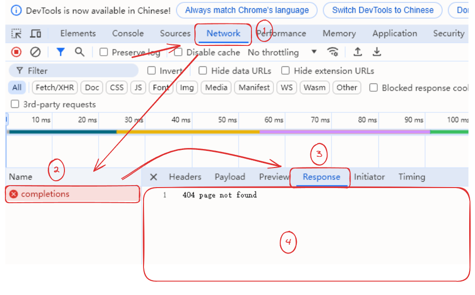

# Foire Aux Questions (FAQ)


Ce document a été traducido del chino por IA y aún no ha sido revisado.


## Codes d'erreur courants

* **4xx (codes d'état d'erreur client)** : Généralement des erreurs de syntaxe de requête, d'échec d'authentification ou d'autorisation empêchant la complétion de la requête.
* **5xx (codes d'état d'erreur serveur)** : Généralement des erreurs côté serveur, comme un serveur en panne ou un dépassement du délai de traitement.

| Code erreur | Scénarios possibles                                                                 | Solution                                                                                                                                                                                                                                                                                                                                                                                                                                                                                                                     |
| ----------- | ----------------------------------------------------------------------------------- | ---------------------------------------------------------------------------------------------------------------------------------------------------------------------------------------------------------------------------------------------------------------------------------------------------------------------------------------------------------------------------------------------------------------------------------------------------------------------------------------------------------------------------- |
| **400**     | Format incorrect du corps de requête, etc.                                           | 
Consultez le contenu d'erreur renvoyé ou <a href="questions.md#kong-zhi-tai-bao-cuo-cha-kan-fang-fa">la console</a> pour les détails d'erreur, et suivez les instructions.

<a href="questions.md#kong-zhi-tai-bao-cuo-cha-kan-fang-fa"><mark style="color:purple;">[Cas courant 1]</mark> : Pour les modèles Gemini, une liaison de carte peut être nécessaire ; <mark style="color:purple;">[Cas courant 2]</mark> : Dépassement de volume de données, fréquent avec les modèles visuels (images trop volumineuses) ; <mark style="color:purple;">[Cas courant 3]</mark> : Paramètres non pris en charge ou incorrects. Testez avec un nouvel assistant vierge ; <mark style="color:purple;">[Cas courant 4]</mark> : Contexte dépassant la limite. Effacez le contexte, créez une nouvelle conversation ou réduisez le nombre d'échanges.</a>
 |
| **401**     | Échec d'authentification : modèle non pris en charge ou compte serveur suspendu, etc. | Contactez le fournisseur de service ou vérifiez l'état du compte                                                                                                                                                                                                                                                                                                                                                                                                                                                             |
| **403**     | Autorisation insuffisante pour l'opération demandée                                 | Suivez les instructions d'erreur dans la réponse ou dans la [console](questions.md#kong-zhi-tai-bao-cuo-cha-kan-fang-fa)                                                                                                                                                                                                                                                                                                                                                                                                     |
| **404**     | Ressource introuvable                                                               | Vérifiez le chemin de requête, etc.                                                                                                                                                                                                                                                                                                                                                                                                                                                                                          |
| **422**     | Format correct mais erreur sémantique                                               | Erreurs traitables par le serveur mais non exécutables. Fréquent avec des erreurs JSON (valeur nulle, type incorrect).                                                                                                                                                                                                                                                                                                                                                                                                        |
| **429**     | Limite de débit de requêtes atteinte                                                 | Taux de requêtes (TPM ou RPM) dépassé. Patientez avant de réessayer.                                                                                                                                                                                                                                                                                                                                                                                                                                                         |
| **500**     | Erreur interne du serveur                                                           | Contactez le fournisseur de service si persistant                                                                                                                                                                                                                                                                                                                                                                                                                                                                            |
| **501**     | Fonctionnalité non implémentée par le serveur                                       |                                                                                                                                                                                                                                                                                                                                                                                                                                                                                                                              |
| **502**     | Réponse invalide d'un serveur intermédiaire                                          |                                                                                                                                                                                                                                                                                                                                                                                                                                                                                                                              |
| **503**     | Serveur temporairement surchargé ou en maintenance                                  |                                                                                                                                                                                                                                                                                                                                                                                                                                                                                                                              |
| **504**     | Délai d'attente dépassé pour un serveur intermédiaire                               |                                                                                                                                                                                                                                                                                                                                                                                                                                                                                                                              |

***

## Méthode d'inspection des erreurs dans la console

* Dans la fenêtre client de Cherry Studio, appuyez sur <kbd>Ctrl</kbd> + <kbd>Shift</kbd> + <kbd>I</kbd> (Mac : <kbd>Command</kbd> + <kbd>Option</kbd> + <kbd>I</kbd>)


- La fenêtre active doit être celle du client Cherry Studio pour ouvrir la console ;
- La console doit être ouverte avant de lancer des tests ou des requêtes pour capturer les informations.


* Dans la console, cliquez sur <mark style="color:blue;">`Network`</mark> → Sélectionnez la dernière entrée avec un <mark style="color:red;">`×`</mark> rouge nommée <mark style="color:red;">`completions`</mark> *(erreurs de dialogue/traduction)* ou <mark style="color:red;">`generations`</mark> *(erreurs de peinture)* → Cliquez sur <mark style="color:blue;">`Response`</mark> pour voir le contenu complet (zone ④ dans l'image).

> Si la cause de l'erreur n'est pas identifiable, envoyez une capture d'écran dans le [groupe officiel](https://t.me/CherryStudioAI).

<figure><figcaption></figcaption></figure>

Cette méthode fonctionne pour les dialogues, tests de modèles, ajout de bases de connaissances, peinture, etc. L'ouverture préalable de la console est indispensable.


Les noms dans la colonne *Name* (zone ②) varient selon les scénarios :

Dialogue/traduction/vérification de modèle : <mark style="color:red;">`completions`</mark>

Peinture : <mark style="color:red;">`generations`</mark>

Création de base de connaissances : <mark style="color:red;">`embeddings`</mark>


***

## Formules non rendues / erreur de rendu

* Si les formules s'affichent en code, vérifiez les délimiteurs :

> **Usage des délimiteurs**
>
> _Formule en ligne_
>
> * Dollar simple : `$formule$`
> * Ou `\(formule\)`
>
> _Bloc de formule_
>
> * Double dollar : `$$formule$$`
> * Ou `\[formule\]`
> * Exemple : `$$\sum_{i=1}^n x_i$$`\
>   $$\sum_{i=1}^n x_i$$

* Pour les erreurs de rendu (souvent avec du Chinois), basculez le moteur de rendu vers KateX.

***

## Impossible de créer une base de connaissances / échec d'obtention des dimensions d'embedding

1. Modèle indisponible

> Vérifiez la prise en charge et l'état opérationnel du modèle chez le fournisseur.

2. Utilisation d'un modèle non adapté aux embeddings

***

## Modèle ne reconnaissant pas les images / impossible d'uploader ou sélectionner des images

Vérifiez d'abord la prise en charge de la reconnaissance d'images. Les modèles compatibles sont marqués d'une icône d'œil dans Cherry Studio.

Les modèles vision acceptent les uploads d'images. Si la fonctionnalité est mal détectée, activez l'option *Image* dans les paramètres du modèle chez le fournisseur.

Consultez les spécifications du modèle chez le fournisseur. Forcer l'option *Image* sur des modèles non vision est inutile.