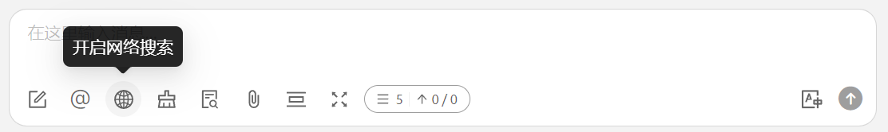
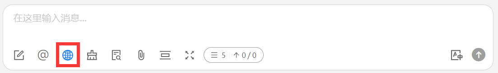
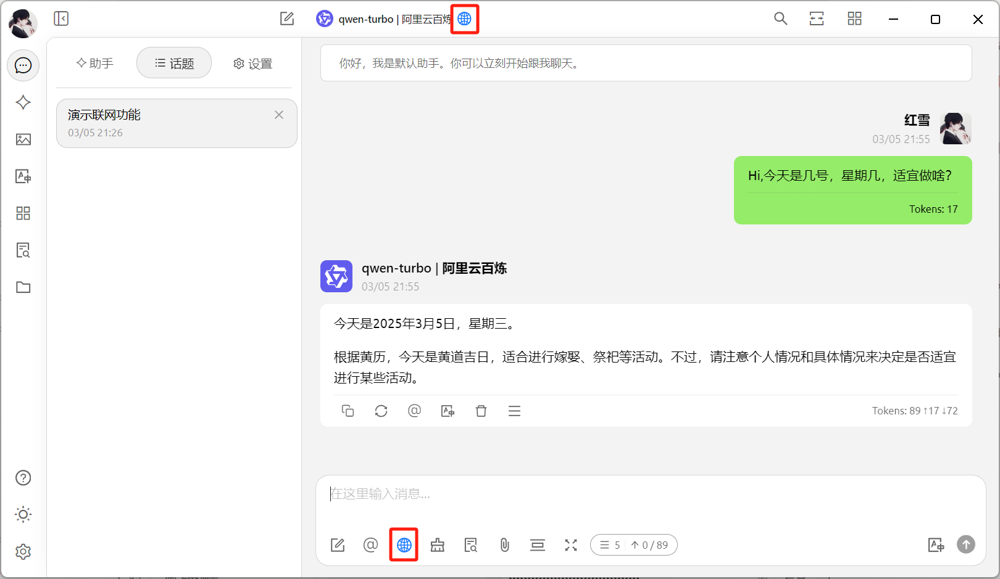
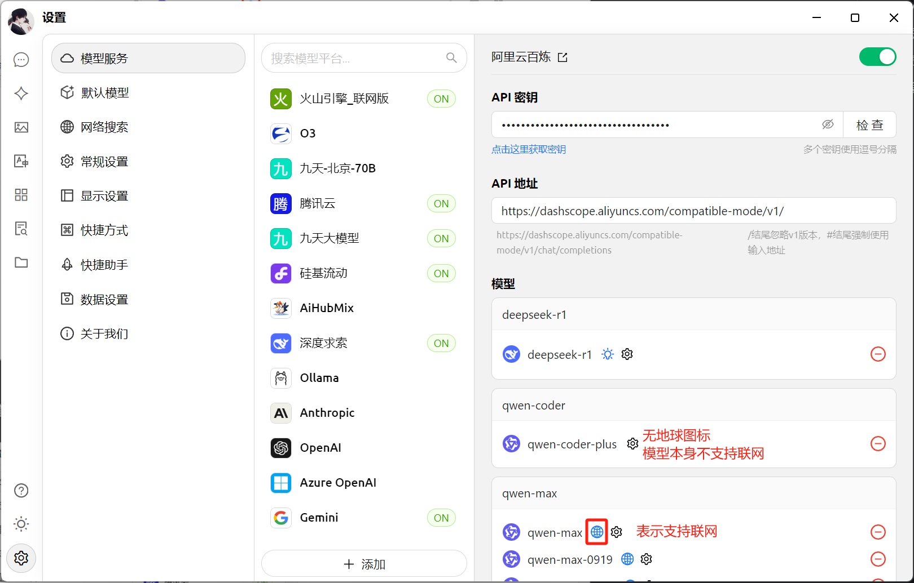
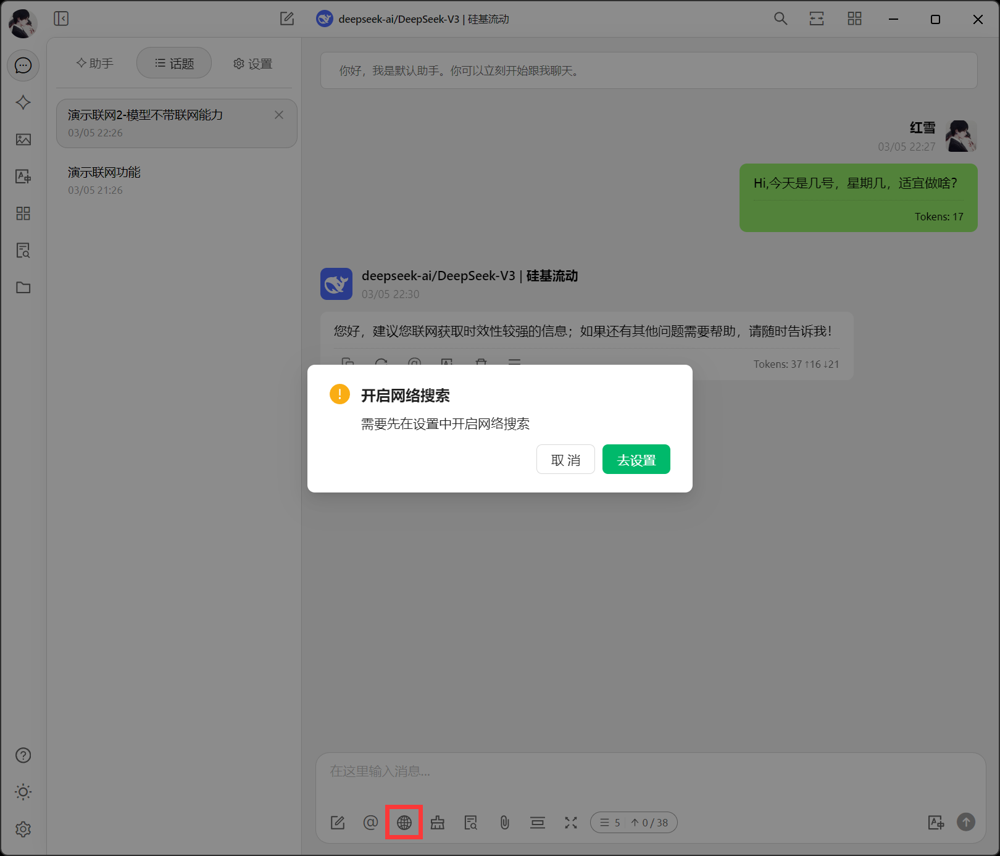
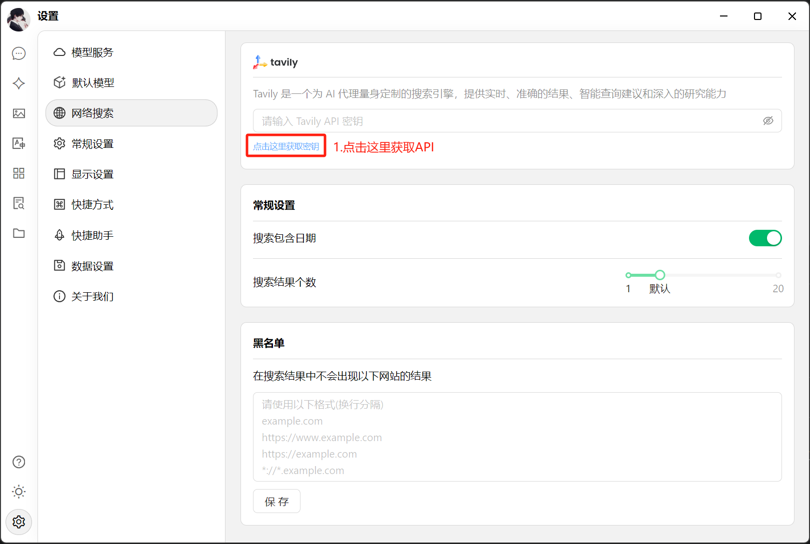
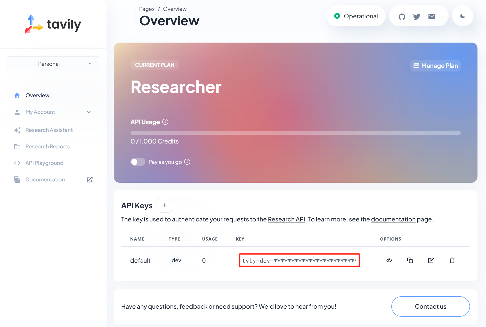
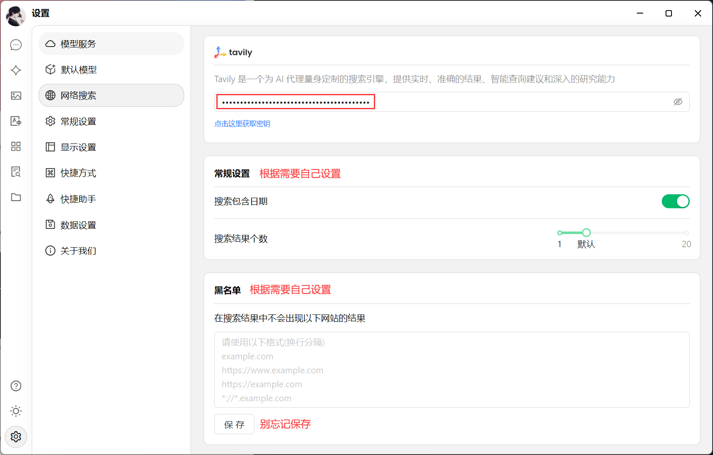
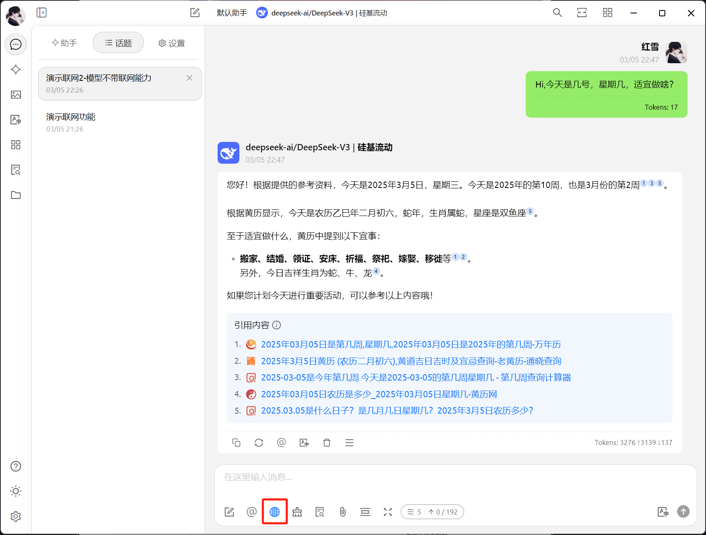
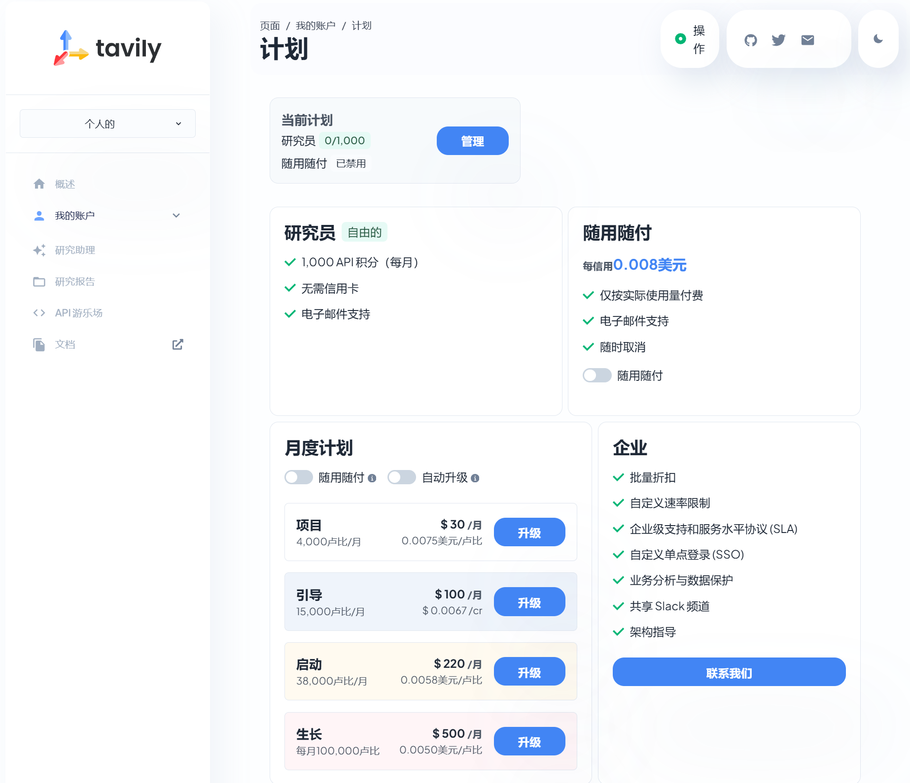

# Mode en ligne


Exemples de situations nécessitant une connexion Internet :
* Informations temporelles : comme les prix des contrats à terme sur l'or d'aujourd'hui/cette semaine/à l'instant, etc.
* Données en temps réel : comme la météo, les taux de change, etc.
* Connaissances émergentes : comme les nouvelles choses, concepts, technologies, etc.


### I. Comment activer le mode en ligne

Dans la fenêtre de question de Cherry Studio, cliquez sur l'icône 【Globe terrestre】 pour activer le mode en ligne.

<figure><figcaption>
Cliquez sur l'icône Globe - Activer la connexion Internet
</figcaption></figure>

<figure><figcaption>
Indicateur - La fonction de connexion Internet est activée
</figcaption></figure>

### II. Remarque importante : deux modes de connexion Internet

#### Mode 1 : Les modèles des opérateurs possèdent une fonction de recherche en ligne intégrée

Dans ce cas, après avoir activé le mode en ligne, vous pouvez directement utiliser le service, c'est très simple.


Vous pouvez rapidement vérifier si un modèle prend en charge la connexion Internet en cherchant une petite icône de carte après son nom dans la partie supérieure de l'interface de question-réponse.


<figure><figcaption></figcaption></figure>

Sur la page de gestion des modèles, cette méthode vous permet également de distinguer rapidement les modèles prenant en charge le mode en ligne.

<figure><figcaption></figcaption></figure>

> <mark style="color:green;">**Opérateurs de modèles avec fonction de recherche en ligne actuellement pris en charge par Cherry Studio**</mark>
>
> * <mark style="color:green;">Google Gemini</mark>
> * <mark style="color:green;">OpenRouter (tous les modèles prennent en charge la connexion Internet)</mark>
> * <mark style="color:green;">Tencent Hunyuan</mark>
> * <mark style="color:green;">Zhipu AI</mark>
> * <mark style="color:green;">Alibaba Cloud Bailian, etc.</mark>


Remarque importante :  
Il existe un cas particulier où même sans l'icône de globe terrestre, un modèle peut accéder à Internet, comme expliqué dans le tutoriel ci-dessous.



[volcengine.md](volcengine.md)


***

#### Mode 2 : Les modèles sans fonction de recherche utilisent le service Tavily pour accéder à Internet

Lorsqu'un modèle ne possède pas de fonction de recherche intégrée (pas d'icône de globe après son nom), mais que vous avez besoin d'informations en temps réel, utilisez le service de recherche Internet Tavily.

**Lors de la première utilisation du service Tavily**, une fenêtre contextuelle vous guidera dans la configuration. Suivez simplement les instructions !

<figure><figcaption>
Fenêtre contextuelle, cliquez : Configurer
</figcaption></figure>

<figure><figcaption>
Cliquez pour obtenir la clé
</figcaption></figure>

Après avoir cliqué "Obtenir la clé", vous serez redirigé vers le **site officiel de Tavily**. Inscrivez-vous, connectez-vous, créez une clé API, puis copiez-la dans Cherry Studio.


Besoin d'aide pour l'inscription ? Consultez le tutoriel dans ce même répertoire.


**Document de référence pour Tavily :**


[tavily.md](tavily.md)


L'interface suivante indique une inscription réussie.

<figure><figcaption>
Copier la clé
</figcaption></figure>

<figure><figcaption>
Coller la clé - C'est terminé !
</figcaption></figure>

Testez à nouveau : les résultats montrent une recherche Internet fonctionnelle, avec un nombre de résultats par défaut de 5.

<figure><figcaption></figcaption></figure>


Remarque : Tavily impose des limites d'utilisation gratuite mensuelle. Le dépassement entraîne des frais.


<figure><figcaption></figcaption></figure>

> PS : Si vous détectez des erreurs, n'hésitez pas à nous contacter.