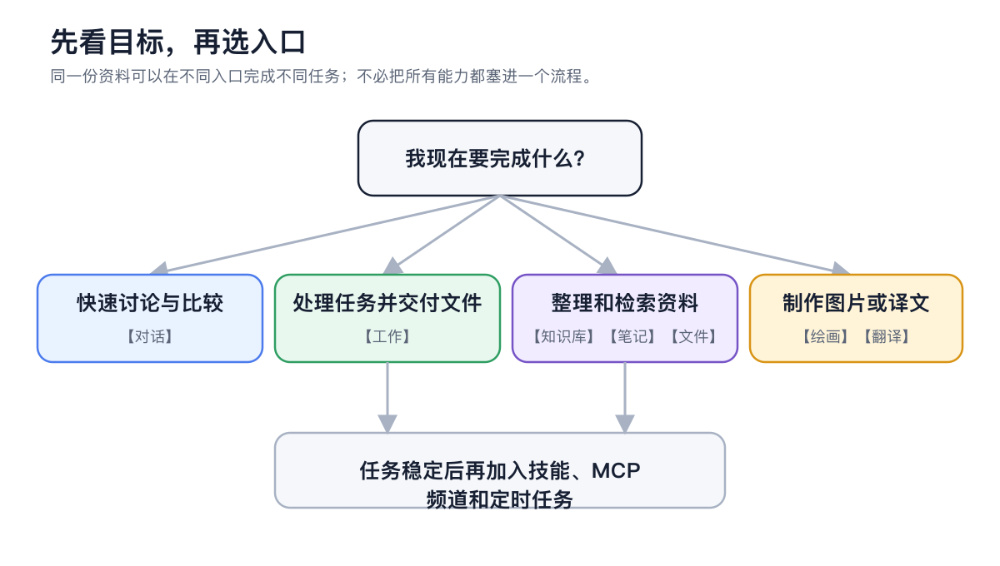
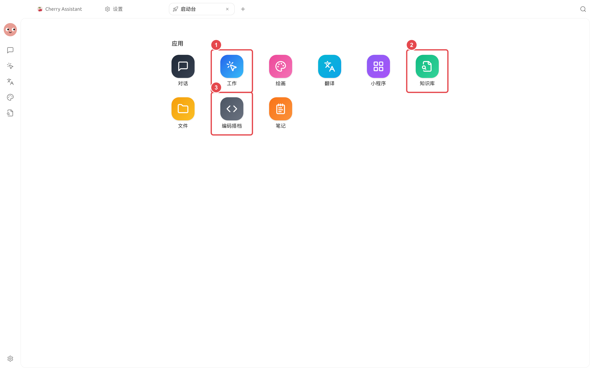

# 高度な機能マップ

高度なチュートリアルは設定メニューを項目ごとに列挙するのではなく、「何を達成したいか」に焦点を当てています。最も近い目標を選択し、該当するチュートリアルに進んでください。

<figure><figcaption>
まずメインエントリを選択して最小限のタスクを完了してください。結果が安定したら、ナレッジベース、スキル、MCP、チャネル、またはスケジュールタスクを追加します。
</figcaption></figure>


チュートリアル、チャネル、スケジュールタスク、または拡張機能を設定する必要がある場合は、まず【ワーク】で Agent に目標を伝えましょう。Agent は不足している要素を判断し、一般的な設定を支援します。アカウント、キー、または正確なパラメータを確認する必要がある場合は、【設定】で手動調整してください。


<figure><figcaption>
左側のランチャーには9つの主要エントリがあり、タスクに最も近いものを選択して開始します。
</figcaption></figure>

図の説明：まず目標に基づいて主要エントリを選択し、フローが安定したらスキル、MCP、チャネル、またはスケジュールタスクを追加します。

### 目標に基づくエントリの選択

| 達成したいこと | 推奨エントリ | 使用する機能 |
| ------------- | ----------------------- | --------------------- |
| 複数の回答を比較し、長い議論を整理する | 【チャット】 | マルチモデル、メッセージ分岐、コンテキスト、引用と成果物 |
| ファイルを処理したり、複数ステップのタスクを完了する | 【ワーク】 | Agent、作業ディレクトリ、ツール、権限とステータスパネル |
| 独自の資料で安定した Q&A を行う | 【ナレッジベース】→リコールテスト、その後 Agent にバインド | ファイル/ウェブページ/ノート、RAG、検索範囲 |
| 記事から画像を生成したり、画像を編集する | 【描画】、または Agent で【画像生成】を有効化 | テンプレート、参照画像、局所編集、強化 |
| テキスト、スクリーンショット、または長い文書を翻訳する | 【翻訳】 | OCR、文書処理、履歴とブックマーク |
| 下書きを保存し、さらに加工する | 【ノート】 | Markdown、検索、エクスポート、ナレッジベースへの追加 |
| インターフェースをキャプチャし、アノテーションしてテキストをコピーする | 【設定】→【スクリーンショット】を有効化後、グローバルショートカットを使用 | 領域キャプチャ、アノテーション、モザイク、OCR |
| よく使うウェブアプリを開く | 【ミニプログラム】 | 組み込みウェブツールと追加済みサイト |
| ローカルファイルを閲覧、プレビュー、整理する | 【ファイル】 | ファイルリスト、プレビューと後続処理 |
| 外部ツールを接続したり、固定された作業方法を確立する | まず Agent に判断させ、その後【設定】で確認 | スキル、MCP、組み込みツール |
| 外部プラットフォームから Agent を使用する | まず【ワーク】で Agent に設定を案内させる | チャネル、許可範囲、権限モード |
| 計画に基づいて日報やリマインダーを生成する | まず Agent を実行し、その後【スケジュールタスク】を作成 | Agent、作業ディレクトリ、チャネル、実行ログ |
| 資料とタスクを同時に表示する | タブを右クリック→【新しいウィンドウで開く】 | マルチウィンドウ、固定タブ、グローバル検索 |
| プログラミングコマンドラインを管理する | ランチャー【コーディングパートナー】 | Code CLI、モデル接続、ディレクトリとターミナル |
| ローカルプログラムからモデルを呼び出したり、トラブルシューティングを行う | 【設定】→【API ゲートウェイ】/【一般】 | 互換 API、呼び出しチェーン、開発者モード |

### 推奨される学習順序



#### 1. まず Agent ワークスペースを習得する

Agent の作成、作業ディレクトリの選択、モデルの役割分担と権限を理解してください。後の拡張、自動化、プロジェクト事例はすべてここに基づいています。



#### 2. 次に資料と機能を接続する

長期の資料にはナレッジベース、繰り返し使う方法にはスキル、外部システムには MCP を使用します。一度に1つの機能のみを追加し、小さなタスクで検証してください。



#### 3. 最後に自動実行または外部接続を行う

手動の結果が安定してから、チャネル、スケジュールタスク、Code CLI、または外部 API を設定します。これにより、問題が発生した際にどの环节が原因かを特定しやすくなります。



### モジュール別の読み方

<table data-view="cards"><thead><tr><th></th><th></th><th data-hidden data-card-target data-type="content-ref"></th></tr></thead><tbody><tr><td><strong>チャット高度化</strong></td><td>マルチモデル、分岐、コンテキストと成果物</td><td><a href="chat/README.md">chat/README.md</a></td></tr><tr><td><strong>Agent ワークスペース</strong></td><td>設定、実行からファイル納品まで</td><td><a href="agent-workspace/README.md">agent-workspace/README.md</a></td></tr><tr><td><strong>ナレッジとコンテンツワークフロー</strong></td><td>ナレッジベース、ノート、描画と翻訳</td><td><a href="knowledge-content/README.md">knowledge-content/README.md</a></td></tr><tr><td><strong>Agent の機能を拡張する</strong></td><td>スキルと MCP</td><td><a href="extensions/README.md">extensions/README.md</a></td></tr><tr><td><strong>自動化と外部到達</strong></td><td>チャネル、スケジュールタスクとハートビート</td><td><a href="automation/README.md">automation/README.md</a></td></tr><tr><td><strong>高効率ワークベンチ</strong></td><td>マルチウィンドウ、効率ツールと検索</td><td><a href="workbench/README.md">workbench/README.md</a></td></tr><tr><td><strong>開発と診断</strong></td><td>Code CLI、API ゲートウェイと呼び出しチェーン</td><td><a href="developer-tools/README.md">developer-tools/README.md</a></td></tr><tr><td><strong>アプリケーション事例</strong></td><td>9つの完全なワークフロー</td><td><a href="cases/README.md">cases/README.md</a></td></tr></tbody></table>


作業ディレクトリ、MCP、チャネル、高権限モードは、Agent がアクセスできるデータ範囲を拡大します。現在のタスクに必要なディレクトリ、ツール、アカウントのみを提供し、API Key、ボットキー、または個人情報を公開チャットやスクリーンショットに含めないでください。

