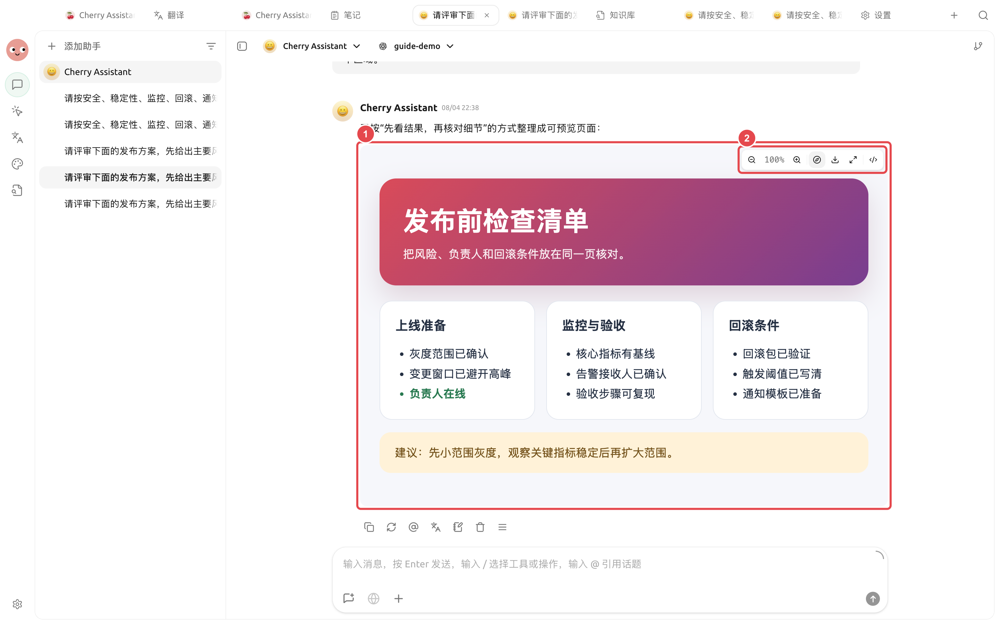

# 成果物、引用とエクスポート

1つの返信には、本文、コード、ファイル、画像、引用、および編集可能なコンテンツが同時に含まれる場合があります。まず成果物を確認し、コピー、ダウンロード、エクスポート、または Agent に継続処理を依頼するかを判断してください。

<figure><figcaption>
最終的な成果物に到達したら、まず内容、出典、ファイルを確認し、その後コピー、エクスポート、または Agent に整理を継続させるかを判断してください。
</figcaption></figure>

### まずプレビューし、その後納品する

メッセージまたは Agent のファイルパネル内の成果物をクリックすると、右側に該当するプレビューが開きます。HTML ではページレイアウトとインタラクションを確認できます。PDF、Word、PowerPoint、画像、テキストは形式に応じて表示されます。`.xlsx` スプレッドシートでは、ワークシート、セルスタイル、結合セル、数式の結果、画像、グラフを直接確認できます。

<figure><figcaption>
① プレビューエリアは完全な内容の確認に使用します。② ツールバーではズーム、ダウンロード、最大化、またはビューの切り替えが可能です。
</figcaption></figure>

1. 対話内で成果物の形式を指定し、右側のプレビューを開きます。
2. 内容とレイアウトが完全であるか確認します。
3. 欠落項目がある場合は、対話に戻り修正要件を補足し、再度プレビューを開いて確認します。
4. 完全性を確認した後、ダウンロード、コピー、または Agent に保存を依頼します。

プレビューの役割は、欠落項目を事前に発見することであり、「生成された」ことのみを確認することではありません。ページを同僚に使用させる場合は、少なくともリンク、ボタン、ダウンロードファイルのそれぞれを一度ずつクリックして確認してください。


結果がコードブロックのみでプレビューが表示されない場合は、同じ対話ターン内で「完全で、直接プレビュー可能な HTML 成果物を出力してください」と補足し、ページに含めるべき領域を明確に記述してください。


#### 応用例：リリース前チェックページ

「リリース前チェックリストを、直接プレビュー可能な完全な HTML 成果物として作成してください。リリース準備、監視と検収、ロールバック条件の3つの領域を含めてください」と入力します。プレビューを開いた後、まず3つの部分が完全であるか確認し、その後ダウンロードするか、Agent にプロジェクトディレクトリへ保存を依頼します。

#### 応用例：データテーブルの確認

Agent が生成した `.xlsx` 予算表を開き、まず各ワークシートに切り替え、その後結合タイトル、金額形式、数式の結果、グラフを確認します。セルの内容が長い場合はクリックして展開し、画像やグラフを明確に確認する場合はズームを使用します。プレビューは検収に使用され、Excel における完全な編集と再計算機能を代替するものではありません。

### まず3つの項目を確認する

1. **内容**：数値、日付、固有名詞、結論が元の資料と一致しているか。
2. **出典**：オンライン検索結果に開けるリンクが保持されているか。引用が対応する主張を本当に支持しているか。
3. **ファイル**：ファイル名、形式、内容が正常に開けるか、共有すべきでない情報が含まれていないか。

### 一般的な処理先

| 結果 | 推奨される対応 |
| ---------------- | ------------------------------------- |
| 確定したテキスト | 対象アプリケーションにコピーするか、ノートとして保存 |
| 継続的な修正が必要な Markdown | Agent の作業ディレクトリに配置し、【ファイル】パネルで編集を継続 |
| 再利用可能な資料 | 整理後、ナレッジベースに追加。一時議論をそのまま全体でインポートしない |
| 画像 | 元画像を開いてサイズと詳細を確認し、ダウンロード |
| `.xlsx` テーブル | 内蔵プレビューでワークシート、スタイル、数式の結果、画像、グラフを確認し、その後表計算ソフトで最終編集 |
| コードまたはコマンド | まず読み、復元可能な環境で検証。不明なコマンドを直接実行しない |


「生成成功」はモデルがコンテンツを返したことを示すだけで、ファイルがそのまま公開可能であることを意味しません。対外向け資料は、事実、著作権、プライバシー、ブランド要件を依然として確認する必要があります。


#### 応用例：議論を納品可能な文書に整理する

チームはまず【対話】で活動案を議論し、対象読者、時間、予算の範囲を確認した後、モデルに構造化されたアウトラインの出力を依頼します。その後、アウトラインを【作業】内のコンテンツ Agent に渡し、指定ディレクトリで `campaign-plan.md` を生成します。最後に右側の【ファイル】で修正し、数十ラウンドの議論をそのまま正式文書にコピーすることを避けます。

なぜ引用リンクが開けないのですか？

リンクが無効になっている、ログインが必要、または検索結果が要約のみを提供している可能性があります。元のソースに切り替えて再確認してください。開けないソースは、重要な結論の唯一の根拠として使用しないでください。

なぜ引用リンクが開けないのですか？

リンクが無効になっている、ログインが必要、または検索結果が要約のみを提供している可能性があります。元のソースに切り替えて再確認してください。開けないソースは、重要な結論の唯一の根拠として使用しないでください。

