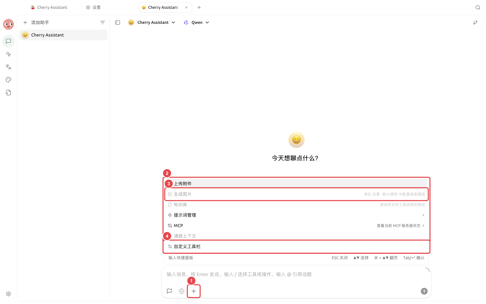
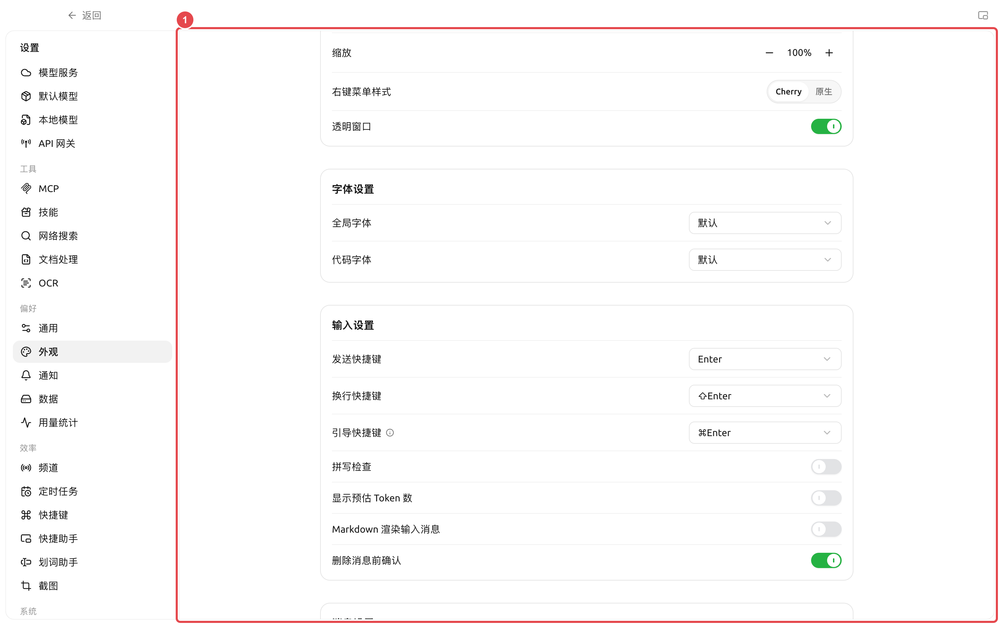

# 入力ツールバーと効率ツール

ツールを固定したのに、別の入力欄に表示されないのはなぜですか？

Chat、Agent、クイックアシスタント、および描画ページではサポートされているツールが異なります。また、Chat と Agent の固定レイアウトはそれぞれ個別に保存されます。対象の入力欄で再度【カスタムツールバー】を開いてください。

<figure><figcaption></figcaption></figure>

<figure><figcaption></figcaption></figure>
