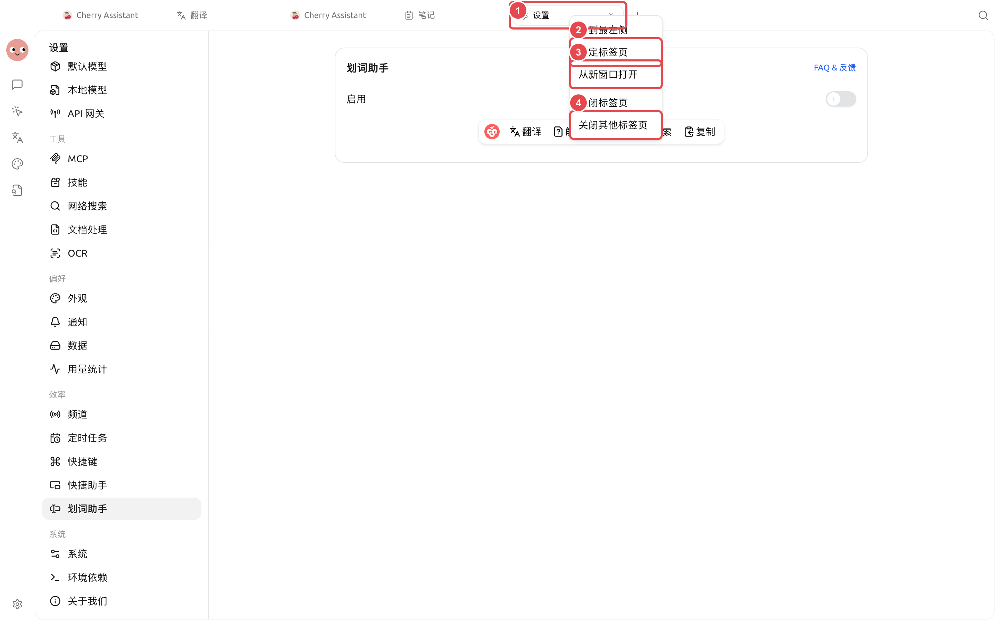

# マルチウィンドウとタブ

チャットトピック、Agent タスク、通常のタブはすべて現在のウィンドウから分離できます。この操作は内容を複製せず、表示位置のみを変更します。

<figure><figcaption>
対象のタブを右クリックし、【新しいウィンドウで開く】を選択します。頻繁に使用するページは先にピン留めし、誤って閉じるのを防ぎます。
</figcaption></figure>

## トピックまたはタスクから開く



### 1. 対象のトピックまたは Agent タスクを見つける

左側のトピックリストまたは Agent タスクリストで、対象の項目を右クリックします。



### 2. 開き方を選択する

【新しいタブで開く】を選択するとメインウィンドウ内に保持されます。【新しいウィンドウで開く】を選択すると独立したウィンドウが作成され、現在のリストは引き続き使用できます。



### 3. 独立ウィンドウの管理

上部の【ウィンドウを最前面に表示】をクリックすると、他のウィンドウの手前に保持されます。【メインウィンドウに戻る】をクリックすると、現在のコンテンツがメインウィンドウに戻され、独立ウィンドウは閉じられます。



## タブから分離する

メインウィンドウ上部のタブを右クリックし、【新しいウィンドウで開く】を選択します。この操作により、そのタブが独立ウィンドウに移動し、メインウィンドウのタブバーから削除されます。

## タブのよく使う操作

* 【最左端に移動】：現在のタブを通常のタブの先頭に移動します。
* 【タブをピン留め】：ピン留めアイコンに縮小し、タブバーの左側に保持します。
* 【他のタブを閉じる】：現在のページのみを残します。
* 【右側のタブを閉じる】：一時的なページをまとめて整理します。
* タブをドラッグ：同種のタブの順序を調整します。

## 使用シーン：資料を確認しながらタスクを監視する

資料のチャットをメインウィンドウに残し、実行中の Agent タスクを【新しいウィンドウで開く】で分離し、タスクウィンドウを最前面に表示します。資料は元のチャット内に残り、タスクもウィンドウ分離によって再開されることはありません。タスク終了後、【メインウィンドウに戻る】をクリックし、独立ウィンドウが長期にわたって蓄積するのを避けます。

### 推奨レイアウト

メインウィンドウで資料と検索を担当し、独立ウィンドウには継続的に監視が必要なタスクを1つだけ保持します。同じプロジェクトのよく使うタブには【タブをピン留め】を使用し、一時的なページは完了後すぐに閉じます。

### 完了基準

資料が元のチャットに戻せること、Agent タスクがウィンドウ分離によって再開されていないこと、タスク終了後にメインウィンドウに戻っているか独立ウィンドウを閉じていること。


ウィンドウを最前面に表示は表示レイヤーのみを変更し、タスクの優先度を上げたり、システムのスリープを防止したりしません。バックグラウンドで継続的に実行する必要がある場合は、Agent の状態とシステムの電源設定を確認してください。


なぜ独立ウィンドウでは非公開の内部タブを新たに開けないのですか？

独立ウィンドウは1つのコンテンツを中心に動作します。他のトピックやタスクを開くには、右クリックメニューから新しいウィンドウを開くか、まず【メインウィンドウに戻る】をクリックしてからタブを管理してください。

