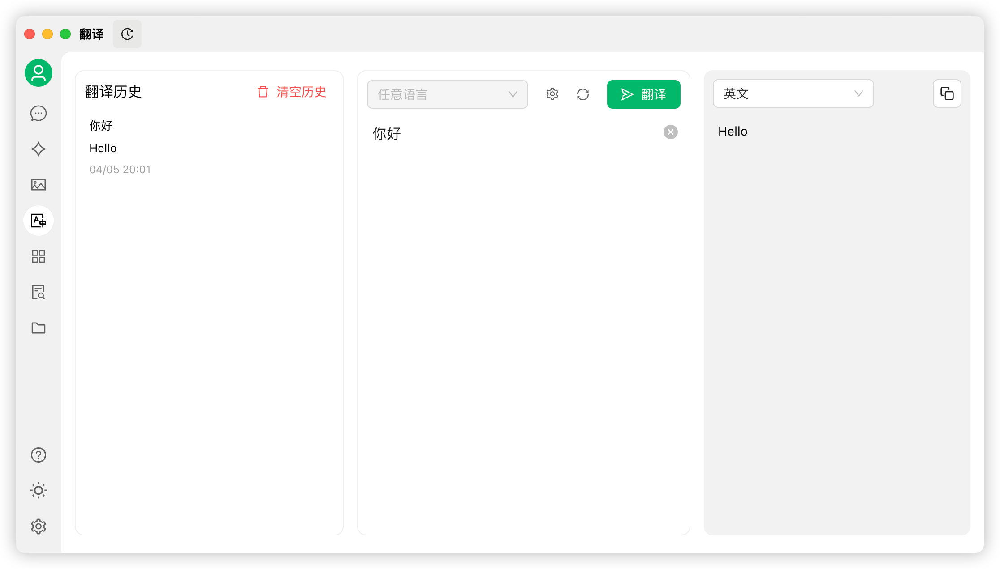

# 翻訳


このドキュメントはAIによって中国語から翻訳されており、まだレビューされていません。


Cherry Studioの翻訳機能は、複数言語間の相互翻訳をサポートする高速かつ正確なテキスト翻訳サービスを提供します。

### インターーフェース概要

<figure><figcaption></figcaption></figure>

翻訳インターフェースは主に以下の要素で構成されています：

1. **ソース言語選択エリア**：
   * 任意の言語：Cherry Studioが自動的にソース言語を識別し翻訳します。
2. **ターゲット言語選択エリア**：
   * ドロップダウンンメニュー：テキストを翻訳したい言語を選択します。
3. **設定ボタン**：
   * クリックすると[デフォルトモデル設定](settings/default-models.md)に移動します。
4. **スクロール同期**：
   * クリックでスクロール同期を切り替え（片側でスクロールすると反対側も連動）。
5. **テキスト入力ボックス（左側）**：
   * 翻訳が必要なテキストを入力または貼り付けます。
6. **翻訳結果ボックス（右側）**：
   * 翻訳されたテキストを表示します。
   * コピーボタン：クリックで翻訳結果をクリップボードにコピーします。
7. **翻訳ボタン**：
   * このボタンをクリックして翻訳を開始します。
8. **翻訳履歴（左上）**：
   * クリックで翻訳履歴を確認できます。

### 使用手順

1. **ターゲット言語の選択**：
   * ターゲット言語選択エリアで翻訳先の言語を選択します。
2. **テキストの入力または貼り付け**：
   * 左側のテキスト入力ボックスに翻訳したいテキストを入力または貼り付けます。
3. **翻訳の開始**：
   * `翻訳` ボタンをクリックします。
4. **結果の確認とコピー**：
   * 翻訳結果が右側のボックスに表示されます。
   * コピーボタンで翻訳結果をクリップボードにコピーします。

### よくある質問 (FAQ)

* **Q: 翻訳が正確でない場合どうすればよいですか？**
  * A: AI翻訳は強力ですが完璧ではありません。専門分野や複雑な文脈のテキストは手動で校正することをお勧めします。別のモデルに切り替えて試すこともできます。
* **Q: 対応言語は何ですか？**
  * A: Cherry Studioの翻訳機能は主要な複数言語に対応しています。対応言語の詳細はCherry Studio公式サイトまたはアプリ内説明をご参照ください。
* **Q: ファイル全体の翻訳は可能ですか？**
  * A: 現在のインターーフェースはテキスト翻訳がメインです。ファイル翻訳が必要な場合は、Cherry Studioの会話ページでファイルを追加して翻訳してください。
* **Q: 翻訳速度が遅い場合はどうすればよいですか？**
  * A: 翻訳速度はネットワーク接続状況、テキストの長さ、サーバー負荷などに影響されます。安定したネットワーク接続を確保し、お待ちください。