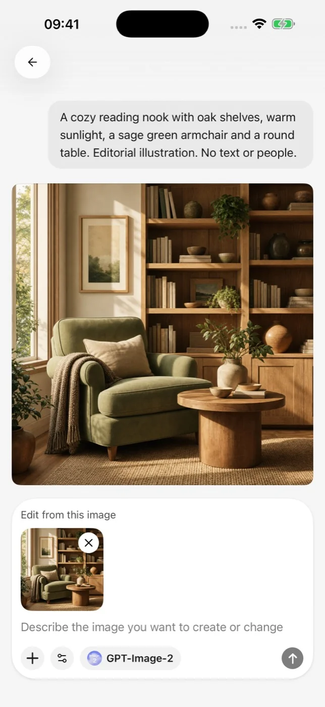
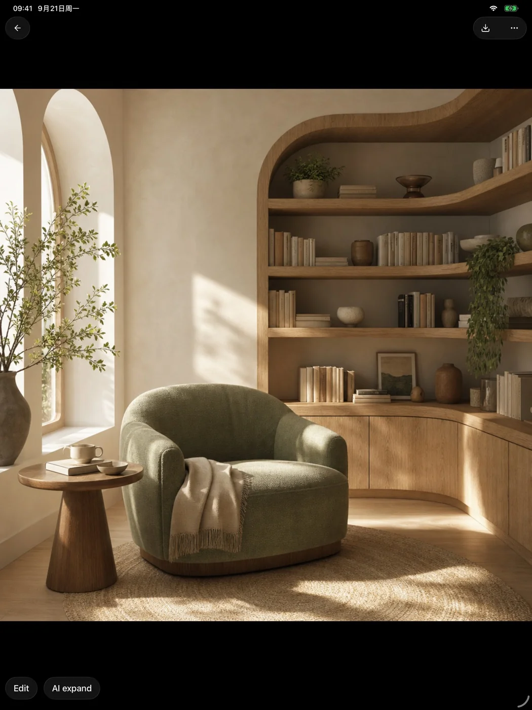

# 画像生成

モバイル版では、設定済みの画像モデルを呼び出して、文章による指示を画像に変換し、結果をプレビューできます。

<figure data-mobile-shot="phone"><figcaption>
<strong>生成</strong> · プロンプトを書き、設定済みの画像モデルを呼び出す
</figcaption></figure>
<figure data-mobile-shot="tablet"><figcaption>
<strong>プレビュー</strong> · 実際の生成結果を確認し、保存または編集を続ける
</figcaption></figure>

## 画像を生成する

1. プロバイダー設定で、画像生成に対応したモデルを追加します。
2. 画像生成を開き、モデルを選びます。
3. 被写体・場面・スタイル・構図を記述します。
4. タスクを送信し、プロバイダーからの結果を待ちます。

画像モデルは通常、チャットモデルとは別に課金されます。生成速度・利用できるサイズ・内容の制限・再試行の規則は、プロバイダーが定めます。

## プロンプトのヒント

まず被写体と用途を書き、次に環境・光・視点・素材・配色・画角を加えます。安定した結果が必要な場合は、うまくいったプロンプトを保存し、一度に 1 つの要素だけを変更してください。

## 生成に失敗する場合

選択したモデルが画像生成に対応しているかを確認し、残高・ネットワーク・プロバイダーのコンテンツポリシーを確認します。タイムアウトした場合は、タスクの状態が確定するまで待ってから再送信し、短時間に何度も同じ要求を送らないでください。
