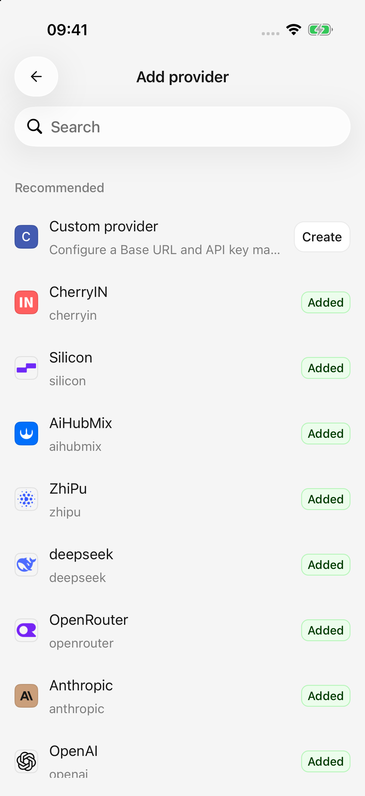
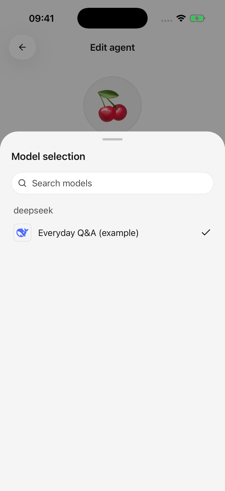

# クイックスタート

まず単純なメッセージに応答する 1 つのモデルを取得し、必要に応じて他の機能を追加します。

## 1. 設定方法を選択します

* **すでに Cherry Studio Desktop を使用していますか?** [コンピューターから構成をインポート](desktop-sync.md) し、モデルを選択してください。インポートが成功したら、以下のステップ 4 に進みます。
* **モバイルでのセットアップ:** オンボーディング中にプロバイダーを選択するか、**設定 → モデルサービス → プロバイダーを追加** を開いて手順 2 ～ 3 に従います。

組み込みプロバイダーには、一般的な接続設定が含まれています。プラットフォームが存在しない場合は、カスタム プロバイダーを使用してください。

## 2. キーを入力して保存します

プラットフォームの **API キー** (モデルを呼び出すために使用される資格情報) を入力します。カスタム プロバイダーには、プラットフォームのベース アドレスと API 形式も必要です。

保存するか、オンボーディングを続行します。ログイン パスワードは API キーではなく、プラットフォームの消費者向けチャット サブスクリプションには API クレジットが含まれていない可能性があります。そこでアカウントを確認してください。

## 3. モデルを追加してプロバイダーを有効にする

モデルリストを取得し、テキストモデルを選択します。検出が失敗した場合は、プラットフォームから正確なモデル ID をコピーし、手動で追加します。

初回はモデル情報のダウンロードに時間がかかる場合があります。プロバイダーが有効になっていることを確認し、会話上部からエージェント編集画面を開いて、有効なモデルを選択します。詳しくは[プロバイダーとモデル](providers-and-models.md)を参照してください。

<figure data-mobile-shot="phone"><figcaption>
<strong>ステップ1 · 英語の画面</strong> · 組み込みプロバイダーを選択するか、カスタムプロバイダーを作成します
</figcaption></figure>
<figure data-mobile-shot="phone"><figcaption>
<strong>ステップ3 · 英語の画面</strong> · エージェント編集画面で有効なモデルを選択します
</figcaption></figure>

## 4. 最初のメッセージを送信する

最初の Cherry エージェントを使用し、モデルを選択して、「私に何ができるかを 3 つの文で説明してください。」と尋ねます。返信により、基本セットアップが機能していることが確認されます。

エージェントは、名前、手順、モデルを含む再利用可能な構成です。同じエージェントと異なるトピックについて個別の会話を開始できます。

何も届かない場合は、添付ファイルなしの短いメッセージを試し、[トラブルシューティング](troubleshooting.md) に従ってください。

## 次は何でしょうか？

| タスク | ガイド |
| --- | --- |
| 写真を理解する、または文書を要約する | [チャットとファイル](chat-and-files.md) |
| 執筆または翻訳用にさまざまな指示を保存する | [エージェントとツール](agents-and-tools.md) |
| Web を検索してソースを検査する | [Web検索とページ閲覧](web-search.md) |
| Feishu、Notion、またはその他のアカウントを接続します | [プラグインと外部ツール](plugins.md) |
| 画像の生成と修正 | [画像生成](image-generation.md) |
| 選択した回答を画像またはドキュメントとして共有する | [共有とエクスポート](sharing-and-export.md) |
