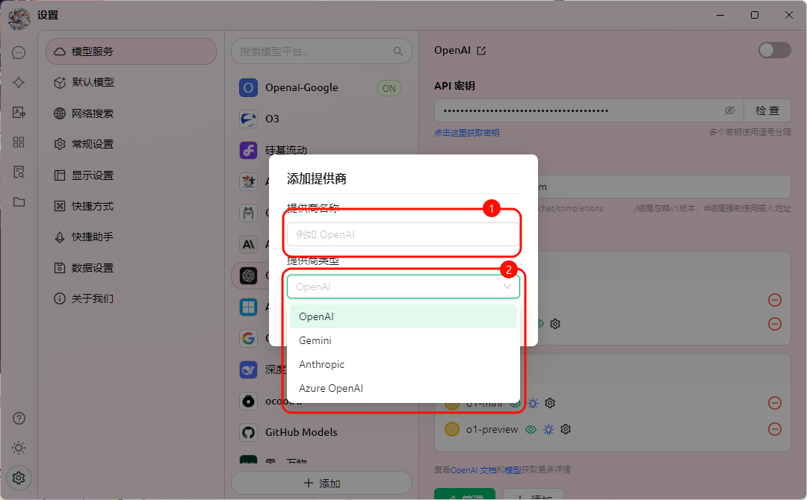
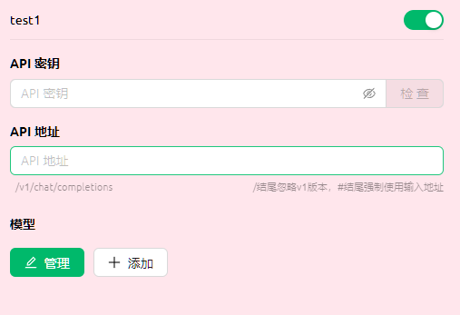
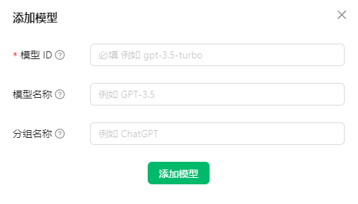

# カスタムプロバイダー



このドキュメントはAIによって中国語から翻訳されており、まだレビューされていません。



Cherry Studio は主要な AI モデルサービスを統合しているだけでなく、強力なカスタマイズ機能を提供します。**カスタム AI プロバイダー**機能を使用すると、必要なあらゆる AI モデルを簡単に接続できます。

## なぜカスタム AI プロバイダーが必要なのか？

* **柔軟性:** 事前設定されたプロバイダーリストに制限されず、ニーズに最適な AI モデルを自由に選択可能
* **多様性:** 様々なプラットフォームの AI モデルを試し、それぞれの強みを発見可能
* **制御性:** API キーとアクセスアドレスを直接管理し、セキュリティとプライバシーを確保
* **カスタマイズ:** プライベートデプロイメントされたモデルを接続し、特定の業務シシナリオに対応

## カスタム AI プロバイダーの追加方法

Cherry Studio にカスタム AI プロバイダーを追加するには、以下の簡単な手順で完了します：

<figure><figcaption></figcaption></figure>

1. **設定を開く:** Cherry Studio インターフェースの左サイドナビゲーションバーで「設定」（歯車アイコン）をクリック
2. **モデルサービスに入る:** 設定ページで「モデルサービス」タブを選択
3. **プロバイダーを追加:** 「モデルサービス」ページの既存プロバイダーリスト下部にある「+ 追加」ボタンをクリックし、「プロバイダーの追加」ポップアップを開く
4. **情報を入力:** ポップアップで以下の情報を入力:
   * **プロバイダー名:** 識別しやすいカスタムプロバイダー名（例: MyCustomOpenAI）
   * **プロバイダータイプ:** ドロップダウンリストからプロバイダータイプを選択。現在サポート:
     * OpenAI
     * Gemini
     * Anthropic
     * Azure OpenAI
5. **設定を保存:** 入力後「追加」ボタンをクリックして設定を保存

## カスタム AI プロバイダーの設定

<figure><figcaption></figcaption></figure>

追加後、リストから追加したプロバイダーを探し詳細設定を実施:

1. **有効状態:** カスタムプロバイダーリスト右端のトグルスイッチでサービスを有効化
2. **API キー:**
   * AI プロバイダーが提供する API キーを入力
   * 右側の「チェック」ボタンでキーの有効性を検証可能
3. **API アドレス:**
   * AI サービスの API アクセスアドレス（Base URL）を入力
   * 必ず AI プロバイダーの公式ドキュメントを参照し正しい API アドレスを取得
4. **モデル管理:**
   * 「+ 追加」ボタンをクリックし、使用したいモデルIDを手動追加（例: `gpt-3.5-turbo`, `gemini-pro` 等）

    <figure><figcaption></figcaption></figure>

   * 具体的なモデル名が不明な場合は AI プロバイダーの公式ドキュメントを参照
   * 「管理」ボタンで追加済みモデルの編集・削除が可能

## 使用開始

上記設定完了後、Cherry Studio のチャットインターフェースでカスタム AI プロバイダーとモデルを選択し、AI との対話を開始できます！

## vLLM をカスタム AI プロバイダーとして使用

vLLM は Ollama に似た高速で使いやすい LLM 推論ライブラリです。Cherry Studio への統合手順:

1. **vLLM のインストール:** vLLM 公式ドキュメント（[https://docs.vllm.ai/en/latest/getting_started/quickstart.html](https://docs.vllm.ai/en/latest/getting_started/quickstart.html)）に従いインストール

    ```sh
    pip install vllm # pip を使用する場合
    uv pip install vllm # uv を使用する場合
    ```
2. **vLLM サービスの起動:** vLLM が提供する OpenAI 互換インターフェースでサービス起動。主に2つの方法:

    * `vllm.entrypoints.openai.api_server` で起動

    ```sh
    python -m vllm.entrypoints.openai.api_server --model gpt2
    ```

    * `uvicorn` で起動

    ```sh
    vllm --model gpt2 --served-model-name gpt2
    ```

サービスが正常に起動し、デフォルトポート `8000` でリスニング状態を確認。`--port` パラメータでポート番号を指定可能。

3. **Cherry Studio に vLLM プロバイダーを追加:**
   * 前述の手順に従い新規カスタム AI プロバイダーを追加
   * **プロバイダー名:** `vLLM`
   * **プロバイダータイプ:** `OpenAI` を選択
4. **vLLM プロバイダーの設定:**
   * **API キー:** vLLM は API キー不要のため空白、または任意の文字列を入力
   * **API アドレス:** vLLM サービスの API アドレスを入力。デフォルトは `http://localhost:8000/`（異なるポート使用時は調整）
   * **モデル管理:** vLLM にロードしたモデル名を追加。上記 `python -m vllm.entrypoints.openai.api_server --model gpt2` の例では `gpt2` を入力
5. **対話開始:** Cherry Studio で vLLM プロバイダーと `gpt2` モデルを選択し、vLLM 駆動の LLM と対話可能！

## ヒントとテクニック

* **ドキュメント精読:** カスタムプロバイダー追加前に、使用する AI プロバイダーの公式ドキュメントで API キー・アクセスアドレス・モデル名等を必ず確認
* **API キーチェック:** 「チェック」ボタンで API キーの有効性を迅速に検証し、キーエラーによる利用不能を回避
* **API アドレス注意:** AI プロバイダーやモデルによって API アドレスが異なるため、必ず正しいアドレスを入力
* **必要なモデルのみ追加:** 実際に使用するモデルのみ追加し、不要なモデルの大量追加を避ける