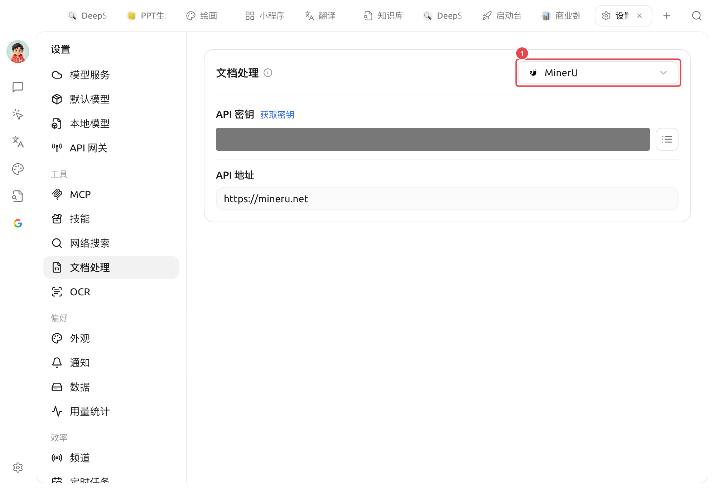

# ドキュメント処理

簡単に言うと、**これは Cherry Studio が「PDF / 複雑なレイアウトのドキュメント」を整理されたテキストに変換するための中央設定です。**

表、複数カラム、スキャンページを含む PDF（学術論文、契約書、調査レポートなど）をそのままモデルに渡すと、読み取りが乱れがちです。ドキュメント処理では、専用の解析エンジンを使ってこれらを構造が明確なテキストに変換し、その後、対話や [ナレッジベース](../../knowledge-base/knowledge-base.md) で使用します。


**ドキュメント処理と OCR**：これらは別々の設定ページです。

* **ドキュメント処理**（このページ）：**PDF / 複雑なレイアウトのドキュメント** の構造化解析を担当します。
* **[OCR](ocr.md)**：**画像 / スキャンデータ** 内の文字認識を担当します。

通常のプレーンテキスト PDF、`.md`/`.txt`/`.docx` 内のテキスト段落については、どちらも不要で、そのまま読み取れます。


### 設定へのアクセス

【設定】→【ドキュメント処理】を開き、右上のドロップダウンから解析エンジンを選択します。**選択したエンジンがデフォルトとなります。**

<figure><figcaption>
ドキュメント処理設定：① 右上のドロップダウンで解析エンジンを選択（デフォルトは MinerU）；下部に選択したエンジンの API キーと API アドレスを入力
</figcaption></figure>

### 組み込み解析エンジン

ドキュメント処理には 5 つのエンジンが組み込まれており、デフォルトは **MinerU** です：

| エンジン | 説明 | 接続方法 |
| --- | --- | --- |
| **MinerU**（デフォルト） | OpenDataLab が提供する高品質な PDF 抽出ツール | API キー（[mineru.net/apiManage](https://mineru.net/apiManage)）|
| **PaddleOCR** | Baidu PaddlePaddle の OCR 認識システム | API キーを入力（[PaddlePaddle 星河コミュニティ](https://aistudio.baidu.com/paddleocr/)）；セルフホスティングの場合は API アドレスを自分のサービスに設定 |
| **Doc2x** | 高度なファイル復元エンジン | API キー（[open.noedgeai.com](https://open.noedgeai.com/apiKeys)）|
| **Mistral** | ファイル解析・理解サービス | API キー（[mistral.ai](https://mistral.ai/api-keys)）|
| **Open MinerU** | セルフホスティング可能な MinerU サービス。処理パイプラインを自分で制御したいチーム向け | セルフホスティング後、API アドレスを入力（必要に応じて API キーを入力）|

### MinerU の設定（デフォルト構成）



### API キーの入力

【API キー】フィールドに MinerU で申請したキーを入力します（右側の「キーを取得」をクリックすると申請ページに移動します。複数のキーはカンマで区切れます）。



### API アドレスの確認

【API アドレス】はデフォルトのままにしてください。



### ナレッジベース / 対話での直接使用

複雑な PDF をインポートすると、ここでの解析設定が自動的に適用されます。ナレッジベースや対話に切り替える際に追加の設定は不要です。




**他のエンジンへの切り替え**：ドロップダウンから選択し、そのエンジンの【API キー】/【API アドレス】を入力すれば、選択したものがデフォルトになります。そのうち **PaddleOCR** と **Open MinerU** はセルフホスティングに対応しています——デプロイ後、【API アドレス】に自分のサービスアドレスを入力してください。


### ナレッジベースとの関係

* ドキュメント処理は「複雑なドキュメント → 整理されたテキスト」の変換のみを担当します；
* 変換後のテキストは引き続き [埋め込みモデル](../../knowledge-base/emb-models-info.md) によるベクトル化、データベースへの登録が行われます；
* 「ナレッジベースでの有効化」の詳細な手順は [ナレッジベースのドキュメント前処理](../../knowledge-base/document-preprocessing.md) を参照してください。

### ヒントとテクニック

* MinerU は、表 / 複数カラムレイアウトを含む PDF に対して効果が顕著です。学術論文などではまずこちらをおすすめします；
* 認識したいのが **画像内の文字**（スクリーンショット、スキャンデータ）であり、PDF の構造ではない場合は、[OCR](ocr.md) を使用してください。

***

### ヘルプの取得とフィードバックの送信

設定や使用過程で疑問、バグ、機能改善の提案がある場合は、[フィードバックと提案](../../question-contact/suggestions.md) に記載されている公式チャネルを参照してください。
