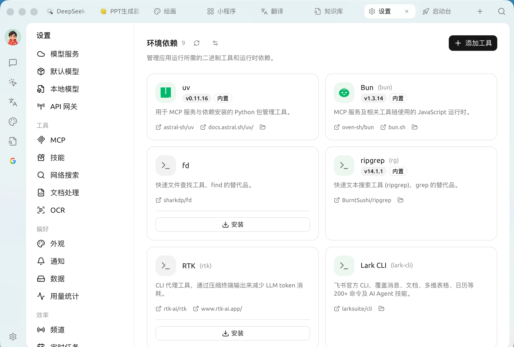

# 環境依存

環境依存は、**Cherry Studio が一部の高度な機能を実行するために必要なバイナリツールとランタイムを管理**するために使用されます。[MCP サービス](../../../../advanced-basic/extensions/mcp)、[スキル](../../advanced-basic/extensions/skills.md)、[Agent](../../advanced-basic/agent.md) の一部の機能は、`uv` や `bun` などのコマンドラインツールを呼び出す必要があります。Cherry Studio はこれらをここに集約しており、コマンドラインで手動インストールや設定を行う必要はありません。

`設定 → 環境依存関係` を開きます：

<figure><figcaption>
環境依存：組み込みおよびインストール可能なツール
</figcaption></figure>

### 組み込みおよびインストール可能

各ツールはカード形式で表示され、状態が示されます：

* <mark style="color:blue;">**組み込み**</mark> と表示されているツールは Cherry Studio に同梱されており、すぐに使用でき、操作は不要です。
* 未インストールのツールカードには **インストール** ボタンが表示され、クリックすると Cherry Studio が自動的にダウンロードしてアプリディレクトリにインストールします。システム環境を汚染しません。
* カードにはソースリポジトリ、公式ドキュメントへのリンク、およびローカルインストールディレクトリを開く入口が提供されています。

一般的なツールの一覧：

| ツール | 用途 |
| --- | --- |
| **uv** | MCP サービスと依存関係のインストールに使用される Python パッケージ管理ツール |
| **Bun** | MCP サービスおよび関連ツールチェーンで使用される JavaScript ランタイム |
| **fd** | 高速ファイル検索ツール、`find` の代替 |
| **ripgrep (rg)** | 高速テキスト検索ツール、`grep` の代替 |
| **RTK** | ターミナル出力を圧縮し、LLM のトークン消費を削減する CLI プロキシツール |
| **Lark CLI** | 飛書公式 CLI。メッセージ / ドキュメント / マルチディメンションテーブル / カレンダーなど 200 以上のコマンドをカバー |

ページには `gh`（GitHub CLI）、`ntn`（Notion CLI）、`pi` などのツールもカード形式でリストされており、必要に応じてワンクリックでインストールできます。（Claude Code / Codex などのプログラミング系 CLI は [コーディングパートナー](../../cherrystudio/preview/code-cli.md) ページで管理され、このページには含まれません。）

### ツールの追加

ページ右上の「**ツールの追加**」は mise ツールキーを使用し、組み込みリスト以外のツール（例：`github:sharkdp/fd`、`uv`、`bun`）を追加できます。

### 高度なインストール設定

右上の設定アイコンをクリックして「**高度なインストール設定**」を開き、ツールのダウンロード方法を微調整します（フィールドはすべて空欄にしてデフォルトを使用できます）：

* **GitHub ミラー**：GitHub Release のダウンロードにプロキシプレフィックスを追加します（例：`https://ghfast.top`）。直接接続が不安定な場合に使用します。
* **GitHub トークン**：ツールクエリ時の GitHub API レート制限を向上させます（ローカルに平文で保存されます）。
* **npm ミラーソース / pip インデックスアドレス**：`npm:` / `pipx:` 系のツールにミラーを設定します（空欄の場合、中国大陸では自動的にミラーが選択されます）。
* **ツール署名の検証**：ツールの Sigstore / SLSA 署名を検証します。通常は有効のままにしてください。


一般ユーザーは通常、ここで操作する必要はありません——特定のツールが必要な場合、関連機能（例：特定の MCP サービスのインストール）が通常、ここに戻ってワンクリックでインストールするよう誘導します。このページは「実行環境のチェックと補完」の入口のようなものです。



特定の MCP サービスやスキルで「uv / bun / コマンドが見つかりません」などのエラーが表示された場合、まずここに来て、対応するツールがインストール済みまたは「組み込み」状態であることを確認してください（インストール状態は自動的に更新されます。右上のボタンは **更新の確認** で、ツールの最新バージョンを取得するために使用されます）。


***

### ヘルプの取得とフィードバックの送信

設定や使用過程で疑問、バグ、または機能改善の提案がある場合は、[フィードバックと提案](../../question-contact/suggestions.md) で提供されている公式チャネルを参照してください。
