# Introdução do Projeto


Este documento foi traduzido do chinês por IA e ainda não foi revisado.


<figure><figcaption></figcaption></figure>

Siga nossas redes sociais: [Twitter(X)](https://x.com/CherryStudioHQ)、[Xiaohongshu](https://www.xiaohongshu.com/user/profile/662b6853000000000b031d9a)、[Weibo](https://weibo.com/u/7975656228)、[Bilibili](https://space.bilibili.com/3546657515898892)、[Douyin](https://www.douyin.com/user/MS4wLjABAAAAmw9A54m5J0hHVMQY5eGrVJ-EHDoOS0hgJ6M1F9MN2Tn2V163A0xrC4_KVzfmQSxC)

Junte-se às nossas comunidades: [Grupo QQ(575014769)](https://qm.qq.com/q/lo0D4qVZKi)、[Telegram](https://t.me/CherryStudioAI)、[Discord](https://discord.gg/wez8HtpxqQ)、[Grupo WeChat (clique para ver)](https://www.cherry-ai.com/#Community)

***

Cherry Studio é uma plataforma completa de assistente de IA que integra múltiplas funcionalidades, incluindo conversas multimodelo, gerenciamento de base de conhecimento, pintura com IA e tradução.  
Com seu design altamente personalizável, poderosa capacidade de expansão e experiência de usuário amigável, o Cherry Studio é a escolha ideal para usuários profissionais e entusiastas de IA. Tanto iniciantes quanto desenvolvedores podem encontrar recursos de IA adequados para melhorar a eficiência no trabalho e a criatividade.

***

### **Funcionalidades e Características Principais**

#### **1. Funções Básicas de Conversação**

* **Respostas Múltiplas**: Suporta geração simultânea de respostas por múltiplos modelos para a mesma pergunta, facilitando a comparação de desempenho entre modelos. Detalhes em [Interface de Conversação](cherrystudio/preview/chat.md).

<figure>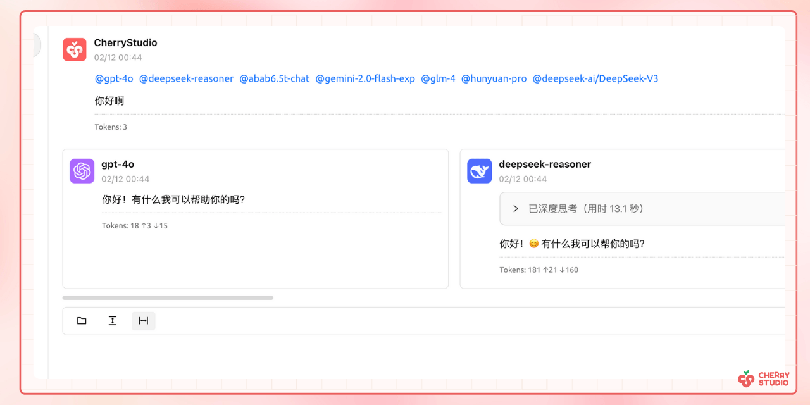<figcaption></figcaption></figure>

* **Agrupamento Automático**: Históricos de conversa são automaticamente organizados por assistente para fácil recuperação.
* **Exportação de Conversas**: Permite exportar conversas completas ou parciais em múltiplos formatos (Markdown, Word, etc.).
* **Parâmetros Personalizáveis**: Além de ajustes básicos, suporta parâmetros personalizados para necessidades específicas.

<figure>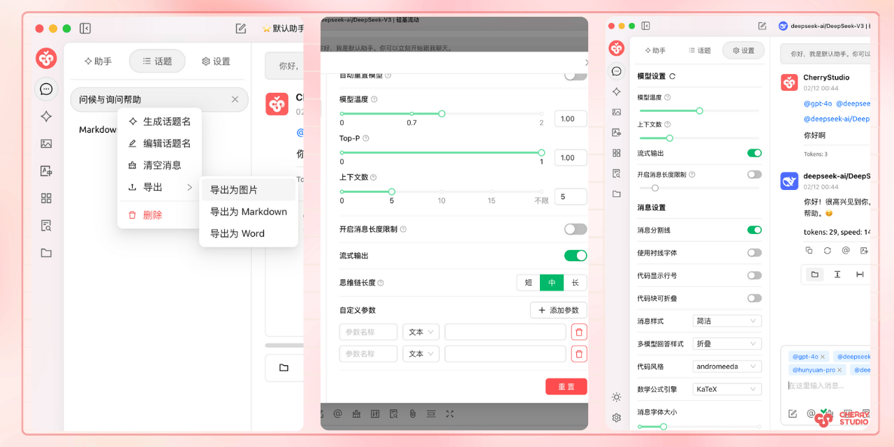<figcaption></figcaption></figure>

* **Mercado de Assistentes**: Inclui milhares de assistentes especializados por setor (tradução, programação, redação) e permite criação personalizada.

<figure>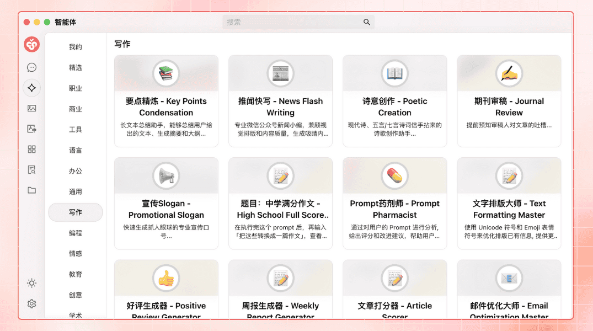<figcaption></figcaption></figure>

* **Renderização Multiformato**: Suporta Markdown, fórmulas matemáticas e pré-visualização HTML para melhor exibição de conteúdo.

<figure>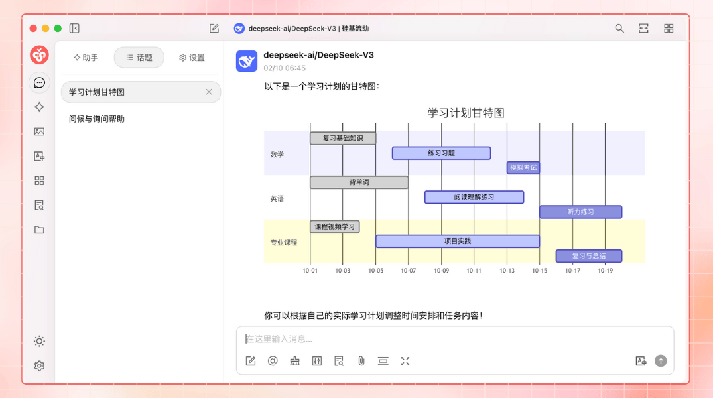<figcaption></figcaption></figure>

#### **2. Integração de Recursos Especiais**

* **Pintura com IA**: Painel dedicado para geração de imagens de alta qualidade através de descrições em linguagem natural.

<figure>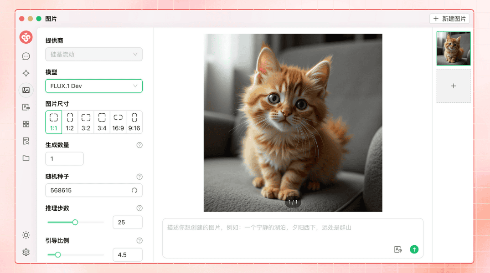<figcaption></figcaption></figure>

* **Mini Programas de IA**: Integra ferramentas de IA gratuitas para uso direto sem alternar entre navegadores.
* **Função de Tradução**: Painel de tradução dedicado, tradução em conversas e tradução de prompts.
* **Gerenciamento de Arquivos**: Arquivos de conversas, pinturas e bases de conhecimento organizados por categoria.

<figure>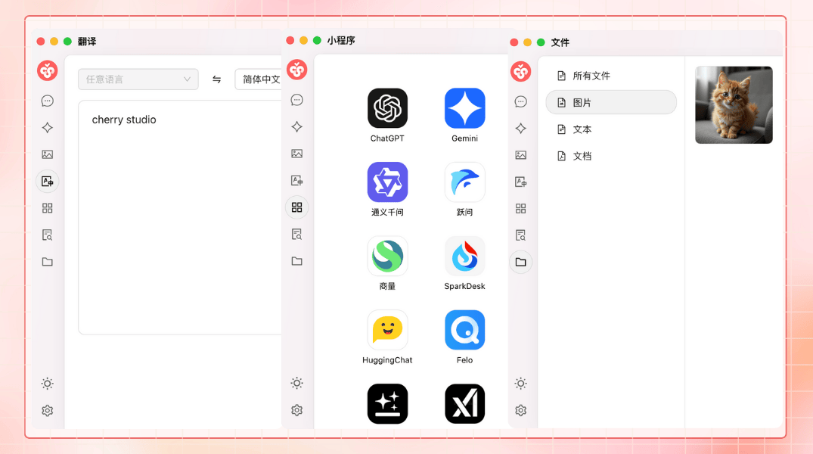<figcaption></figcaption></figure>

* **Busca Global**: Localização rápida de históricos e conteúdo da base de conhecimento.

<figure>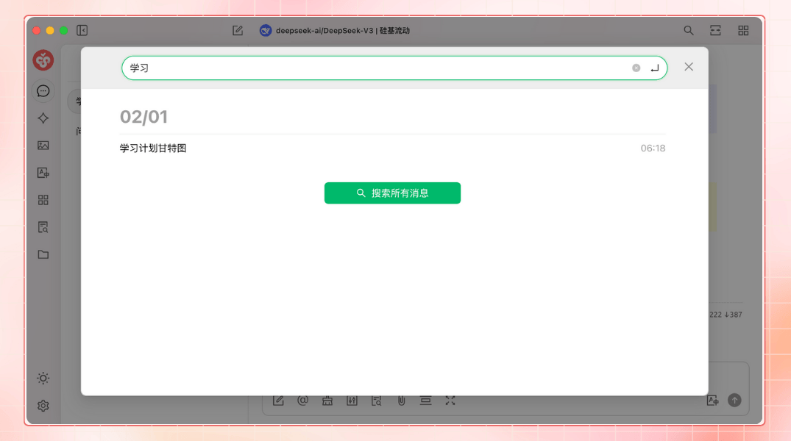<figcaption></figcaption></figure>

#### **3. Mecanismo Unificado de Gerenciamento de Provedores**

* **Agregação de Modelos**: Suporta modelos principais de provedores como OpenAI, Gemini, Anthropic e Azure.
* **Obtenção Automática de Modelos**: Lista completa de modelos disponível com um clique.
* **Rotação de Múltiplas Chaves**: Evita limitações de taxa usando várias chaves de API alternadamente.
* **Avatares Personalizados**: Cada modelo recebe automaticamente um avatar exclusivo.
* **Provedores Personalizados**: Compatível com provedores terceiros seguindo padrões OpenAI/Gemini/Anthropic.

<figure>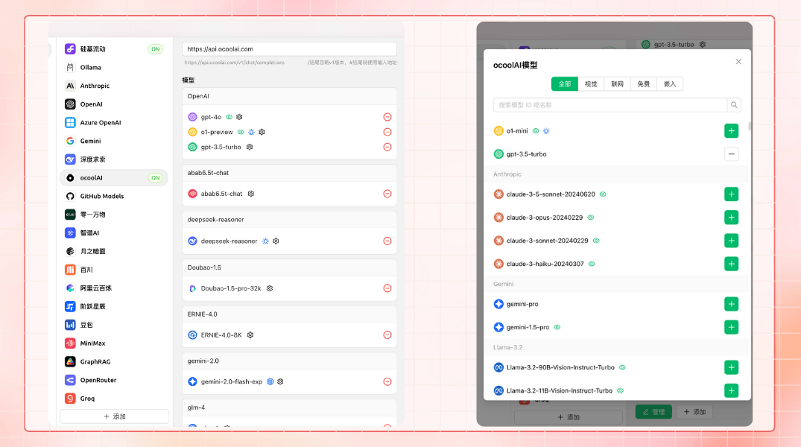<figcaption></figcaption></figure>

#### **4. Interface e Layout Altamente Personalizáveis**

* **CSS Personalizado**: Personalização global de estilos para interface única.
* **Layout de Conversa Personalizável**: Suporta layouts em lista ou estilo bolha com estilos de mensagem customizáveis.
* **Avatares Personalizados**: Define avatares para o software e assistentes.
* **Menu Lateral Personalizado**: Ocultar ou ordenar funcionalidades conforme necessidade.

<figure>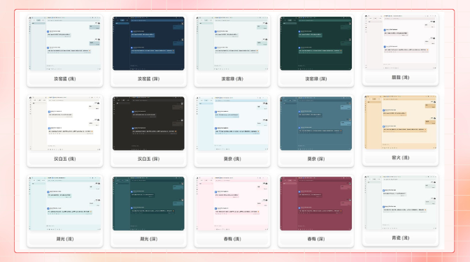<figcaption></figcaption></figure>

#### **5. Sistema Local de Base de Conhecimento**

* **Suporte Multiformato**: Importação de PDF, DOCX, PPTX, XLSX, TXT, MD, etc.
* **Múltiplas Fontes**: Arquivos locais, URLs, mapas de site e conteúdo manual.
* **Exportação de Base de Conhecimento**: Compartilhe bases processadas com outros usuários.
* **Verificação de Busca**: Teste de recuperação em tempo real após importação.

<figure>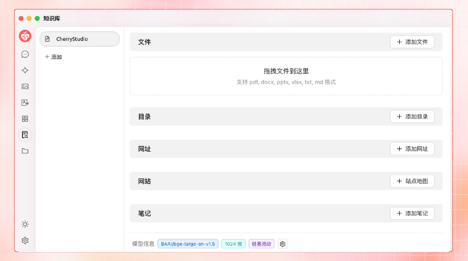<figcaption></figcaption></figure>

#### **6. Recursos de Foco Especial**

* **Perguntas Rápidas**: Acesse assistentes instantâneos em qualquer contexto (WeChat, navegador).
* **Tradução Rápida**: Tradução instantânea de palavras ou textos em outros cenários.
* **Resumo de Conteúdo**: Síntese rápida de textos longos.
* **Explicação Simplificada**: Esclareça dúvidas sem prompts complexos.

<figure>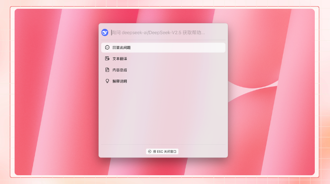<figcaption></figcaption></figure>

#### **7. Garantia de Dados**

* **Múltiplos Planos de Backup**: Backup local, WebDAV e agendado para segurança.
* **Segurança de Dados**: Uso totalmente local combinado com modelos locais evita vazamentos.

***

### **Vantagens do Projeto**

1. **Amigável para Iniciantes**: Baixa barreira técnica para focar em trabalho, estudo ou criação.
2. **Documentação Completa**: Manuais detalhados de uso e solução de problemas.
3. **Iteração Contínua**: Resposta ativa ao feedback para otimização constante.
4. **Código Aberto e Extensibilidade**: Personalização via código aberto para necessidades específicas.

***

### **Cenários de Aplicação**

* **Gestão e Consulta de Conhecimento**: Construção rápida de bases especializadas para pesquisa/educação.
* **Conversas e Criação Multimodelo**: Obtenção rápida de informações e geração de conteúdo.
* **Tradução e Automação de Escritório**: Assistente de tradução e processamento de documentos.
* **Pintura e Design com IA**: Geração de imagens para necessidades criativas.

### Star History

[Star History](https://cherrystarhistory.ocool.online/)

## Siga Nossas Redes Sociais

<table data-view="cards"><thead><tr><th></th><th data-hidden data-card-cover data-type="files"></th><th data-hidden data-card-target data-type="content-ref"></th></tr></thead><tbody><tr><td><a href="https://www.xiaohongshu.com/user/profile/662b6853000000000b031d9a?xsec_token=YB_1nKvlH4r5hPYVVbbsNHF8Y6n6AKlm5-DaggPCtd2DQ%3D&#x26;xsec_source=app_share&#x26;xhsshare=CopyLink&#x26;appuid=662b6853000000000b031d9a&#x26;apptime=1738627324&#x26;share_id=ace5db41b5954fab8d98a2a7865a62bc&#x26;share_channel=copy_link">Xiaohongshu</a></td><td><a href=".gitbook/assets/1.webp">1.png</a></td><td><a href="https://www.xiaohongshu.com/user/profile/662b6853000000000b031d9a?xsec_token=YB_1nKvlH4r5hPYVVbbsNHF8Y6n6AKlm5-DaggPCtd2DQ%3D&#x26;xsec_source=app_share&#x26;xhsshare=CopyLink&#x26;appuid=662b6853000000000b031d9a&#x26;apptime=1738627324&#x26;share_id=ace5db41b5954fab8d98a2a7865a62bc&#x26;share_channel=copy_link">https://www.xiaohongshu.com/user/profile/662b6853000000000b031d9a?xsec_token=YB_1nKvlH4r5hPYVVbbsNHF8Y6n6AKlm5-DaggPCtd2DQ%3D&#x26;xsec_source=app_share&#x26;xhsshare=CopyLink&#x26;appuid=662b6853000000000b031d9a&#x26;apptime=1738627324&#x26;share_id=ace5db41b5954fab8d98a2a7865a62bc&#x26;share_channel=copy_link</a></td></tr><tr><td><a href="https://b23.tv/hIfGgDW">Bilibili</a></td><td><a href=".gitbook/assets/3.webp">3.png</a></td><td><a href="https://b23.tv/hIfGgDW">https://b23.tv/hIfGgDW</a></td></tr><tr><td><a href="https://weibo.com/u/7975656228">Weibo</a></td><td><a href=".gitbook/assets/2.webp">2.png</a></td><td><a href="https://weibo.com/u/7975656228">https://weibo.com/u/7975656228</a></td></tr><tr><td><a href="https://v.douyin.com/ifTpX4X7">Douyin</a></td><td><a href=".gitbook/assets/4.webp">4.png</a></td><td><a href="https://v.douyin.com/ifTpX4X7">https://v.douyin.com/ifTpX4X7</a></td></tr><tr><td><a href="https://x.com/CherryStudioHQ?t=DYR0ulaLur-bO4Us3bG79A&#x26;s=05">Twitter(X)</a></td><td><a href=".gitbook/assets/5.webp">5.png</a></td><td><a href="https://x.com/CherryStudioHQ?t=DYR0ulaLur-bO4Us3bG79A&#x26;s=05">https://x.com/CherryStudioHQ?t=DYR0ulaLur-bO4Us3bG79A&#x26;s=05</a></td></tr></tbody></table>