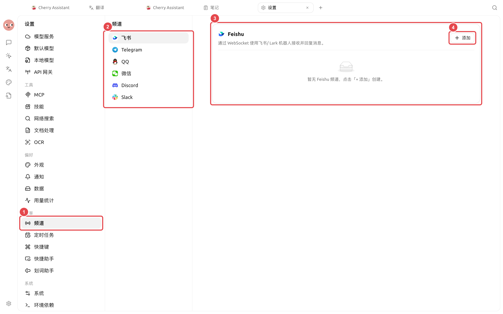
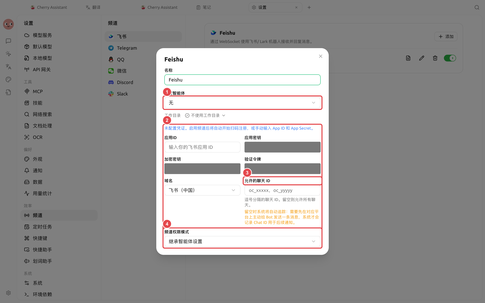

# Canais

Um canal conecta um Agent a uma plataforma de mensagens externa. Atualmente, é possível configurar Feishu, Telegram, QQ, WeChat, Discord e Slack; cada plataforma requer credenciais de bot e identificadores de sessão diferentes.


Recomenda-se primeiro informar ao Agent na seção [Trabalho]: "Configure um canal Feishu para o Agent atual, para receber mensagens de grupo e enviar resultados de tarefas." O Agent solicitará as informações necessárias conforme o uso, o que é mais rápido do que lidar diretamente com todos os campos das plataformas. Para modificações precisas, use [Configurações] → [Canais].


<figure><figcaption>
Selecione primeiro a plataforma a ser integrada e clique em [Adicionar]; as contas e credenciais necessárias variam conforme a plataforma. 
</figcaption></figure>

## Caminho de configuração manual

[Configurações] → [Canais] → Selecione a plataforma → [Adicionar].



### 1. Preparar a conta da plataforma

Crie o bot ou aplicativo conforme as regras da plataforma. Para Feishu e WeChat, quando suportarem fluxos de QR Code, você pode concluí-los seguindo as instruções da interface após ativar o canal; para outras plataformas, preencha o Token correspondente ou as credenciais do aplicativo.



<figure><figcaption>
Vincule primeiro um Agent testado e restrinja o escopo de chats permitidos; abra apenas as credenciais e permissões necessárias para concluir a tarefa. 
</figcaption></figure>

### 2. Vincular Agent e área de trabalho

Selecione um Agent já validado como funcional e especifique a área de trabalho para as mensagens do canal. As mensagens externas serão executadas neste contexto; não selecione diretórios que contenham arquivos sensíveis irrelevantes.



### 3. Restringir as origens das mensagens

Preencha os IDs de Chat, IDs de canal ou IDs de usuário permitidos. Deixar em branco pode significar permitir todos, conforme a descrição dos campos da plataforma atual. Você pode enviar `/whoami` para o bot para obter o identificador no formato correto.



### 4. Selecionar o modo de permissão e ativar

O padrão é [Herdar configurações do Agent]. Grupos públicos, grupos com múltiplos usuários ou fontes não confiáveis devem usar um modo mais estrito. Após ativar, envie primeiro uma mensagem de teste sem efeitos colaterais.



## Configuração recomendada

| Item de configuração | Padrão do produto | Ponto de partida sugerido | Função | Cenário aplicável | Observações |
| -------- | --------- | --------------- | ------------ | --------- | ---------------- |
| Agent vinculado | Necessário selecionar | Prepare um Agent dedicado para o canal | Determina quem processa a mensagem | Chat em grupo, chat privado com bot | Não misture com Agent de desenvolvimento com altas permissões |
| Área de trabalho | Necessário selecionar | Use um diretório dedicado sem dados pessoais | Limita os arquivos processáveis | Coleta em grupo, entrega de relatórios diários | Não selecione o diretório principal do usuário |
| Origens de mensagens permitidas | Depende dos campos da plataforma | Inicialmente, permita apenas contas ou grupos de teste | Restringe quem pode acionar o Agent | Testes internos, grupos de equipe | Leia a descrição dos campos antes de deixar em branco |
| Modo de permissão | [Herdar configurações do Agent] | Use aprovação mais estrita para entradas externas | Controla operações de ferramentas | Grupos públicos, grupos com múltiplos usuários | Não recomendado usar [Acesso total] |

## Cenário de uso: Grupo de plantão da equipe

Crie um Agent que processe apenas o manual de plantão, vincule um banco de conhecimento testado para recuperação e uma área de trabalho dedicada, permitindo apenas o grupo de plantão para acionamento. Teste primeiro mensagens do tipo "consultar uma política" e "não encontrar resposta", e depois teste a geração de um resumo de passagem de plantão sem informações sensíveis.

### Critérios de conclusão

Origens não permitidas não podem acionar tarefas; as respostas devem retornar ao grupo especificado; quando o banco de conhecimento não tiver conteúdo, isso deve ser explicitado; a gravação de arquivos ainda solicitará aprovação.

## Pontos focais de configuração por plataforma

| Plataforma | Credenciais principais | Foco do escopo da sessão |
| --------- | ----------------------- | ------------------ |
| Feishu / Lark | App ID, App Secret, ou fluxo de QR Code | ID de chat e domínio nacional/internacional |
| Telegram | Bot Token | Chat ID |
| QQ | App ID, Client Secret | Formato de identificação para chat privado, grupo ou canal |
| WeChat | Login por QR Code ou caminho de credenciais | IDs de usuários permitidos |
| Discord | Bot Token | ID de canal ou chat privado |
| Slack | Bot Token, App Token | Socket Mode e ID de canal |


Tokens de bot, App Secret e tokens de verificação são equivalentes a senhas de conta. Não os insira na memória de longo prazo do Agent, em prompts de tarefas, capturas de tela ou Issues públicos; em caso de vazamento, revogue e regenere imediatamente na plataforma.


O que fazer se não conseguir selecionar o canal como destino de recebimento em tarefas agendadas? 

Primeiro, envie ativamente uma mensagem para o bot na plataforma correspondente para que o Cherry Studio registre o Chat ID disponível, e depois volte à tarefa agendada para selecionar o destino da notificação.

O que fazer se o canal estiver conectado, mas não responder? 

Verifique os IDs de sessão permitidos, o Agent vinculado, a área de trabalho e o modo de permissão, e depois consulte os logs do canal. Se a plataforma recebeu a mensagem, mas o Agent não executou, continue verificando o gateway de API e o status da tarefa do Agent.

