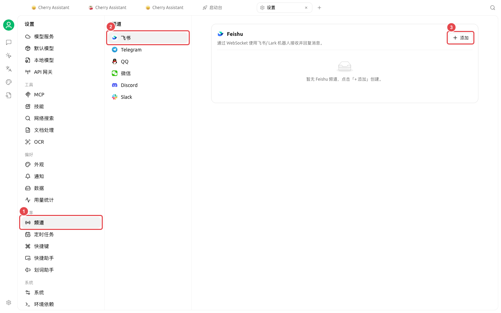
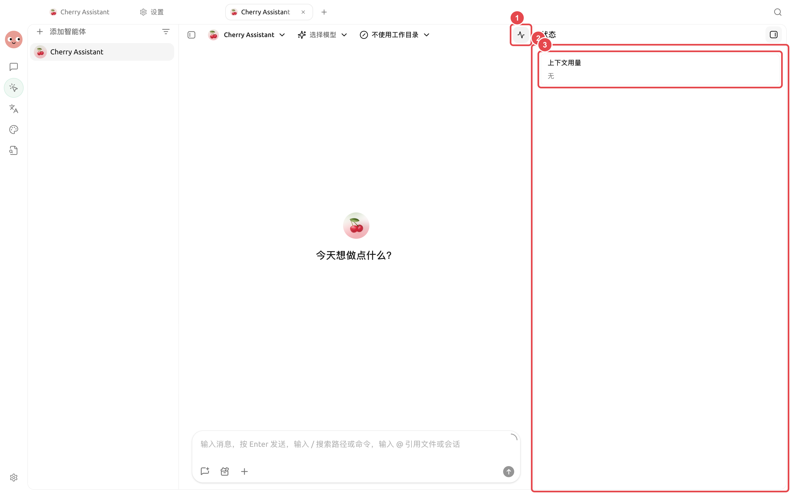
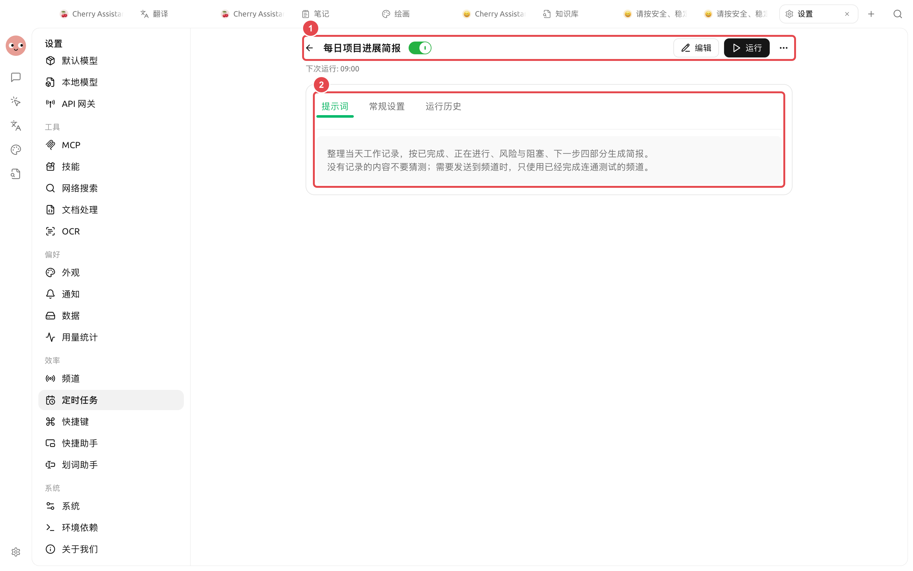

# Canais e relatório diário agendado

A equipe de operações deseja que, automaticamente, em cada manhã de dia útil, os materiais especificados sejam resumidos, um relatório diário seja gerado e enviado ao canal da equipe. Antes de automatizar, execute manualmente um relatório para identificar precocemente problemas como dados ausentes, caminhos incorretos e destinos de notificação.

## O que preparar primeiro

* Um Agent de relatório diário já validado em [Trabalho];
* Fontes de dados claras e um diretório de trabalho contendo apenas os materiais necessários;
* Formatos fixos podem ser configurados como habilidades;
* Um canal conectado com escopo de mensagens limitado;
* Uma tarefa agendada para dias úteis.

<figure><figcaption><p>Primeiro vincule o relatório diário a um canal testado, depois selecione-o como destino de notificação da tarefa agendada. </p></figcaption></figure>

<figure><figcaption><p>Após a primeira execução automática, verifique se a tarefa foi realmente concluída pelo status do Agent e pelos registros de execução. </p></figcaption></figure>

<figure><figcaption><p>① A tarefa está ativada e exibe o horário da próxima execução; ② O prompt define claramente a estrutura de quatro seções, o tratamento de dados ausentes e as condições de envio ao canal. </p></figcaption></figure>

## Etapas de configuração



### 1. Gerar manualmente um relatório diário

Solicite ao Agent que produza quatro seções: "Progresso, Métricas, Riscos e Pendências". Verifique se, em caso de dados ausentes, o Agent explica claramente a ausência em vez de inventar conteúdo.



### 2. Configurar o canal de notificação

Priorize informar na conversa com o Agent a plataforma e o grupo a serem conectados, depois verifique em [Configurações] → [Canais] as credenciais, os IDs de sessão permitidos, o workspace e o modo de permissões.



### 3. Criar a tarefa agendada

Peça ao Agent para criar um plano para dias úteis, ou abra [Configurações] → [Tarefas Agendadas] → [Nova]. Selecione o Agent do relatório diário, o diretório de trabalho, o horário de execução e o canal de notificação.



### 4. Testar imediatamente

Após salvar, clique em [Executar] e verifique a sessão gerada, o histórico de execução e as mensagens no canal. Não espere até o dia seguinte para descobrir erros de caminho ou de destino de recebimento.



### 5. Observar e ajustar

Nas primeiras execuções, verifique o tempo de execução, o uso e as causas de falha. Quando as fontes de dados ou o formato da equipe mudarem, atualize a habilidade ou o prompt da tarefa; não mantenha regras conflitantes em múltiplos locais.



## Exemplo de prompt de tarefa

```
Leia os dados adicionados ontem ao diretório de trabalho e gere um relatório operacional diário em chinês com progresso, indicadores principais, anomalias e tarefas de hoje. Se faltarem dados, escreva “Sem dados” e liste os arquivos ausentes sem inventar valores. Envie o resultado ao canal da equipe configurado e mantenha uma cópia em Markdown no diretório.
```

## Tratamento de falhas

| Fenômeno | Local de verificação |
| ------ | --------------------- |
| Não executou | Status da tarefa agendada, horário da próxima execução, suspensão do sistema |
| Falha na execução | [Histórico de Execução] → [Ver Sessão] |
| Arquivo não gerado | Diretório de trabalho, solicitações de permissão e ferramentas de arquivo do Agent |
| Mensagem não entregue | Status do canal, destino de recebimento e logs da plataforma |
| Conteúdo duplicado | Se o heartbeat e múltiplos planos idênticos estão ativados simultaneamente |

## Combinações recomendadas e critérios de conclusão

| Item | Prática recomendada |
| ----- | ---------------------------------- |
| Agent | Primeiro execute manualmente o mesmo relatório diário, depois entregue à tarefa agendada |
| Plano | Prefira usar [Diariamente] ou [Dias Úteis] e confirme o horário da próxima execução |
| Canal | Primeiro envie para uma sessão de teste, depois alterne para o grupo oficial |
| Critério de conclusão | Histórico de execução bem-sucedido; arquivo do relatório acessível; canal recebe apenas uma mensagem; não inventa resultados quando há dados ausentes |


A tarefa agendada será executada sem supervisão. Antes de colocar em produção, mantenha o escopo de arquivos mínimo e permissões adequadas, evitando atribuir gravações de alto risco ou modificações externas ao modo de acesso total.



O ambiente de demonstração na captura de tela não tem um canal externo vinculado, portanto exibe apenas a tarefa salva e ativada. Para uso oficial, clique também em [Executar], confirme o sucesso no [Histórico de Execução] e veja uma mensagem real no canal de teste antes de iniciar a operação diária.

