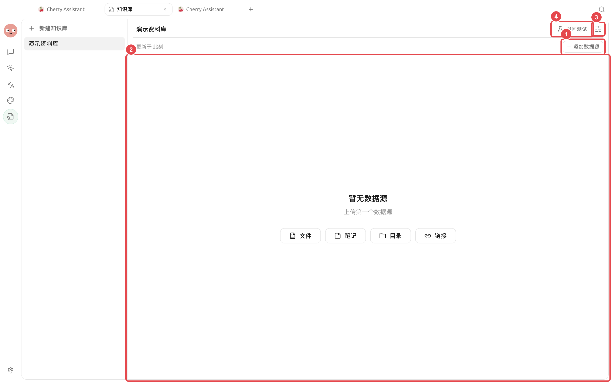
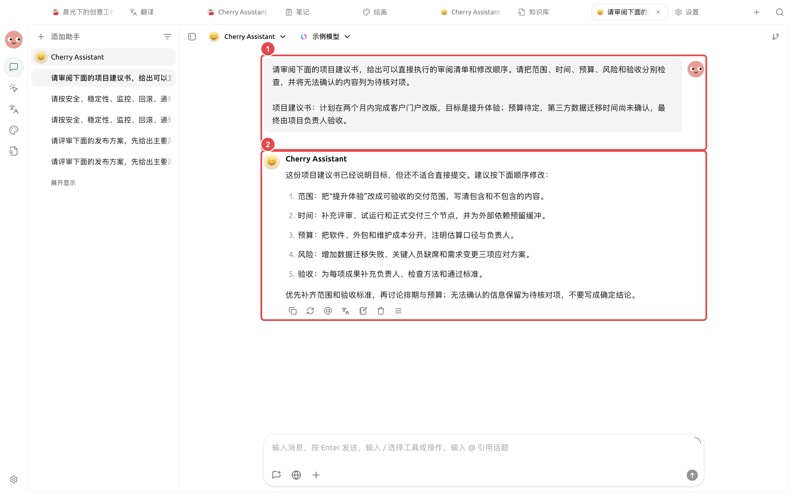

# Revisão de documentos longos

O gerente de produto recebe um plano extenso e precisa identificar problemas factuais, lacunas estruturais e correções acionáveis, mantendo o rascunho original e o processo de confirmação humana. A abordagem abaixo é adequada para relatórios, regulamentos, materiais de licitação e planos de produto.

## Combinação recomendada

* [Diálogo]: comparar rapidamente os ângulos de revisão de diferentes modelos;
* [Trabalho] Agent: ler o diretório de trabalho e gerar um rascunho revisado;
* Base de conhecimento: fornecer regulamentos, terminologia ou materiais históricos;
* [Arquivos] à direita: verificar o rascunho original e os artefatos gerados.

<figure><figcaption><p>Regulamentos, terminologia e materiais históricos podem servir como fontes para a base de conhecimento, enquanto o rascunho original permanece em um diretório de trabalho independente. </p></figcaption></figure>

<figure><figcaption><p>① Insira o texto original e os critérios de revisão; ② Os resultados reais apontam lacunas item a item e mantêm informações não confirmadas como itens pendentes de verificação. </p></figcaption></figure>

## Fluxo de operação



### 1. Preparar o rascunho original e os critérios de revisão

Coloque o rascunho original em um diretório de trabalho independente e crie uma breve descrição de revisão, especificando o público-alvo, o objetivo, os fatos que não podem ser alterados e o formato de entrega.



### 2. Realizar uma calibração em pequena escala primeiro

Selecione um capítulo e peça ao Agent para gerar a saída no formato "problema, localização no texto original, impacto, sugestão". Confirme se a escala é adequada antes de processar o texto completo.



### 3. Separar fatos de expressão

Peça ao Agent para listar separadamente os fatos que precisam de verificação, sem usar polimento linguístico para mascarar conteúdo incerto. Verifique os números-chave contra os materiais originais.



### 4. Gerar um novo arquivo e finalizar manualmente

Exija a retenção do arquivo original e gere a lista de problemas e o rascunho revisado em `review/`. Use [Arquivos] à direita para verificar parágrafo por parágrafo, depois exporte ou compartilhe.



## Tarefa de exemplo

```
Revise proposal.docx no diretório atual. Liste por seção os problemas factuais, lacunas de estrutura e problemas de redação, indicando a localização no original. Não altere o arquivo original; após confirmar a lista, gere em review/ a versão revisada e os itens a verificar.
```

## Preparação prévia e critérios de conclusão

| Item | Preparação recomendada |
| ---- | -------------------------------- |
| Arquivos | Texto original, requisitos de revisão e diretório de saída armazenados separadamente |
| Combinação recomendada | Agent dedicado + diretório de trabalho contendo apenas os arquivos deste projeto + [Confirmação por etapa] |
| Método de verificação | Verifique primeiro um capítulo, confirmando o formato de citação e a escala de julgamento |
| Critério de conclusão | Cada comentário inclui a localização no texto original; partes não lidas são claramente marcadas; o arquivo original não foi sobrescrito |

Adequado para revisão estruturada de contratos, relatórios, dissertações ou normas; quando envolver conclusões jurídicas, médicas ou financeiras, a saída deve ser usada apenas como material de apoio.


Quando o documento for muito longo, não cole o texto completo repetidamente em uma única conversa. Peça ao Agent para ler diretamente o diretório de trabalho e deixar artefatos intermediários por capítulo, o que facilita a revisão e a recuperação.

