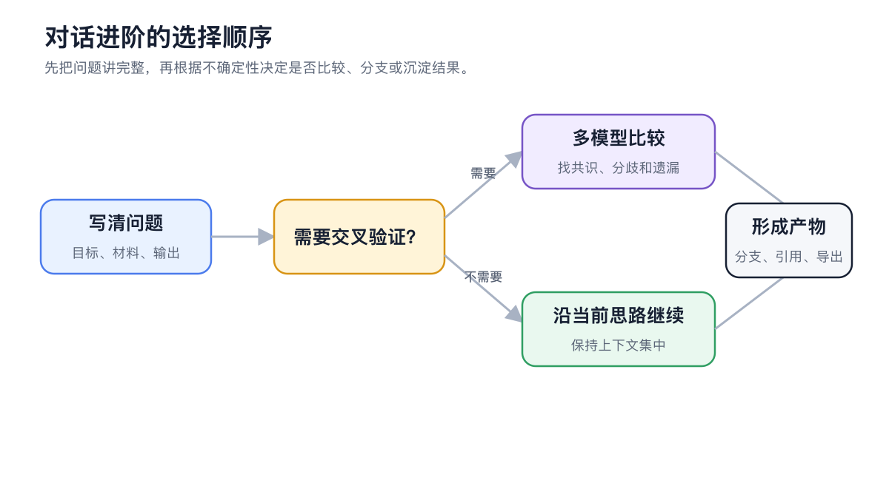
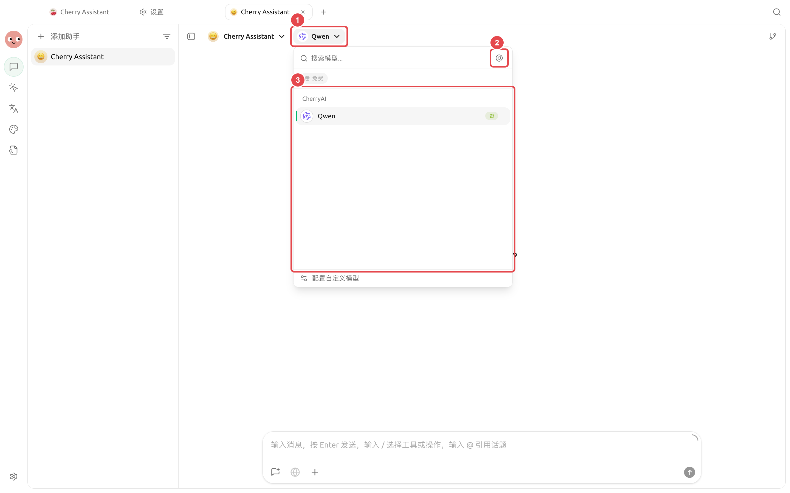

# Conversas Avançadas

【Conversas】é ideal para organizar ideias enquanto você interage. Além de perguntas e respostas com um único modelo, você pode comparar vários modelos lado a lado, criar ramificações a partir de qualquer mensagem, gerenciar o contexto de conversas longas e continuar utilizando arquivos, imagens, código e citações das respostas como artefatos.


Se a tarefa exigir leitura e escrita contínuas de arquivos locais, o uso de várias ferramentas ou execução por longos períodos, utilize o Agent em 【Trabalho】. Conversas são mais adequadas para discussão, comparação e finalização, enquanto o Agent é mais adequado para execução.


<figure><figcaption>
Escreva primeiro as perguntas e requisitos de saída de forma completa; adicione comparação de modelos ou ramificações de mensagens apenas quando for necessário validar cruzadamente. 
</figcaption></figure>

## Selecione a capacidade conforme o objetivo

| Objetivo | Prática recomendada |
| ------------- | --------------------- |
| Comparar pontos de vista de diferentes modelos | Selecione vários modelos na área de entrada e envie a mesma pergunta |
| Manter a discussão original e explorar outra abordagem | Crie uma ramificação a partir de uma mensagem-chave |
| Continuar uma discussão muito longa | Verifique o uso do contexto e, se necessário, resuma e inicie um novo tópico |
| Enviar a próxima pergunta mais tarde | Use a fila de mensagens, sem interromper a resposta atual |
| Continuar processando arquivos ou código da resposta | Abra a pré-visualização do artefato e, em seguida, baixe, copie ou continue em uma nova tarefa |

<figure><figcaption>
 O seletor de modelos permite escolher um ou vários modelos para a mesma pergunta. 
</figcaption></figure>

## Ordem recomendada



### 1. Escreva a pergunta de forma completa

Descreva o objetivo, os materiais, as restrições e o formato de saída desejado. Vários modelos apenas ampliam as diferenças da pergunta original; eles não preenchem automaticamente informações ausentes.



### 2. Depois, decida se é necessário comparar

Selecione vários modelos apenas quando precisar de diferentes perspectivas. Para perguntas e respostas do dia a dia, mantenha um único modelo para uma interface mais clara e um controle mais fácil do uso.



### 3. Consolide as conclusões válidas

Armazene materiais reutilizáveis em notas ou na base de conhecimento; entregue o trabalho que precisa ser executado ao Agent, incluindo as conclusões já confirmadas.



<table data-view="cards"><thead><tr><th></th><th></th><th data-hidden data-card-target data-type="content-ref"></th></tr></thead><tbody><tr><td><strong> Comparação de múltiplos modelos e ramificações de mensagens </strong></td><td> Compare respostas, mantendo ao mesmo tempo o caminho de exploração </td><td><a href="model-compare-branches.md">model-compare-branches.md</a></td></tr><tr><td><strong> Conversas longas, contexto e mensagens em fila </strong></td><td> Mantenha conversas longas claras e controláveis </td><td><a href="context-queue.md">context-queue.md</a></td></tr><tr><td><strong> Artefatos, citações e exportação </strong></td><td> Verifique e leve consigo os resultados realmente úteis </td><td><a href="artifacts-export.md">artifacts-export.md</a></td></tr></tbody></table>
