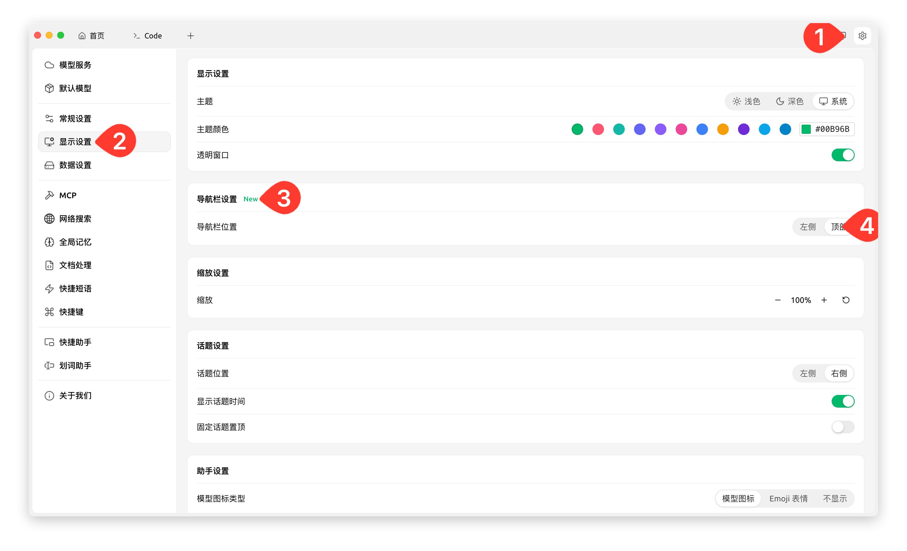
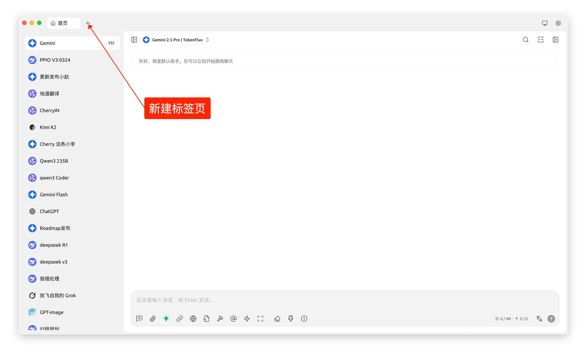

# Instruções de Uso do Rastreamento (Trace)

## Funcionalidade

O rastreamento (também chamado de "trace") oferece aos usuários capacidade de insight sobre diálogos, ajudando a identificar o desempenho específico de modelos, bases de conhecimento, MCP, pesquisas na web e outros componentes durante as conversas. É uma ferramenta de observabilidade implementada com base no [OpenTelemetry](https://opentelemetry.io/docs/languages/js/). Através da coleta, armazenamento e processamento de dados no lado do cliente, ele permite visualização e fornece base quantitativa para solução de problemas e otimização de resultados.

Cada diálogo corresponde a um registro de trace. Um trace consiste em múltiplos spans, onde cada span corresponde a uma lógica de processamento do Cherry Studio, como chamada de sessão de modelo, invocação de MCP, consulta à base de conhecimento ou pesquisa na web. O trace é exibido em estrutura de árvore, com os spans como nós. Os principais dados incluem tempo de execução e uso de tokens. Os detalhes do span também permitem ver entradas e saídas específicas.

## Ativar o Trace

Por padrão, após a instalação do Cherry Studio, o Trace fica oculto. É necessário ativá-lo em "Configurações" → "Configurações Gerais" → "Modo Desenvolvedor", conforme mostrado abaixo:

<figure><figcaption></figcaption></figure>

Sessões anteriores não gerarão registros de Trace. Os registros são produzidos apenas após novas perguntas/respostas. Os dados são armazenados localmente. Para limpar completamente os Traces:
1. Acesse "Configurações" → "Configurações de Dados" → "Diretório de Dados" → "Limpar Cache"
2. Ou exclua manualmente os arquivos em `~/.cherrystudio/trace`, como ilustrado:

<figure><figcaption></figcaption></figure>

## Cenários de Uso

### Visualização de Cadeia Completa

Clique em "Trace" na caixa de diálogo do Cherry Studio para ver todos os dados da cadeia de execução. Todas as chamadas a modelos, pesquisas na web, bases de conhecimento ou MCP durante a conversa serão exibidas na janela de Trace.

<figure><figcaption></figcaption></figure>

<figure><figcaption></figcaption></figure>

### Detalhamento de Modelos na Cadeia

Para ver detalhes de modelos específicos na cadeia, clique no nó correspondente para visualizar entradas e saídas.

<figure><figcaption></figcaption></figure>

<figure><figcaption></figcaption></figure>

<figure><figcaption></figcaption></figure>

### Análise de Pesquisas Web

Clique em nós de pesquisa na web para ver detalhes de consultas realizadas e resultados retornados.

<figure><figcaption></figcaption></figure>

<figure><figcaption></figcaption></figure>

<figure><figcaption></figcaption></figure>

### Verificação de Base de Conhecimento

Ao clicar em nós de base de conhecimento, é possível visualizar a pergunta enviada e a resposta recuperada.

<figure><figcaption></figcaption></figure>

### Auditoria de Chamadas MCP

Nós de MCP exibem parâmetros de entrada e retornos de ferramentas (tools) de servidor MCP.

<figure><figcaption></figcaption></figure>

<figure><figcaption></figcaption></figure>

## Problemas e Sugestões

Esta funcionalidade é fornecida pela equipe [EDAS](https://www.aliyun.com/product/edas) da Alibaba Cloud. Para dúvidas ou sugestões, entre no grupo DingTalk (ID: 21958624) para comunicação direta com os desenvolvedores.

\