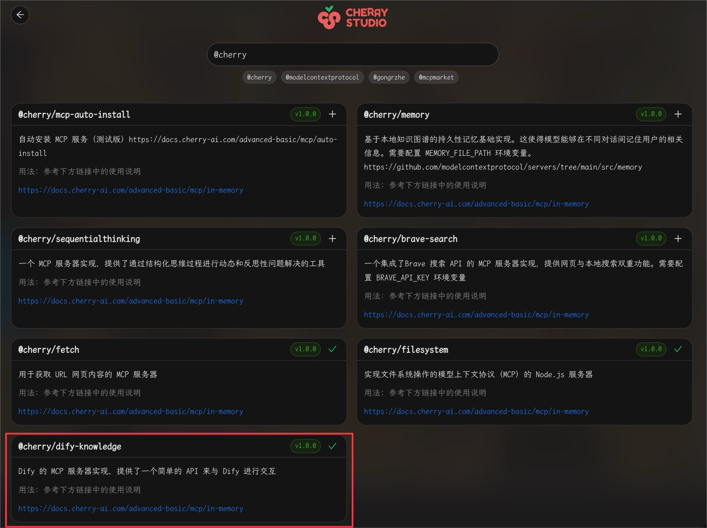
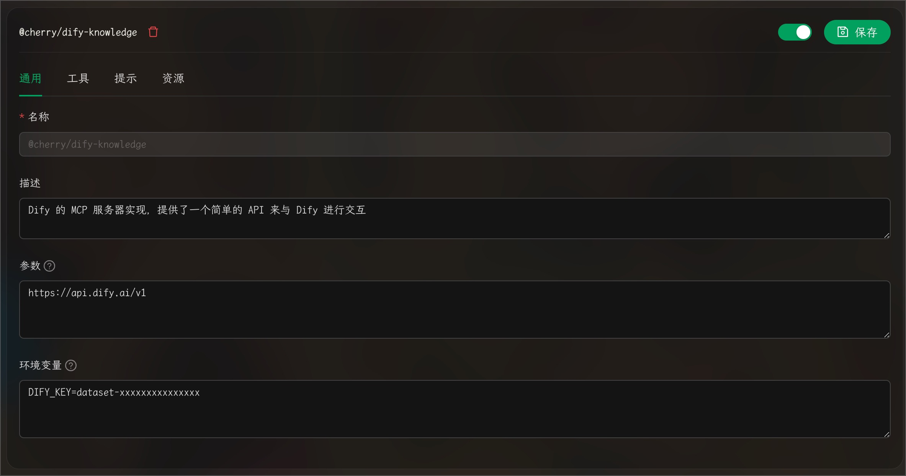
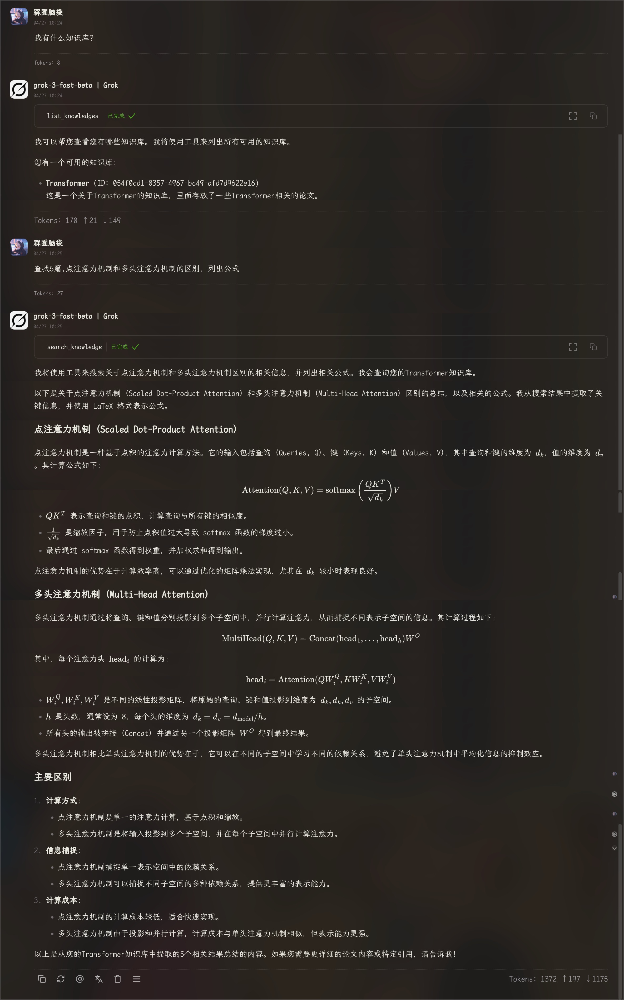

# Configurar a Base de Conhecimento Dify

> O MCP da Base de Conhecimento Dify requer que o Cherry Studio seja atualizado para a versão v1.2.9 ou superior.

### Adicionar servidor MCP da Base de Conhecimento Dify

<figure><figcaption></figcaption></figure>

1. Abra `Pesquisar MCP`.
2. Adicione o servidor `dify-knowledge`.

### Configurar a Base de Conhecimento Dify

<figure><figcaption></figcaption></figure>

> É necessário configurar parâmetros e variáveis de ambiente

1. A chave da Base de Conhecimento Dify pode ser obtida da seguinte forma:

<figure><figcaption></figcaption></figure>

### Utilizar o mcp da Base de Conhecimento Dify

<figure><figcaption></figcaption></figure>