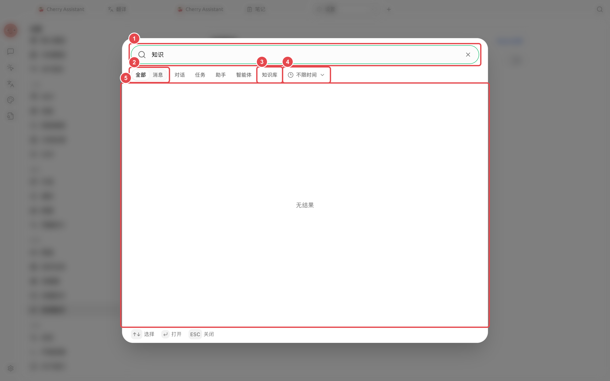

# Busca global

A busca global é usada para localizar mensagens, conversas, tarefas, assistentes, Agent e bases de conhecimento em um único ponto de entrada. É ideal para situações em que você lembra do conteúdo, mas não sabe onde o salvou.

<figure><figcaption>
Primeiro, insira palavras-chave distintivas e, em seguida, refine a busca por tipo (como conversas e bases de conhecimento) e data de atualização. 
</figcaption></figure>

## Como usar



### 1. Clique no botão de busca no topo da janela

Você também pode visualizar ou modificar o atalho correspondente em [Configurações] → [Atalhos de teclado].



### 2. Insira palavras-chave distintivas

Prefira usar nomes de projetos, nomes de pessoas, temas de arquivos ou frases de conclusões. Se você inserir apenas termos comuns como "configurações" ou "relatório", os resultados geralmente serão excessivos.



### 3. Refine o escopo da busca

Alterne para [Mensagens] ou use os filtros [Conversas], [Tarefas], [Assistentes], [Agentes] e [Bases de conhecimento], e depois refine pela data de atualização.



### 4. Abra o resultado para continuar o trabalho

A busca o levará de volta ao conteúdo correspondente. Antes de abrir, verifique o tipo para evitar confundir assistentes com o mesmo nome e tarefas do Agent.



### Caso de aplicação: recuperar conclusões de clientes do mês passado

Busque pelo nome do projeto do cliente, refine o tipo para [Mensagens] e limite pela data de atualização. Após encontrar a conclusão, abra a conversa original e verifique se houve revisões subsequentes. Se precisar usar a conclusão em uma nova tarefa, copie o resumo já confirmado, em vez de fazer a nova conversa depender de fragmentos dispersos da memória.

Por que a busca não encontra o conteúdo de arquivos no disco? 

A busca global localiza principalmente o conteúdo já salvo no Cherry Studio. Arquivos no disco precisam estar no diretório de trabalho do Agent, na base de conhecimento ou nas notas e, em seguida, passar pelo fluxo correspondente para serem encontrados pela entrada apropriada.

