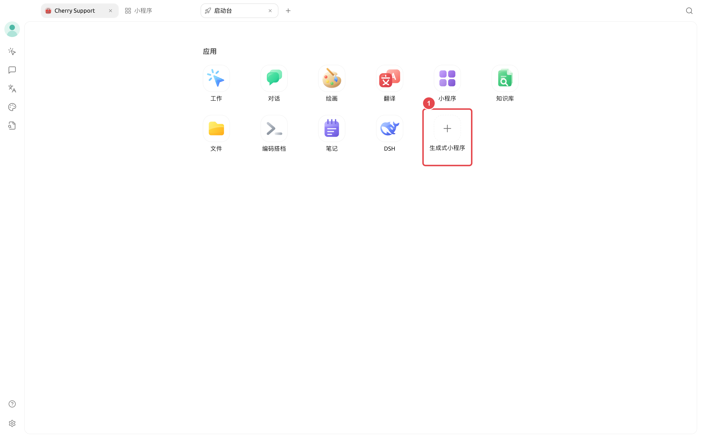
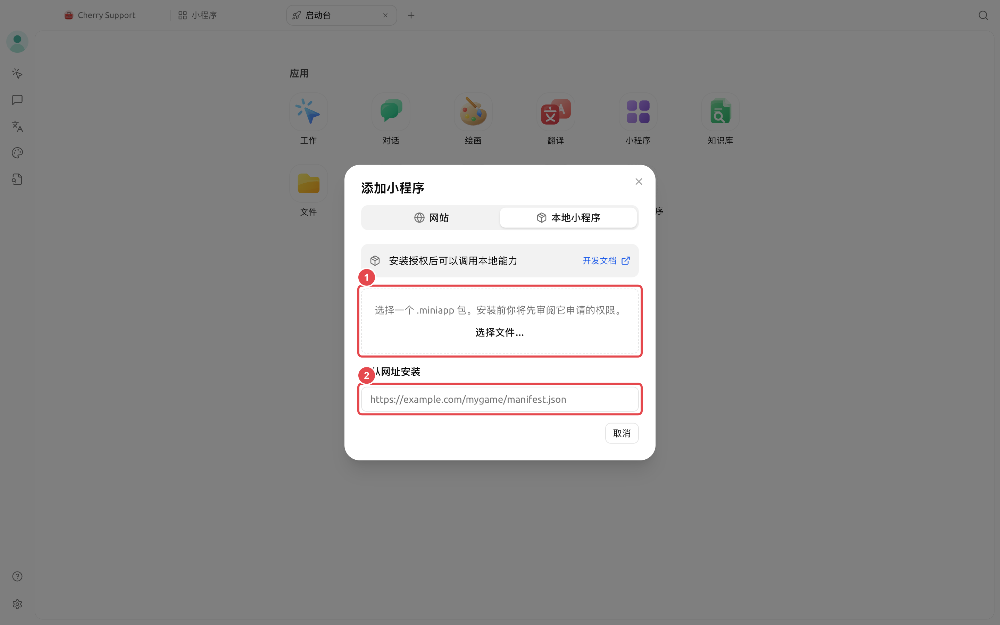
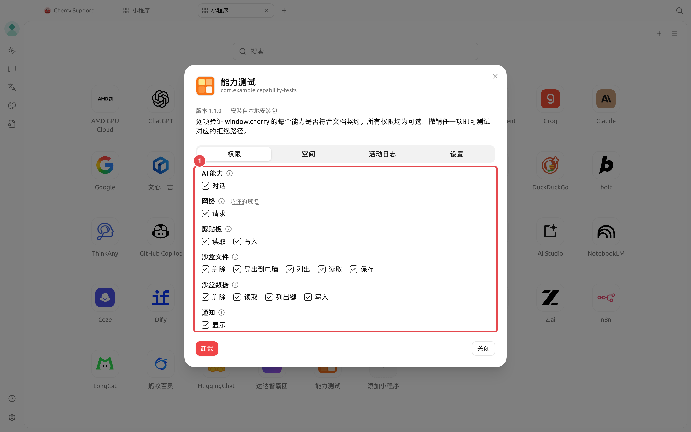
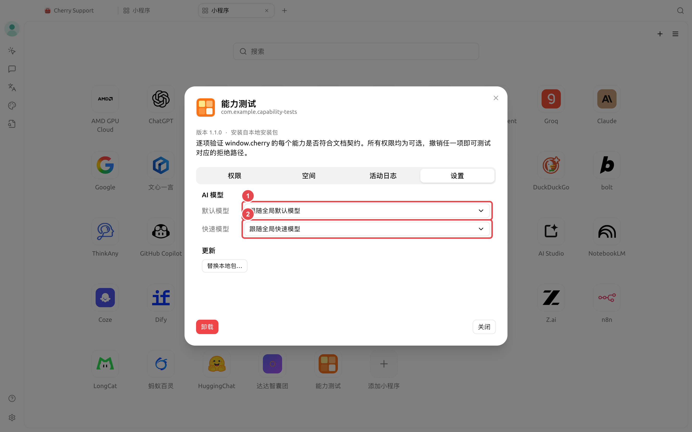

# Miniaplicativos Generativos

Miniaplicativos generativos são aplicativos Web locais executados no Cherry Studio [Miniaplicativos]. Sua interface e fluxo de trabalho são personalizados por você e podem chamar os modelos de IA configurados no Cherry Studio via `window.cherry`, transformando um modelo genérico em um assistente de escrita, extrator de informações, ferramenta de aprendizado ou aplicativo de negócios específico.

A diferença em relação a miniaplicativos do tipo site não está na aparência, mas na origem das capacidades: miniaplicativos do tipo site apenas abrem uma URL; miniaplicativos generativos precisam ser empacotados como `.miniapp` e, após a instalação e a concessão de permissões, podem acessar as capacidades de IA, dados em sandbox, arquivos, notificações, rede e área de transferência do Cherry.


O Cherry Studio fornece o ambiente de execução, o mecanismo de autorização e as interfaces de IA. Você pode escrever o miniaplicativo por conta própria ou usar ferramentas de programação com IA para gerar HTML, CSS e JavaScript primeiro, e depois empacotar e instalar conforme as instruções desta página.


## Objetivos e pré-requisitos

Ao concluir esta página, você poderá:

* Instalar e usar miniaplicativos generativos fornecidos por terceiros;
* Criar seu próprio pacote `.miniapp` a partir de uma necessidade simples;
* Fazer com que o miniaplicativo chame o [Modelo Padrão] ou o [Modelo Rápido] do Cherry Studio;
* Verificar permissões, logs de atividade, armazenamento, atualizações e status de desinstalação.

Para usar um miniaplicativo pronto, basta ter um arquivo `.miniapp` confiável ou um endereço de instalação. Para criar o seu, você também precisa ser capaz de editar arquivos Web e criar arquivos ZIP; se for testar recursos de IA, configure primeiro um modelo de conversa funcional no Cherry Studio.

## Terminologia

| Termo | Nome na interface | Significado nesta página |
| ------ | ------------- | ----------------------------------------- |
| Miniaplicativo generativo | [Miniaplicativo Generativo] | Miniaplicativo com interface e fluxo personalizáveis que pode acessar as capacidades de IA do Cherry Studio |
| Miniaplicativo local | [Miniaplicativo Local] | Tipo de miniaplicativo instalado via pacote `.miniapp` e executado em uma sandbox isolada |
| Miniaplicativo do tipo site | [Site] | Página Web aberta via URL, sem capacidades `window.cherry` |
| Permissão | [Permissões] | Escopo de capacidades solicitado na instalação do miniaplicativo e revisado pelo usuário |
| Slot de modelo | [Modelo Padrão], [Modelo Rápido] | Duas posições de modelo selecionadas pelo usuário para o miniaplicativo; o miniaplicativo não visualiza o provedor, o nome do modelo ou a Chave de API |

## Caminhos de operação

Usar um miniaplicativo pronto: `【Início】→【Miniaplicativos generativos】→【Miniaplicativo local】→selecionar arquivo ou informar URL de instalação→revisar permissões→【Instalar】`

Também é possível acessar pela página de miniaplicativos: `【Início】→【Miniaplicativos】→【Adicionar miniaplicativo】 no canto superior direito→【Miniaplicativo local】`

Gerenciar miniaplicativos instalados: `【Miniaplicativos】→clique com o botão direito no aplicativo→【Ver detalhes】`

## Procedimentos

### Instalação e primeiro uso



### Abrir a entrada de instalação

Clique em [Miniaplicativo Generativo] no [Launchpad] ou, após entrar em [Miniaplicativos], clique em [Adicionar Miniaplicativo] no canto superior direito. No painel exibido, alterne para [Miniaplicativo Local].



### Selecionar a origem da instalação

Arraste um pacote `.miniapp` para a área de instalação ou clique em [Selecionar arquivo...]. Se o desenvolvedor fornecer um endereço de instalação HTTPS, você também pode colar o endereço e clicar em [Carregar].



### Revisar permissões

A página de confirmação de instalação exibirá o nome, a versão, a descrição e todas as permissões do miniaplicativo. Permissões obrigatórias não podem ser desmarcadas; permissões opcionais estão marcadas por padrão, mas você pode desmarcá-las antes da instalação ou ajustá-las posteriormente.

Continue apenas se o propósito do miniaplicativo corresponder às permissões solicitadas e a origem for confiável. Miniaplicativos que requerem IA geralmente exibem [Capacidade de IA] → [Conversa].



### Instalar e abrir

Clique em [Instalar]. Após a conclusão da instalação, o miniaplicativo aparecerá na grade de [Miniaplicativos]; clique no ícone para executá-lo.



### Selecionar modelos de IA para o miniaplicativo

1. Na grade de [Miniaplicativos], clique com o botão direito no miniaplicativo desejado e selecione [Ver Detalhes].
2. Alterne para [Configurações] e localize [Modelos de IA].
3. Configure o [Modelo Padrão] e o [Modelo Rápido] de acordo com o uso do miniaplicativo. Se deixados em branco, seguirão, respectivamente, o modelo padrão global e o modelo rápido global do Cherry Studio.
4. Reabra o miniaplicativo e dispare uma operação de IA. Se não houver um modelo disponível, o miniaplicativo deve indicar que a IA está temporariamente indisponível.

O [Modelo Padrão] é adequado para tarefas principais como geração de textos longos e análises complexas; o [Modelo Rápido] é adequado para tarefas de baixa latência como sugestão de títulos, reescrita de frases curtas e extração de tags. Qual slot será usado é determinado pelo design do miniaplicativo.

### Criar uma versão mínima

Um miniaplicativo generativo é, essencialmente, um projeto de página Web estática. A estrutura de diretórios mínima requer apenas dois arquivos:

```
my-writer/
├── manifest.json
└── index.html
```

Primeiro, crie o `manifest.json`, declarando as informações do aplicativo e as permissões `ai.chat`:

```json
{
  "id": "com.example.my-writer",
  "name": { "zh": "Assistente de reescrita", "en": "Rewrite Helper" },
  "description": "Insira um texto e use o modelo de IA do Cherry Studio para reescrevê-lo.",
  "version": "1.0.0",
  "entry": "index.html",
  "permissions": ["ai.chat"]
}
```

`id` Recomenda-se usar um formato de domínio reverso controlado por você, contendo apenas letras minúsculas, números, pontos e hífens. `com.cherrystudio.*` é um intervalo reservado oficialmente; não o utilize.

Em seguida, no `index.html`, chame a IA através do objeto global `cherry`. O exemplo abaixo primeiro verifica a disponibilidade do [Modelo Padrão] e, em seguida, exibe o texto em streaming por segmentos:

```html
<!doctype html>
<html lang="zh-CN">
  <head>
    <meta charset="UTF-8" />
    <meta name="viewport" content="width=device-width, initial-scale=1" />
    <link rel="stylesheet" href="/__cherry/theme.css" />
    <title>Assistente de reescrita</title>
  </head>
  <body>
    <textarea id="source" placeholder="Insira o texto que deseja reescrever"></textarea>
    <button id="rewrite">Reescrever</button>
    <pre id="result"></pre>

    <script>
      const button = document.querySelector('#rewrite')
      const source = document.querySelector('#source')
      const result = document.querySelector('#result')

      button.addEventListener('click', async () => {
        const capability = await cherry.ai.getCapabilities({ model: 'default' })
        if (!capability.available) {
          result.textContent = 'Configure primeiro um modelo disponível nos detalhes do miniaplicativo.'
          return
        }

        result.textContent = ''
        await cherry.ai.chat(
          {
            model: 'default',
            reasoning: 'off',
            messages: [
              { role: 'system', content: 'Você é um editor de chinês. Preserve o sentido e deixe o texto mais claro.' },
              { role: 'user', content: source.value }
            ]
          },
          {
            callId: `rewrite-${Date.now()}`,
            onChunk: (text) => {
              result.textContent += text
            }
          }
        )
      })
    </script>
  </body>
</html>
```

`window.cherry` e `cherry` apontam para o mesmo conjunto de interfaces do host, sem necessidade de importar um SDK. O miniaplicativo só pode enviar mensagens de texto; atualmente, não há suporte para entrada de imagens ou chamadas de ferramentas. Ele especifica apenas o uso do slot `default` ou `quick`, sem acesso ao nome do modelo, informações do provedor ou Chave de API.

### Empacotar e testar

1. Confirme que o `manifest.json` está na raiz do projeto e que o arquivo de entrada corresponde ao `entry`.
2. Execute a compressão dentro do diretório do projeto; no macOS ou Linux, você pode usar:

```bash
zip -r ../my-writer.miniapp . -x '.*' -x '__MACOSX/*'
```

No Windows PowerShell, você pode gerar um ZIP primeiro e, em seguida, alterar a extensão para `.miniapp`:

```powershell
Compress-Archive -Path .\* -DestinationPath ..\my-writer.zip
Rename-Item ..\my-writer.zip my-writer.miniapp
```

3. Na área de instalação de [Miniaplicativos Locais] do Cherry Studio, selecione o `my-writer.miniapp` gerado.
4. Confirme que a página de instalação solicita apenas as permissões esperadas, instale, abra e teste a entrada, a saída de IA, as mensagens de erro e o estado após reentrar.
5. Para depuração, abra as [Ferramentas do Desenvolvedor] na barra de ferramentas do miniaplicativo e verifique erros de página e solicitações bloqueadas pela sandbox.


Não comprima a pasta inteira do projeto a partir de um diretório externo; garanta que a raiz do arquivo compactado exiba diretamente o `manifest.json`. O Cherry Studio também reconhece arquivos compactados com uma única camada de diretório, mas uma estrutura de raiz clara facilita a solução de problemas.


## Resultado esperado

Após a instalação, você deve ver o novo ícone na grade de [Miniaplicativos]. Ao abrir, insira texto e clique no botão; a área de resultados exibirá continuamente o texto retornado pelo modelo. Clique com o botão direito no miniaplicativo para acessar [Ver Detalhes], onde você pode ver a permissão de [Capacidade de IA] solicitada, o slot de modelo utilizado e os registros de chamadas recentes.

Se a instalação for bem-sucedida, mas a IA estiver indisponível, verifique primeiro os modelos em [Ver Detalhes] → [Configurações] e, em seguida, verifique se as [Permissões] permitem [Capacidade de IA] → [Conversa].

## Capturas de tela principais

<figure><figcaption><p>Entrada de [Miniaplicativo Generativo] no Launchpad. </p></figcaption></figure>

1. Clique em [Miniaplicativo Generativo] para abrir o painel [Adicionar Miniaplicativo].

<figure><figcaption><p>Miniaplicativos locais suportam instalação a partir de arquivo ou endereço. </p></figcaption></figure>

1. Arraste o pacote `.miniapp` ou clique em [Selecionar arquivo...].
2. Você também pode inserir o endereço de instalação HTTPS fornecido pelo desenvolvedor.

<figure><figcaption><p> A página de [Permissões] lista as capacidades do host autorizadas para o miniaplicativo. </p></figcaption></figure>

1. Verifique se as autorizações de [Capacidade de IA], bem como de rede, área de transferência, arquivos, dados e notificações, correspondem ao uso do miniaplicativo.

<figure><figcaption><p>Gerencie os slots de modelos de IA nos detalhes do miniaplicativo. </p></figcaption></figure>

1. O [Modelo Padrão] processa as principais solicitações de IA do miniaplicativo; se vazio, segue o modelo padrão global.
2. O [Modelo Rápido] processa solicitações de baixa latência especificadas pelo miniaplicativo; se vazio, segue o modelo rápido global.


A interface e a saída reais do miniaplicativo são determinadas pelo próprio miniaplicativo; a imagem acima usa um exemplo de teste de capacidades oficial para ilustrar as localizações de permissões e gerenciamento de modelos após a instalação.


## Notas de configuração

| Item de configuração | Padrão do produto | Ponto de partida sugerido | Função | Cenários aplicáveis | Observações |
| ----- | --------------------- | ------------------------ | ----------------------- | -------------- | ----------------------- |
| Origem da instalação | — | Use um arquivo local `.miniapp` para o primeiro teste | Determina se a instalação é feita a partir de um pacote local ou de um endereço HTTPS | Testes pessoais, distribuição em equipe | Para miniaplicativos de terceiros, verifique primeiro o publicador, o código-fonte e as permissões |
| Permissão de IA | Declarada pelo miniaplicativo; permissões opcionais marcadas por padrão na instalação | Conceda apenas as permissões necessárias para concluir as funções | Permite chamar `cherry.ai.chat()` | Todos os recursos de IA | Permissões obrigatórias não podem ser revogadas individualmente; desinstale se a confiança for perdida |
| Modelo Padrão | Segue o modelo padrão global | Use um modelo de conversa verificado e funcional | Processa tarefas principais de geração e análise | Textos longos, instruções complexas, saída estruturada | As chamadas contarão para o uso do serviço do modelo correspondente |
| Modelo Rápido | Segue o modelo rápido global | Selecione um modelo com resposta mais rápida para tarefas curtas | Processa tarefas de baixa latência | Alterar títulos, completar, classificar, extrair tags | O miniaplicativo deve selecionar explicitamente `quick` para usá-lo |
| Modo de raciocínio | Desativado se o miniaplicativo não enviar | Desative primeiro para reescritas comuns | Permite que modelos com suporte a raciocínio realizem raciocínio antes | Análises complexas, planejamento | Modelos sem suporte a alternância ignorarão este item |
| Estilo de tema | Segue o tema claro/escuro do Cherry Studio | Refira `/__cherry/theme.css` | Use variáveis de cores fornecidas pelo host | Todas as interfaces personalizadas | Recursos de CDN externos serão bloqueados pela sandbox; devem ser empacotados dentro do aplicativo |

### Quais outras capacidades podem ser chamadas

| Capacidade | Uso | Declaração |
| --------------------- | ----------------------- | ---------------------------------- |
| `cherry.storage` | Salvar configurações e estados em formato de string | `storage.*` ou métodos específicos |
| `cherry.file` | Salvar, ler e exportar arquivos no sandbox do próprio miniapp | `file.*` ou métodos específicos |
| `cherry.notification` | Enviar notificações do sistema via Cherry Studio | `notification.show` |
| `cherry.network` | Acessar domínios HTTPS declarados no manifesto | `network.fetch`, preenchendo a lista de domínios `network` |
| `cherry.clipboard` | Ler e escrever texto puro quando o miniapp está visível e tem foco de teclado | `clipboard.read`, `clipboard.write` |
| `cherry.app` | Ler versão do aplicativo, idioma e permissões atuais | Não requer declaração |

Miniapps locais não podem usar diretamente `localStorage`, `fetch` do navegador, Cookies, pop-ups ou CDNs externos. Use `cherry.storage` para salvar estados e `cherry.network.fetch` para acesso à rede, declarando os domínios permitidos no manifesto.

## Casos de uso

| Cenário | Entrada | Como o miniapp faz | Indicador de conclusão |
| ------- | ----------- | ------------------------- | -------------- |
| Escrita e reescrita | Rascunho, tom e requisitos de extensão | Gera o texto principal com o [Modelo Padrão] e sugere títulos alternativos com o [Modelo Rápido] | Mantém o sentido original e alterna rapidamente entre diferentes expressões |
| Organização de atas de reunião | Registro da reunião colado | Extrai conclusões, responsáveis e prazos, formatando a saída em layout fixo | Cada ação possui campos de responsável e prazo |
| Tradução multilíngue | Texto original, idioma de destino e glossário | Fixa termos e formato de saída na mensagem de sistema, exibindo a tradução em streaming | Termos técnicos consistentes e estrutura de parágrafos preservada |
| Extração de informações estruturadas | Contratos, currículos ou textos de feedback | Solicita ao modelo retornar resultados em campos fixos, validando itens ausentes na interface | Campos obrigatórios completos e conteúdo anômalo destacado |
| Prática de estudo | Notas, tipos de questões e nível de dificuldade | Gera questões, dicas e explicações, salvando o progresso nos dados do sandbox | Permite retomar a prática anterior ao reabrir |
| Fluxos de trabalho especializados | Modelos de equipe e regras de negócio | Combina entrada, processamento por IA, confirmação humana e exportação em uma única interface | Tarefas repetitivas concluídas de forma estável pelo mesmo fluxo |


Os resultados dos miniapps generativos ainda são gerados pelo modelo selecionado. Usos de alto risco, como saúde, direito e finanças, bem como dados que impactem operações formais, devem ser revisados por pessoas com qualificações adequadas.


## Perguntas frequentes

<details>

<summary>Por que, ao inserir uma URL de site, não consigo chamar o Cherry AI?</summary>

O [Site] apenas abre páginas web e não injeta `window.cherry` na página. Crie o aplicativo como um pacote `.miniapp` e instale-o a partir de [Miniapp Local].

</details>

<details>

<summary>O miniapp pode ver minha API Key ou o provedor de modelos?</summary>

Não. O miniapp solicita apenas os slots [Modelo Padrão] ou [Modelo Rápido]. O Cherry Studio executa as chamadas em seu nome, sem expor nomes de modelos, informações do provedor ou API Keys ao miniapp.

</details>

<details>

<summary>Por que recebo a mensagem de que a IA não está disponível após a instalação?</summary>

Abra primeiro [Ver Detalhes] → [Configurações] e confirme se há um modelo disponível no slot correspondente; depois, em [Permissões], verifique se [Capacidade de IA] → [Conversa] está autorizada. Se a permissão for obrigatória, mas você não confia mais no aplicativo, desinstale-o diretamente.

</details>

<details>

<summary>Como confirmar quais capacidades o miniapp chamou?</summary>

Abra [Ver Detalhes] → [Log de Atividade]. Aqui são registradas chamadas externas para IA, rede, área de transferência, exportação de arquivos, bem como chamadas recusadas, mas não são registrados prompts, respostas do modelo, conteúdo da área de transferência ou conteúdo de arquivos.

</details>

<details>

<summary>Qual a diferença entre atualizar, reverter e limpar dados?</summary>

Atualizar preserva os dados do sandbox e solicita confirmação novamente ao adicionar permissões; após a atualização, é possível reverter para a versão anterior. Limpar dados remove os dados e arquivos salvos pelo miniapp, mas mantém o aplicativo; desinstalar remove o aplicativo, as autorizações e os dados simultaneamente.

</details>

## Referências

* [Documentação de desenvolvimento e lista da comunidade do Cherry Studio MiniApps](https://github.com/CherryHQ/cherry-studio-miniapps/blob/main/README.zh-CN.md)
* [Documentação de referência oficial do MiniApp](https://github.com/CherryHQ/cherry-studio/tree/main/docs/references/mini-app)
* [Formato do manifesto](https://github.com/CherryHQ/cherry-studio/blob/main/docs/references/mini-app/manifest.md)
* [Interfaces de capacidade](https://github.com/CherryHQ/cherry-studio/blob/main/docs/references/mini-app/capabilities.md)
* [Empacotamento, atualização e desinstalação](https://github.com/CherryHQ/cherry-studio/blob/main/docs/references/mini-app/packaging.md)
