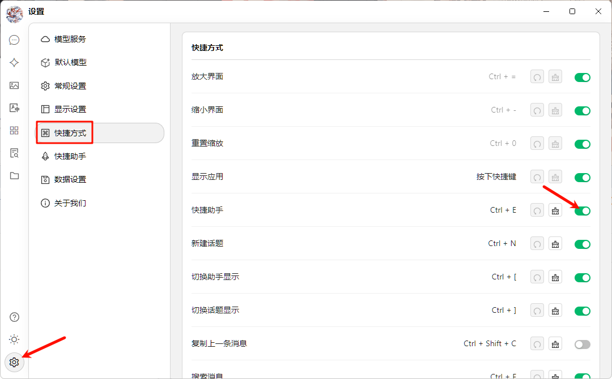

# Assistente Rápido

O Assistente Rápido é uma ferramenta conveniente fornecida pelo Cherry Studio que permite acessar rapidamente funções de IA em qualquer aplicativo, possibilitando operações como questionamentos instantâneos, tradução, resumo e explicação.

### Ativar o Assistente Rápido

1. **Abrir configurações:** Navegue até `Configurações` -> `Atalhos` -> `Assistente Rápido`.
2. **Ativar alternador:** Localize e ative o botão correspondente ao `Assistente Rápido`.

<figure><figcaption>
Diagrama de ativação do Assistente Rápido
</figcaption></figure>

3. **Configurar atalho (opcional):**
   * Atalho padrão para Windows: <kbd>Ctrl</kbd> + <kbd>E</kbd>.
   * Atalho padrão para macOS: <kbd>⌘</kbd> + <kbd>E</kbd>.
   * Você pode personalizar o atalho aqui para evitar conflitos ou adaptá-lo ao seu fluxo de trabalho.

### Usando o Assistente Rápido

1. **Ativar:** Em qualquer aplicativo, pressione o atalho configurado (ou o padrão) para abrir o Assistente Rápido.
2. **Interagir:** Na janela do Assistente Rápido, você pode realizar diretamente as seguintes operações:
   * **Pergunta rápida:** Faça qualquer pergunta à IA.
   * **Tradução de texto:** Insira o texto que precisa ser traduzido.
   * **Resumo de conteúdo:** Insira textos longos para síntese.
   * **Explicação:** Insira conceitos ou termos que precisam ser elucidados.

       <figure><figcaption>
Diagrama da interface do Assistente Rápido
</figcaption></figure>
3. **Fechar:** Pressione a tecla <kbd>ESC</kbd> ou clique em qualquer área fora da janela do Assistente Rápido para fechá-la.


O Assistente Rápido utiliza o [modelo de diálogo padrão global](settings/default-models.md#mo-ren-zhu-shou-mo-xing).


### Dicas e Truques

* **Conflito de atalhos:** Se o atalho padrão entrar em conflito com outro aplicativo, modifique-o.
* **Explore mais funções:** Além das funcionalidades mencionadas, o Assistente Rápido pode suportar outras operações como geração de código, conversão de estilo, etc. Recomendamos explorar durante o uso.
* **Feedback e melhorias:** Caso encontre problemas ou tenha sugestões, [forneça feedback](../../../question-contact/suggestions.md) à equipe do Cherry Studio.