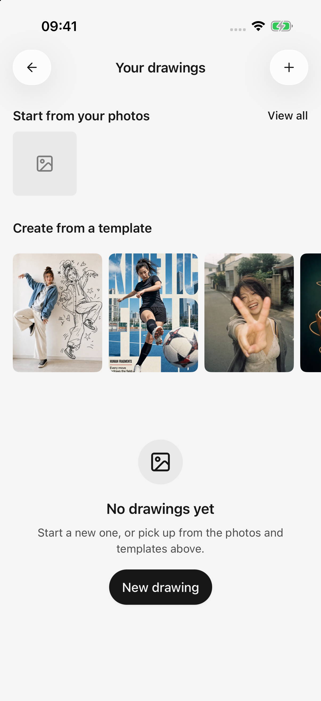
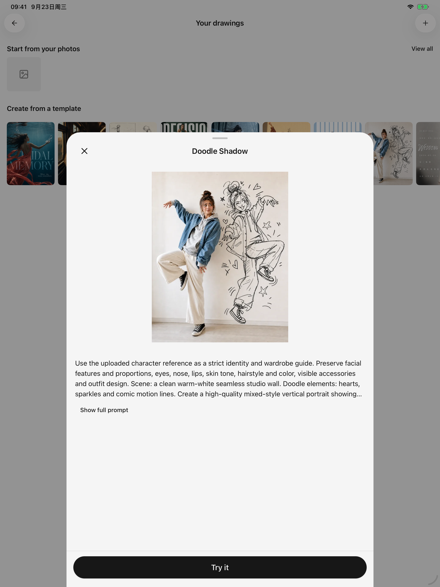

# Geração de imagens

Crie imagens a partir de uma descrição, imagem de referência ou modelo. Configure primeiro um modelo de geração de imagens: um modelo de texto que compreende imagens não necessariamente as gera.

<figure data-mobile-shot="phone"><figcaption>
<strong>Criação de imagens · Interface em inglês</strong> · Comece a criar a partir de uma foto ou de um modelo predefinido
</figcaption></figure>
<figure data-mobile-shot="tablet"><figcaption>
<strong>Prévia do modelo · Interface em inglês</strong> · Confira o exemplo e o prompt antes de usar o modelo predefinido
</figcaption></figure>

## Três maneiras de criar

| Fluxo de trabalho | Comece aqui | Onde os resultados aparecem |
| --- | --- | --- |
| Desenho independente | Abra **Desenhos** na barra lateral, toque em adicionar no canto superior direito e escolha um modelo | História do desenho |
| Modelo de imagem no chat | Selecione um modelo de geração de imagem para o agente | Anexos de imagem nessa conversa |
| Ferramenta de desenho usada por um agente de texto | Defina um modelo de desenho em **Configurações → Modelo predefinido**, ative o **Geração de imagens** do agente e peça a um modelo de texto com capacidade de ferramenta para desenhar | Atividade da ferramenta e imagens nessa conversa |

O terceiro fluxo de trabalho solicita confirmação antes da execução da ferramenta de imagem, mesmo sob aprovação automática. Para desenho independente ou um modelo de imagem selecionado diretamente, pressionar Enviar/Gerar envia a solicitação.

## Comece com uma descrição

1. Escolha um modelo de geração de imagem.
2. Descreva o assunto, propósito, estilo e composição.
3. Abra os parâmetros e ajuste o tamanho, proporção, contagem ou outros controles disponíveis.
4. Envie, aguarde e toque no resultado para ampliá-lo.

Exemplo:

> Uma capa de paisagem para notas de leitura: um livro aberto e uma xícara de chá sobre uma mesa de madeira, luz suave da manhã, branco quente e tons de madeira claros, espaço vazio à esquerda, sem texto.

Os controles dependem do modelo. Imagens maiores ou mais resultados podem aumentar o tempo e o custo.

## Comece com um modelo pronto

Escolha um modelo pronto de desenho, veja a prévia e personalize o tema e os outros campos disponíveis. Esses modelos prontos são pontos de partida; o modelo de IA e suas instruções determinam o resultado final.

Revisite o histórico de desenho e **Detalhes da geração** para reutilizar solicitações bem-sucedidas.

## Continue com uma imagem de referência

As regras de referência automática e preservação de entrada abaixo se aplicam a **desenhos independentes** e **conversas diretas de modelo de imagem**. Em vez disso, um agente de texto que chama a ferramenta de desenho seleciona o material por meio de sua conversa/solicitação de ferramenta.

Para modelos que suportam referências ou edição, anexe uma imagem e descreva a alteração: “Mantenha a composição, mude o fundo para vespertino e preserve todo o resto”.

* Uma solicitação de continuação compatível pode usar automaticamente a única imagem gerada com sucesso na etapa anterior. Se houver várias imagens, selecione aquela a partir da qual deseja continuar.
* A entrada editada durante a geração é retida em vez de substituída pelo resultado.
* As referências manuais substituem as referências automáticas. Verifique as imagens anexadas antes de enviar.
* Mudar para um modelo somente texto para imagem pausa as referências automáticas. Imagens explicitamente anexadas incompatíveis exigem remoção ou um modelo diferente.
* Modelos que exigem uma imagem precisam de uma referência antes do envio. Alguns modos permitem enviar sem texto; siga as orientações da página.

As ações de edição e redimensionamento no visualizador de imagens levam a imagem selecionada para a criação. O suporte ainda depende do modelo alvo; nem todo modelo de imagem pode realizar edições arbitrárias.

## Falhas, cancelamentos e solicitações repetidas

Acompanhamentos falhados ou cancelados preservam a intenção de entrada/referência sempre que possível. O desenho independente mantém o resultado anterior bem-sucedido. O cancelamento não prova que o provedor interrompeu o processamento e não garante reembolso.

Inspecione o erro: modelo não suportado, referências incompatíveis, créditos, limites de taxa e tempos limite exigem soluções diferentes. Verifique a tarefa anterior antes de pressionar Gerar repetidamente.

## Salve e compartilhe

O visualizador de imagens oferece salvamento em Fotos, compartilhamento do sistema e abertura em outro aplicativo. Salvar em Fotos requer acesso ao sistema.

Use **Configurações → Geral → Marca de água na partilha** para controlar exportações futuras. As imagens criadas no chat podem ser exportadas com mensagens selecionadas; os resultados independentes estão no histórico do desenho. Consulte [compartilhamento e exportação](sharing-and-export.md).
