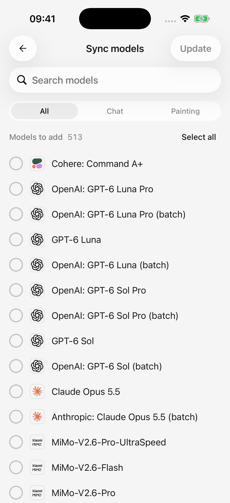

# Atualização de informações e listas de modelos

“Atualizar” pode significar várias coisas. Uma atualização de informações do modelo não muda o modelo escolhido, não concede permissões de conta nem adiciona automaticamente cada novo modelo à sua lista.

| O que você quer | Onde fazer | O que muda |
| --- | --- | --- |
| Novos nomes de modelos, capacidades, limites ou preços | Abra a guia **Modelos** de um provedor | As informações do modelo compartilhado usadas pelo aplicativo |
| Modelos atualmente retornados por uma plataforma | Toque em **Sincronizar** na guia Modelos desse fornecedor | Uma prévia das adições e modelos não devolvidos; você seleciona quais alterações aplicar |
| A configuração existente do seu computador | Escolha **Sincronizar a partir da aplicação para computador** | Configuração do provedor selecionado e modelos habilitados ausentes |
| Novos recursos e correções de aplicativos | Atualização através do canal oficial de instalação | O próprio aplicativo |

## Quando as informações do modelo são atualizadas?

Na primeira utilização, o aplicativo baixa informações do modelo em segundo plano. A seleção, criação e edição do modelo podem mostrar estados de carregamento ou nova tentativa até terminar. Verifique a rede e tente novamente após um primeiro download com falha.

As informações baixadas são armazenadas no seu dispositivo. Lançamentos posteriores usam as informações salvas sem baixá-las novamente a cada inicialização. **Abrir a guia Modelos de um provedor** aciona uma tentativa de atualização em segundo plano.

**Informações dos modelos atualizadas** aparece somente quando uma versão mais recente foi aplicada e você permanece na tela Modelos. Um catálogo inalterado, falha na atualização em segundo plano ou saída da página podem não produzir nenhuma notificação. O silêncio não significa necessariamente fracasso.

## O que acontece off-line?

Um catálogo salvo existente permanecerá utilizável se uma atualização falhar. Uma falha no download não limpa a configuração do seu modelo. O primeiro uso sem informações salvas ainda requer conexão com a internet.

Navegar off-line pelas informações salvas não disponibiliza modelos de nuvem off-line; enviar uma solicitação ainda requer uma conexão com seu provedor.

## Minhas edições serão substituídas?

As atualizações remotas de informações não reescrevem as substituições de modelos salvas ou modelos personalizados. Os campos que ainda seguem os padrões herdam novas informações, portanto, os nomes, recursos ou preços padrão podem mudar.

Essas atualizações não alteram suas **chaves API, endereços de provedores ou configurações de autenticação** e não habilitam um provedor. Limpe um limite de token inserido manualmente e salve se quiser que ele siga o padrão do catálogo/aplicativo novamente.

## Buscar a lista de modelos de um provedor

1. Abra **Configurações → Serviço de modelo → Seu provedor → Modelos**.
2. Salve todas as alterações na configuração do provedor e toque em **Sincronizar**.
3. Revise os modelos disponíveis para adicionar e aqueles **não retornados pelo serviço remoto**.
4. Selecione as alterações desejadas e toque em **Atualização**. Nada é selecionado automaticamente.
5. Leia a confirmação antes de aplicar qualquer remoção.

A busca da lista não habilita o provedor. Resultados com falha ou vazios mantêm os modelos existentes; repare a configuração, tente novamente ou [adicione um modelo manualmente](model-management.md).

<figure data-mobile-shot="phone"><figcaption>
<strong>iPhone · Interface em inglês</strong> · Revise e selecione modelos antes de aplicar alterações; a lista de provedores pode mudar
</figcaption></figure>

## “Não devolvido” significa que um modelo foi descontinuado?

Não necessariamente. Chaves, permissões de conta, APIs de listagem incompletas e falhas temporárias podem afetar os resultados.

Os modelos não são removidos automaticamente após uma única resposta. A remoção requer sua seleção e confirmação; o histórico da conversa permanece. Os modelos protegidos podem ser ignorados; consulte [regras de exclusão de modelo](model-management.md). Não remova modelos funcionais em massa simplesmente porque eles não foram devolvidos.

## Por que o chat funciona quando a sincronização falha?

A descoberta de modelo e o chat usam endereços de solicitação diferentes. Algumas plataformas suportam chat, mas não expõem uma lista de modelos API.

As configurações do provedor personalizado exibem o **URL do pedido da lista de modelos** separado. Se a plataforma não suportar, copie o ID exato do modelo da plataforma, adicione-o manualmente e verifique a conexão.

## Existe um novo modelo, mas não consigo vê-lo

Verifique isso:

1. Você abriu a aba Modelos para permitir uma atualização de informações.
2. Você sincronizou com o provedor relevante ou adicionou o modelo manualmente.
3. Sua conta/chave pode acessá-lo.
4. O provedor e o modelo estão habilitados e o filtro do seletor está definido como Todos.

As informações do modelo, o acesso à conta e os modelos adicionados localmente são separados. O aplicativo também deve suportar o formato de conexão do modelo.
