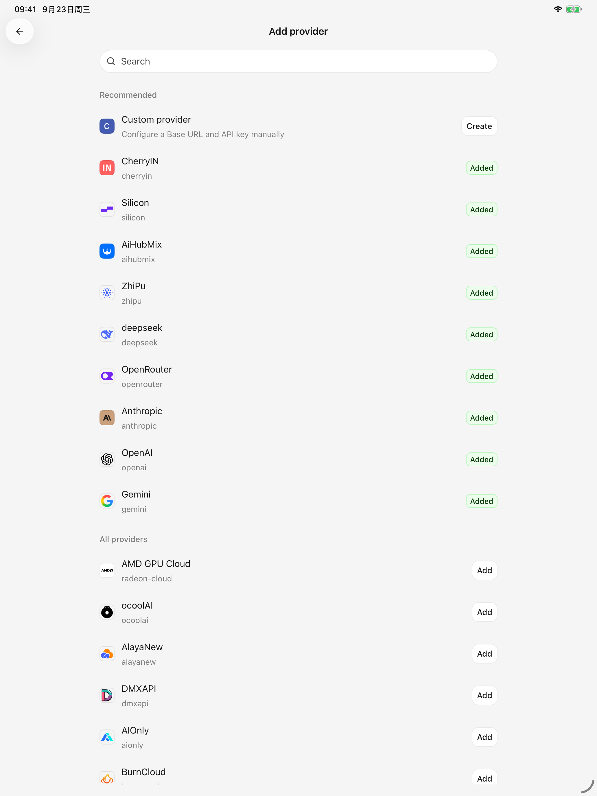
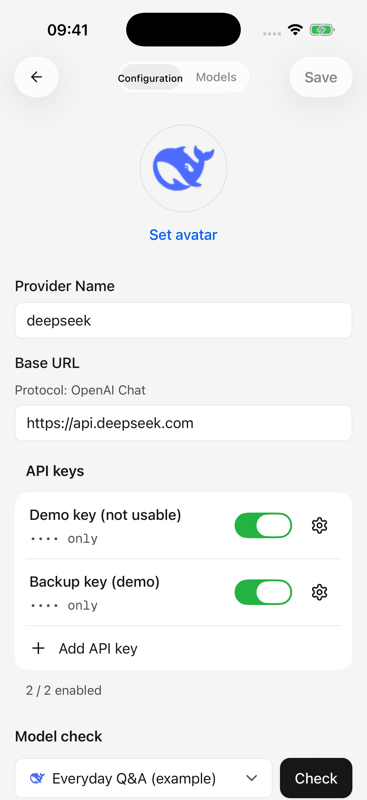
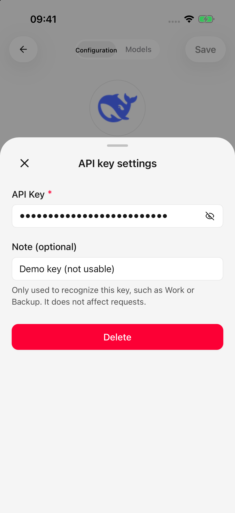

# Provedores e modelos

Um fornecedor é a plataforma que fornece um serviço de IA; um modelo é a IA específica que você usa por meio dessa plataforma. O mesmo modelo pode estar disponível em vários fornecedores, cada um com suas próprias credenciais.

Para começar, insira um **Chave API**, adicione um modelo e habilite o provedor. Uma chave API é a credencial que seu provedor emite para acesso ao aplicativo. Cherry Studio não inclui créditos de modelo; a disponibilidade e os custos dependem da conta do seu provedor.

<figure data-mobile-shot="phone"><figcaption>
<strong>iPhone · Interface em inglês</strong> · Pesquise o catálogo de provedores ou crie um provedor personalizado
</figcaption></figure>
<figure data-mobile-shot="tablet"><figcaption>
<strong>iPad · Interface em inglês</strong> · O mesmo catálogo de fornecedores no layout do tablet
</figcaption></figure>

## Adicione um provedor integrado

1. Abra **Configurações → Serviço de modelo** e toque no botão adicionar.
2. Procure um provedor e toque em **Adicionar**. As entradas integradas fornecem configurações de conexão comuns.
3. Insira a chave API desse provedor. Mantenha o endereço sugerido e a opção API, a menos que o provedor instrua o contrário.
4. Salve, busque a lista de modelos, selecione os modelos desejados e confirme. Se a lista não estiver disponível, adicione um modelo manualmente.
5. Conclua a configuração e verifique a opção do provedor na lista de serviços de modelo. Ative-o se permanecer desativado e selecione o modelo em uma conversa.

Edite um provedor existente em vez de adicioná-lo novamente. Você pode desativar um provedor temporariamente e ativá-lo novamente mais tarde.

## Adicione um provedor personalizado

Use um provedor personalizado quando sua plataforma estiver ausente do catálogo ou fornecer um endereço dedicado.

1. Escolha **Fornecedor personalizado** e insira um nome reconhecível.
2. Selecione o formato API documentado pela plataforma. OpenAI, Anthropic e Gemini descrevem formatos de conexão; escolha aquele que sua plataforma suporta.
3. Insira **URL Base**, o endereço base usado para se conectar ao serviço e sua chave API.
4. Revise o **URL do pedido** exibido e salve.
5. Busque modelos ou adicione manualmente o ID exato do modelo na plataforma. Retorne à lista de provedores e ative sua opção, se necessário.

### Qual endereço entra no URL base?

Use o endereço base do provedor, como `https://api.example.com/v1`. Não use sua página de login/painel nem cole um URL de solicitação completo terminando em `/chat/completions`. O aplicativo adiciona o caminho da solicitação; incluí-lo duas vezes causa um endereço incorreto. URLs completos reconhecidos mostram uma dica de correção.

Alguns gateways exigem um endereço sem uma versão API inserida automaticamente. Quando o provedor exigir isso, anexe `#`, por exemplo `https://api.example.com#`, e verifique a visualização do URL da solicitação. Caso contrário, deixe o marcador de fora.

Um provedor que oferece suporte a várias APIs pode ter endereços separados e um API padrão. Alterar o padrão pode afetar os modelos que o seguem; leia a confirmação antes de prosseguir.

## Edite um provedor e gerencie chaves

Abra a guia **Configuração** do provedor para editar seu nome, endereço e chaves. Notas-chave opcionais, como “Pessoal” ou “Backup”, são rótulos de identificação e não alteram as permissões.

* Adicione uma chave por entrada. As chaves podem ser editadas, habilitadas, desabilitadas ou removidas separadamente; não cole vários em um campo.
* Fechar o editor de uma chave mantém as alterações no rascunho da página. Toque em **Guardar** na página do provedor para salvar o endereço e as chaves juntos.
* Mantenha pelo menos uma chave válida habilitada. Um provedor com todas as chaves desabilitadas não pode fazer solicitações normais.
* Um prompt de descarte de alterações significa que ainda há edições não salvas.

As solicitações de bate-papo suportadas podem tentar outra chave habilitada após um erro de autorização ou de limite de taxa, desde que nenhuma resposta tenha sido iniciada. Isso não cobre todos os erros, geração de imagens ou solicitações de lista de modelos e não aumenta os créditos da conta.

<figure data-mobile-shot="phone"><figcaption>
<strong>iPhone · Interface em inglês</strong> · Salve as alterações do provedor com o botão superior direito; as chaves mostradas são exemplos que não funcionam
</figcaption></figure>
<figure data-mobile-shot="phone"><figcaption>
<strong>iPhone · Interface em inglês</strong> · As notas das chaves ajudam a identificar as contas; salve o provedor após fechar este painel
</figcaption></figure>

## Verifique a conexão

Salve primeiro, abra **Verificação do modelo**, selecione um modelo e execute a verificação. A página exibe o endereço da solicitação e o resultado.

O sucesso se aplica a essa configuração e ao modelo selecionado, não a todos os modelos da plataforma. Verificar uma conexão não habilita o provedor; verifique sua opção na lista de provedores.

## Escolha modelos e padrões

O seletor de modelo de conversação altera o modelo do agente atual. O provedor deve estar habilitado e o modelo disponível. Pesquise ou use os filtros **Todos**, **Grátis** e **imagem** para restringir a lista. Se os modelos desaparecerem, retorne para **Todos**.

O filtro de imagens indica os modelos registrados como compatíveis com entrada de imagens; Grátis indica o preço registrado. As capacidades reais, a franquia gratuita e as cotas dependem do provedor.

Em **Configurações → Modelo predefinido**, selecione os modelos padrão e de desenho. Selecionar ou limpar salva imediatamente. Os agentes existentes mantêm as suas próprias escolhas de modelos; alterar o padrão global não atualiza todos os agentes.

## Guias relacionados

* [Adicionar, editar e gerenciar modelos](model-management.md): recursos, limites, preços e exclusão.
* [Informações do modelo e atualizações da lista](model-updates.md): atualizações automáticas versus sincronização manual.
* [Importar configuração do desktop](desktop-sync.md): reutiliza uma configuração existente.
* [Solução de problemas](troubleshooting.md): erros de conexão e recuperação.
