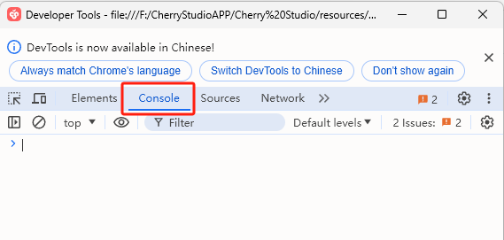


Este documento foi traduzido do chinês por IA e ainda não foi revisado.


# Limpar configuração CSS


Use este método para limpar as configurações CSS quando configurar um CSS incorreto ou quando não conseguir acessar a interface de configurações após definir o CSS.


* Abra o console: clique na janela do CherryStudio e pressione <kbd>Ctrl</kbd>+<kbd>Shift</kbd>+<kbd>I</kbd> (MacOS: <kbd>command</kbd>+<kbd>option</kbd>+<kbd>I</kbd>).
* Na janela do console exibida, clique em `Console`

<figure><figcaption></figcaption></figure>

* Digite manualmente `document.getElementById('user-defined-custom-css').remove()` (copiar e colar provavelmente não funcionará).
* Pressione Enter após digitar para limpar as configurações CSS, depois retorne às configurações de exibição do CherryStudio para remover o código CSS problemático.