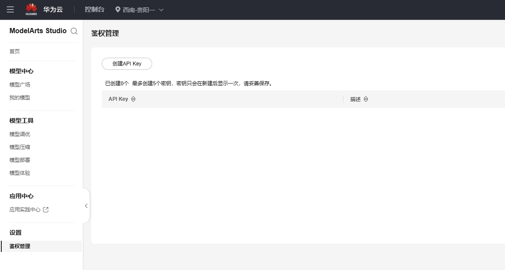
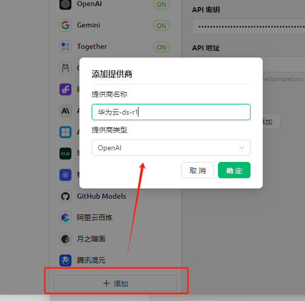
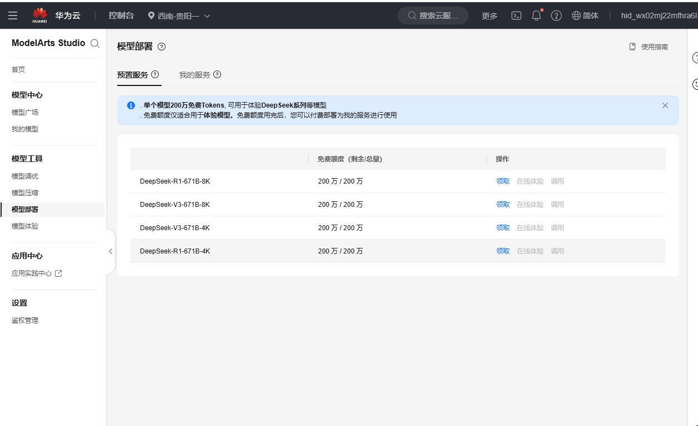
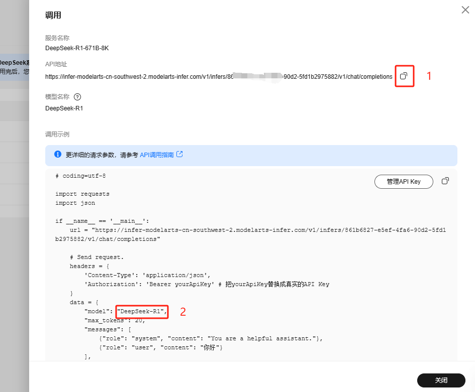
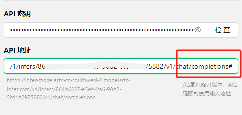
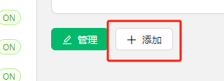
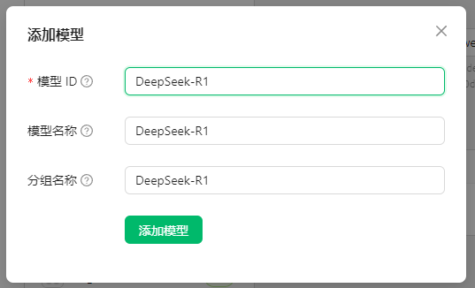


Este documento foi traduzido do chinês por IA e ainda não foi revisado.


# Huawei Cloud

## Passo 1
Vá até o site [Huawei Cloud](https://auth.huaweicloud.com/authui/login) para criar uma conta e fazer login

## Passo 2
Clique [neste link](https://console.huaweicloud.com/modelarts/?region=cn-southwest-2#/model-studio/homepage) para acessar o console do Maa S

## Passo 3
Autorização

Etapas de autorização (pule se já autorizado)

1. Após acessar o link do Passo 2, siga as instruções para a página de autorização (clique em IAM Subuser → Add Agency → Regular User)

2. Após criar, volte para o link do Passo 2
3. Será exibida uma mensagem de "Permissão insuficiente" - clique em "Clique aqui" na mensagem
4. Adicione a autorização existente e confirme

Observação: Este método é para iniciantes e não requer leitura extensa. Basta seguir os prompts. Se conseguir autorizar de outra forma, siga seu próprio método.

## Passo 4
Clique em "Gestão de Autenticação" na barra lateral, crie uma API Key (chave secreta) e copie-a

<figure><figcaption></figcaption></figure>

Em seguida, crie um novo provedor no CherryStudio

<figure><figcaption></figcaption></figure>

Após criar, cole a chave secreta

## Passo 5
Clique em "Model Deployment" na barra lateral e ative todas as opções

<figure><figcaption></figcaption></figure>

## Passo 6
Clique em "Invoke"

<figure><figcaption></figcaption></figure>

Copie o endereço em ① e cole no campo de endereço do provedor do CherryStudio, adicionando "#" ao final  
e adicione "#" ao final  
e adicione "#" ao final  
e adicione "#" ao final  
e adicione "#" ao final  

Por que adicionar "#"? [Veja aqui](https://docs.cherry-ai.com/cherrystudio/preview/settings/providers#api-di-zhi)

> Você também pode ignorar e seguir o tutorial diretamente;  
> Ou usar o método de excluir "v1/chat/completions" - preencha como preferir, mas siga rigorosamente o tutorial se não tiver experiência.

<figure><figcaption></figcaption></figure>

Copie o nome do modelo em ②, clique em "+ Adicionar" no CherryStudio para criar novo modelo

<figure><figcaption></figcaption></figure>

Digite o nome do modelo exatamente como exibido, sem adicionar elementos extras ou aspas.

<figure><figcaption></figcaption></figure>

Clique em "Adicionar Modelo" para concluir.


Na Huawei Cloud, como cada modelo tem endereço único, repita todo o processo para cada modelo criando um novo provedor.
