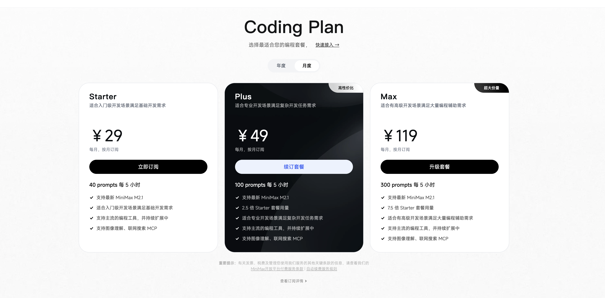
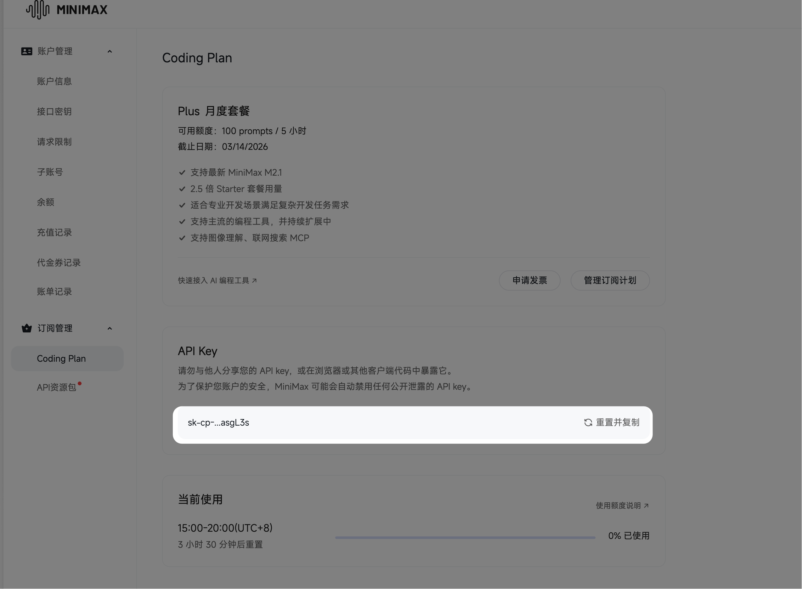
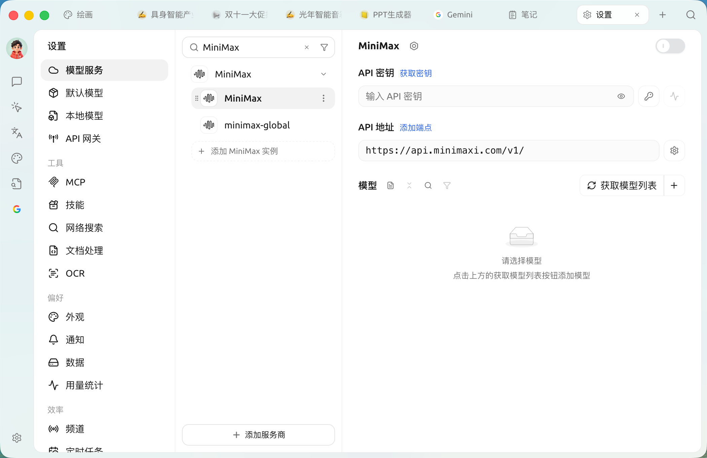
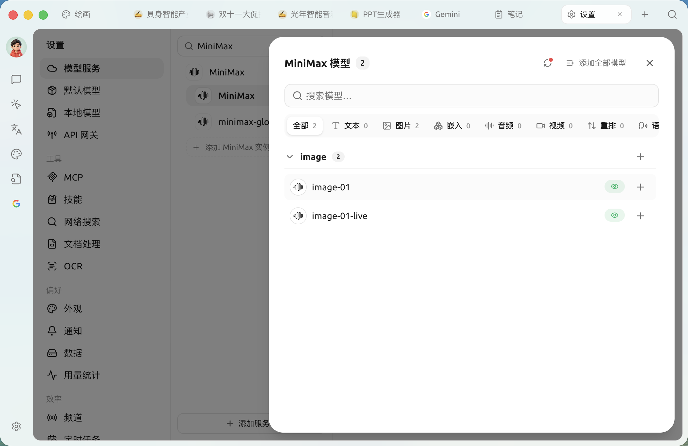

# Plano de Coding MiniMax

O **Coding Plan** é um serviço de assinatura de programação com excelente custo-benefício lançado pela MiniMax (como os planos Starter/Plus). Ao configurar esse plano no Cherry Studio, você pode usar o modelo `MiniMax-M2.1` com um custo fixo muito baixo (a partir de ¥29/mês).


**Vantagens principais**

* **Público-alvo**: usuários com uma assinatura do MiniMax Coding Plan (Starter / Plus / Max).
* **Modelo de cobrança**: cota renovada por período (por exemplo, 40 Prompts a cada 5 horas), em vez de cobrança por Token, sem preocupação com consumo rápido.


### 1. Preparação

Antes de começar, certifique-se de que você já comprou o plano e obteve a chave:

1. Faça login na [**Plataforma Aberta MiniMax**](https://platform.minimaxi.com/).
2. Acesse a [página **Coding Plan**](https://platform.minimaxi.com/subscribe/coding-plan?code=FYWiC6CtHy\&source=link) e verifique se o plano está ativo.

    <figure><figcaption></figcaption></figure>
3. No **Coding Plan**, copie sua chave `API Key` exclusiva (que começa com `sk-`).

<figure><figcaption></figcaption></figure>

### 2. Etapas de configuração

#### Passo 1: Localizar o provedor

Abra o Cherry Studio, clique em **Configurações** > **Serviços de Modelo** na barra lateral e localize **MiniMax** na lista.


Se a lista for longa, você pode digitar `mini` na caixa de pesquisa no topo para localizar rapidamente.


#### Passo 2: Preencher a configuração

**Não é necessário** modificar o endereço da API complexo; use a configuração padrão. Siga as instruções abaixo para preencher:

<table><thead><tr><th width="128.20703125">Parâmetro</th><th>Instruções de preenchimento</th></tr></thead><tbody><tr><td><strong>API Key</strong></td><td>Cole sua chave exclusiva do Coding Plan <em>(Atenção: deve ser a Key gerada após a compra do plano, sem espaços em branco extras)</em></td></tr><tr><td><strong>Endereço da API</strong></td><td>Mantenha o padrão <code>https://api.minimaxi.com/v1</code></td></tr><tr><td><strong>Interruptor</strong></td><td>Clique no interruptor no canto superior direito para garantir que esteja <strong>verde (ON)</strong></td></tr></tbody></table>

<figure><figcaption></figcaption></figure>

#### Passo 3: Adicionar o modelo especificado (crítico)

O plano Coding Plan suporta apenas modelos específicos. Selecionar o modelo errado impedirá o uso ou gerará custos adicionais.

1. Clique no botão **Gerenciar (Manage)** na parte inferior da página de configuração.

<figure><figcaption></figcaption></figure>

2. Localize e adicione **`MiniMax M2.1`** na lista.


**Certifique-se de selecionar o modelo correto!**

* ✅ **Recomendado**: `MiniMax M2.1` (modelo principal designado para o Coding Plan).


#### Passo 4: Salvar e verificar 

1. Clique no botão **Verificar (Check)** ao lado da caixa de entrada da chave da API.
2. Se aparecer **Success** em verde, sua assinatura do Coding Plan foi conectada com sucesso!

### 3. Explicação de uso e limitações

O modelo de cobrança do Coding Plan é completamente diferente do da API comum. Entenda os mecanismos a seguir:


**Mecanismo de renovação de cota** A cota do Coding Plan é **renovada periodicamente**. Por exemplo, o plano Starter: fornece **40** conversas a cada **5 horas**.

* **Se não houver mais resposta**: significa que sua cota das atuais 5 horas foi esgotada.
* **Solução**: espere algumas horas para que a cota seja restaurada automaticamente, sem necessidade de pagamento adicional.


### 4. Solução de problemas comuns


**Encontrou o erro `429 Too Many Requests`?**

Isso não é uma falha do software, mas sim o acionamento da **limitação de frequência do Coding Plan**.

* Isso significa que o número de "mensagens enviadas" no seu período atual foi utilizado.
* Aguarde pacientemente a renovação do próximo ciclo de 5 horas.



**Encontrou o erro `401 Unauthorized`?**

* Verifique se a API Key possui espaços em branco extras.
* Acesse o site oficial da MiniMax para confirmar se sua assinatura do Coding Plan expirou.


***

### Obter ajuda e enviar feedback

Se você tiver dúvidas, encontrar bugs ou tiver sugestões de melhorias de funcionalidades durante a configuração ou o uso, consulte os canais oficiais fornecidos em [Feedback e Sugestões](../../question-contact/suggestions.md).
