
Este documento foi traduzido do chinês por IA e ainda não foi revisado.


# Integração do Volcano Engine com Acesso à Internet

### 1. Acessar/Registrar uma conta do «Volcano Engine» 

Visite o site oficial: [https://www.volcengine.com/](https://www.volcengine.com/)

<figure>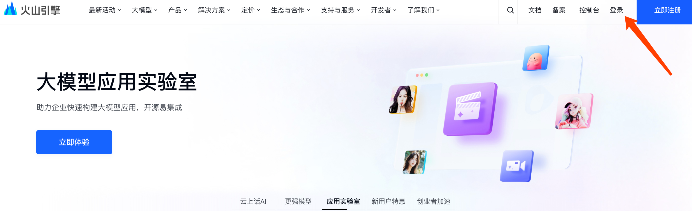<figcaption>
Site oficial do Volcano Engine
</figcaption></figure>

### 2. Criar «Meu Aplicativo» com acesso à internet 

2.1. Faça login no Volcano Engine e acesse a página «Volcano Ark»: [https://console.volcengine.com/ark](https://console.volcengine.com/ark)

2.2. **Clique sequencialmente em:** <mark style="color:red;">**«Meus Aplicativos» → «Criar Aplicativo» → «Sem Código» → «Bate-papo Individual»**</mark>

<figure>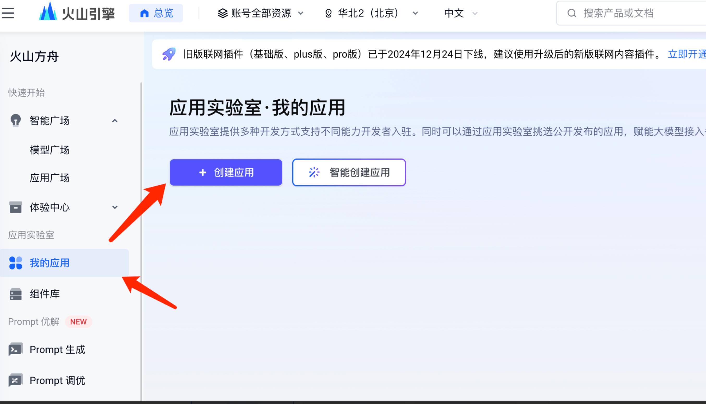<figcaption></figcaption></figure>

<figure>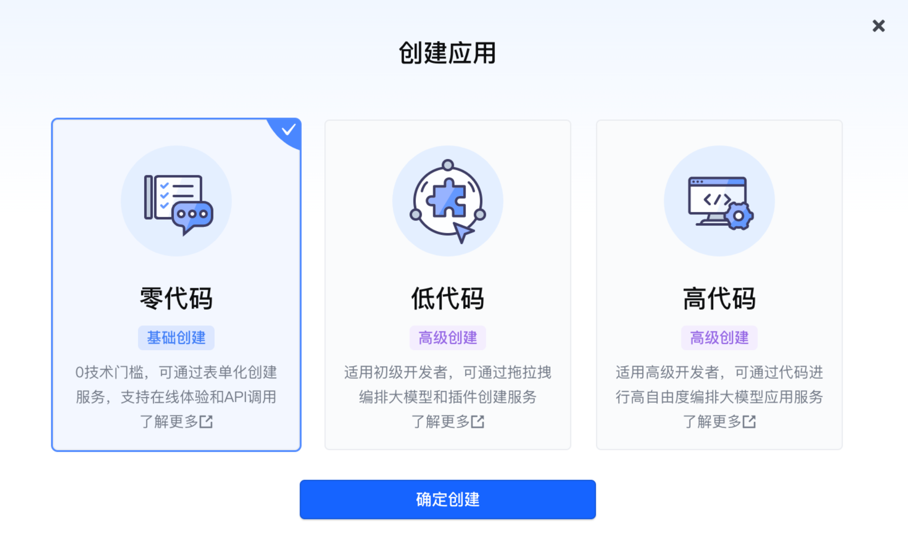<figcaption></figcaption></figure>

<figure>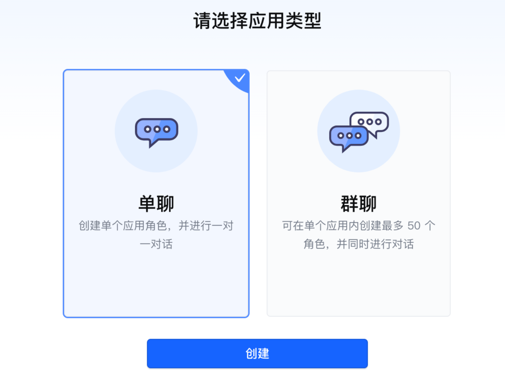<figcaption></figcaption></figure>

### 3. Preencher informações e publicar o aplicativo 

**Nome do aplicativo**: Escolha qualquer nome conforme exigido. (Campos com <mark style="color:red;">**\* são obrigatórios**</mark>, outros são opcionais)

<mark style="color:red;">**Chave: Ative o plugin de internet (requer ativação prévia)**</mark>

<figure>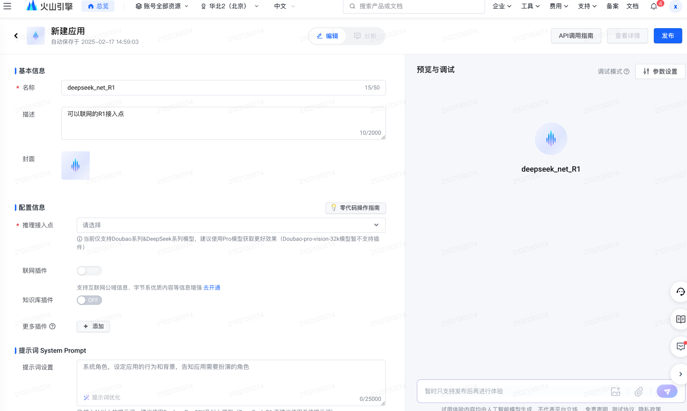<figcaption></figcaption></figure>

#### 3.1. Ativar o recurso de plugin de internet (observe custos e uso gratuito) 

<figure>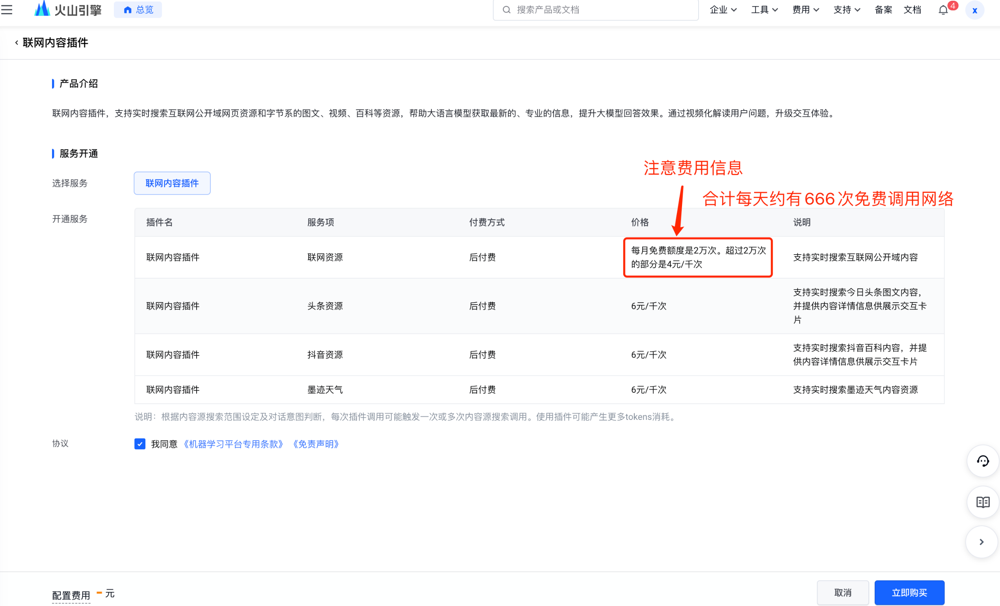<figcaption>
Clique em "Comprar Agora" e siga até ver esta tela, indicando ativação bem-sucedida.
</figcaption></figure>

<figure>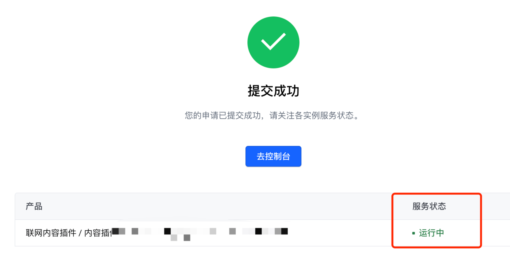<figcaption>
Verifique o status: ativação concluída
</figcaption></figure>

Retorne à tela «Preencher Informações do Aplicativo» e continue.

<figure>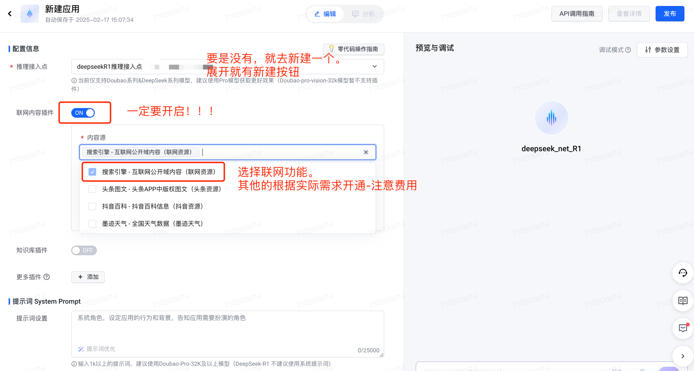<figcaption></figcaption></figure>

#### 3.2. Configurações avançadas de «Busca na Internet» 

Escolha conforme sua necessidade:

* Para controle preciso de entrada/saída: use **«Chamada Personalizada»**;
* Para simplicidade: **«Chamada Automática»** (padrão);
* Se prioriza atualização em tempo real: **«Forçar Ativação»**.

<figure>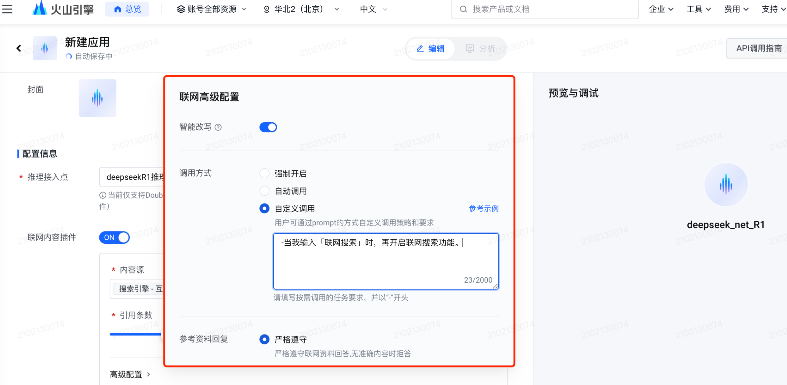<figcaption></figcaption></figure>

#### 3.3. Publicar o aplicativo 

Clique em **«Publicar»** no canto superior direito para finalizar.

<figure>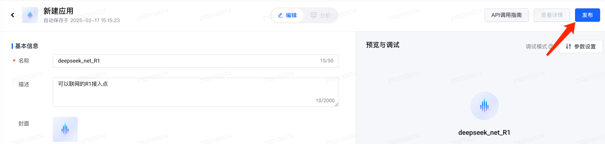<figcaption></figcaption></figure>

### 4. Obter a API Key 

Siga: **«Guia de Chamada de API» → «Selecionar e copiar API Key» → «Ver e Selecionar»**

Copie a API Key e cole-a posteriormente no cherry studio (veja detalhes abaixo).

<figure>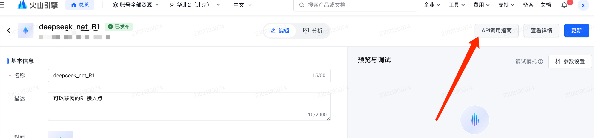<figcaption></figcaption></figure>

**Nota**: Sem API Key? Clique em **«Criar API Key»** no canto superior direito do pop-up.

<figure>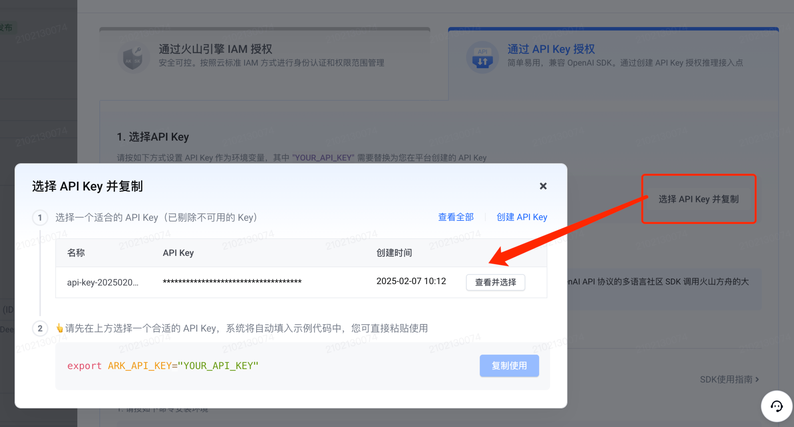<figcaption></figcaption></figure>

### 5. Usar a API Key no cherry studio para acesso à internet com deepseek-R1 

#### 5.1. Acesse cherry studio → «Configurações» → «Nome qualquer» → «Tipo: OpenAI» 

<figure>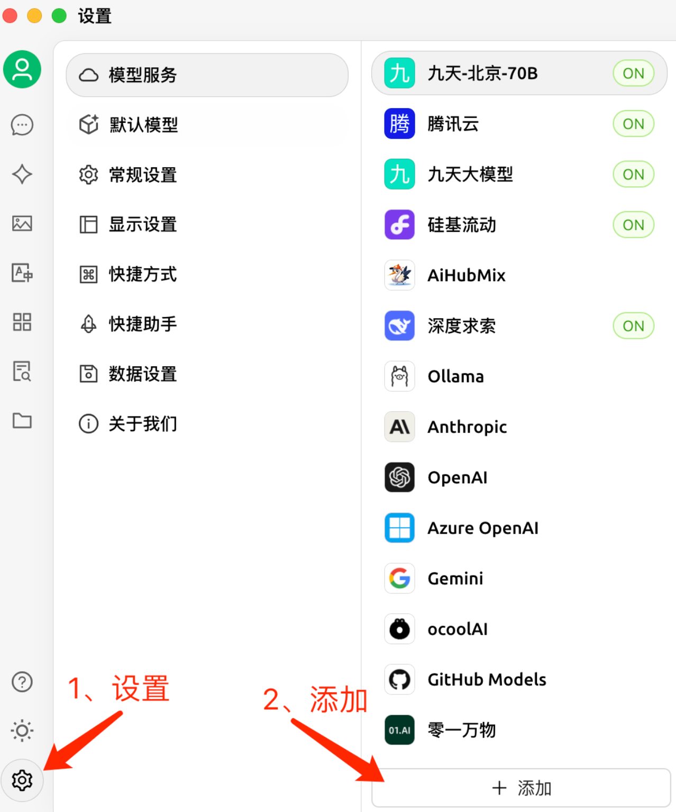<figcaption></figcaption></figure>

<figure>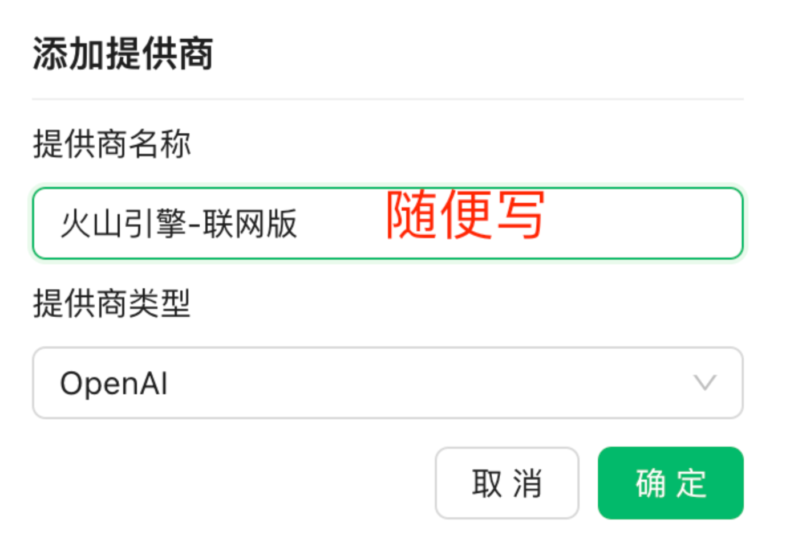<figcaption></figcaption></figure>

#### 5.2. Configurar URL e Key 

<figure>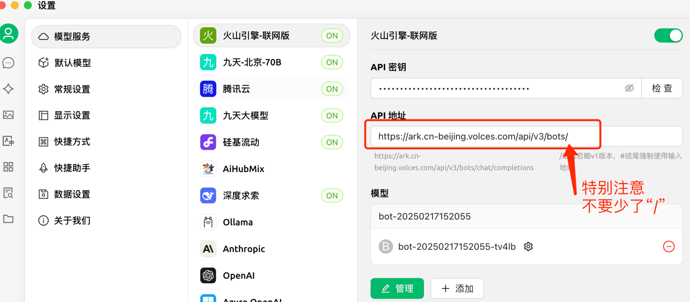<figcaption></figcaption></figure>

<mark style="color:purple;">Dica: Se o endereço não for encontrado ou não for do nó de Pequim, verifique aqui (não esqueça "/"):</mark>

<figure>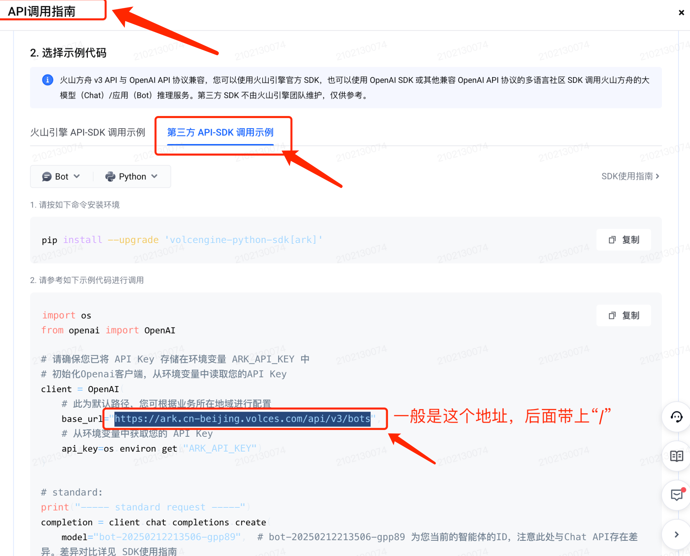<figcaption></figcaption></figure>

#### 5.3. Adicionar nome do modelo 

**Copie o nome do modelo indicado em texto pequeno**, caso contrário ocorrerá erro.

<figure>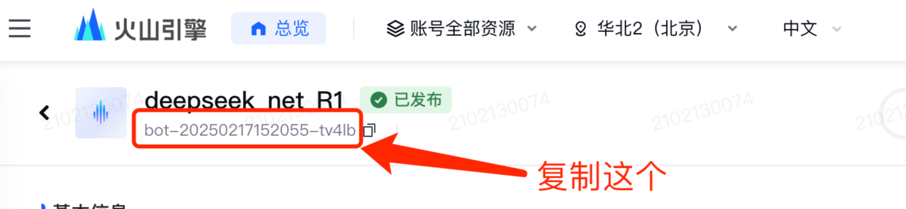<figcaption></figcaption></figure>

<figure>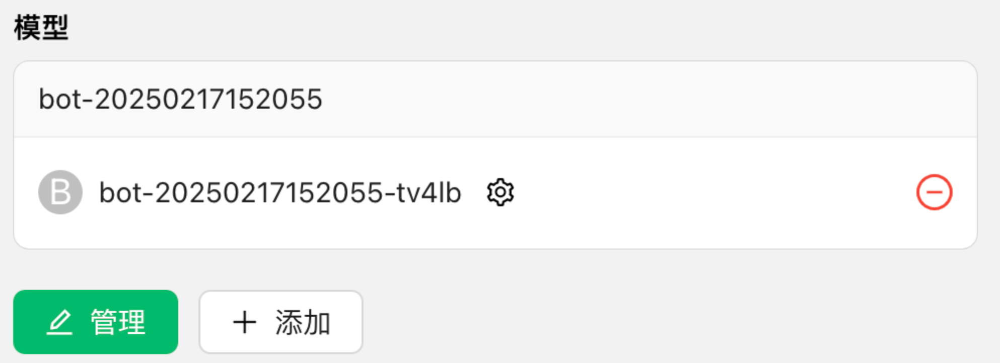<figcaption></figcaption></figure>

### 6. Visualização do resultado 

<figure>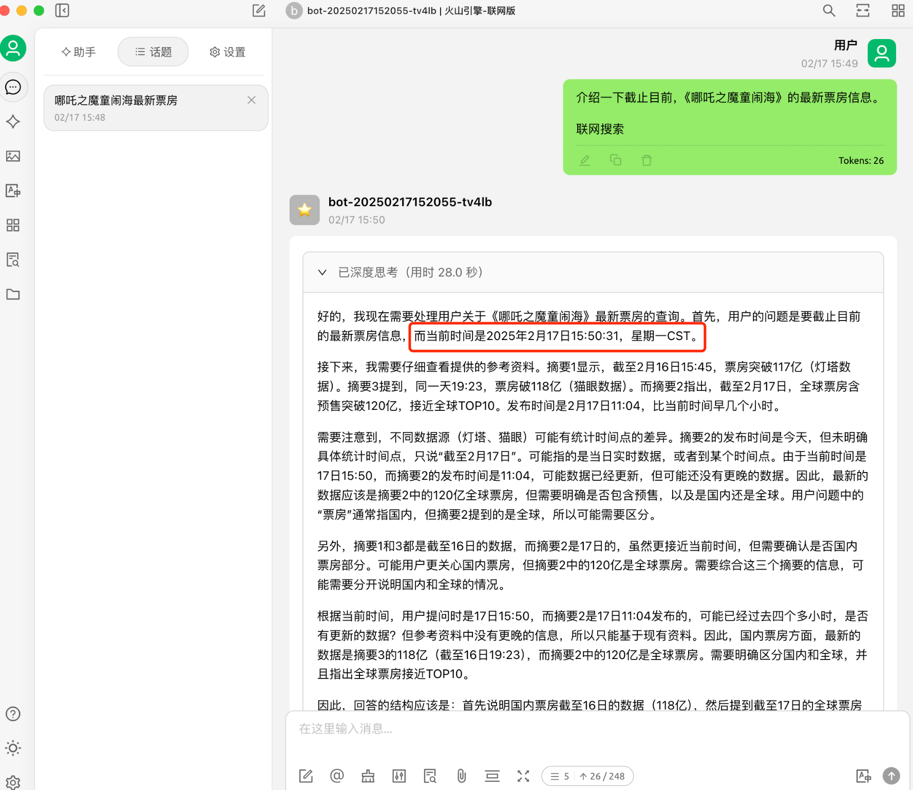<figcaption></figcaption></figure>