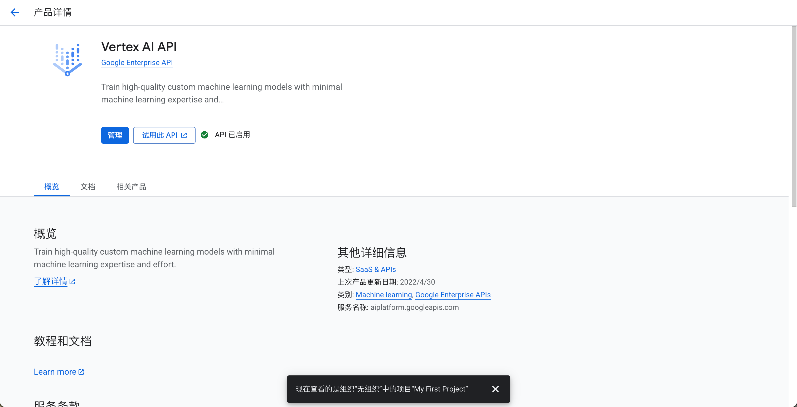
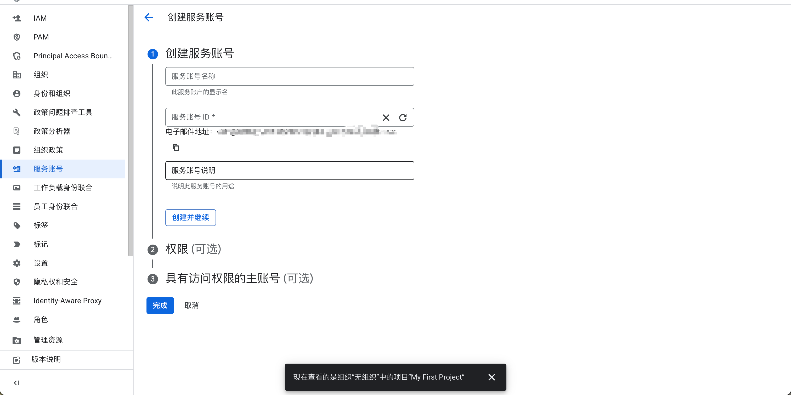
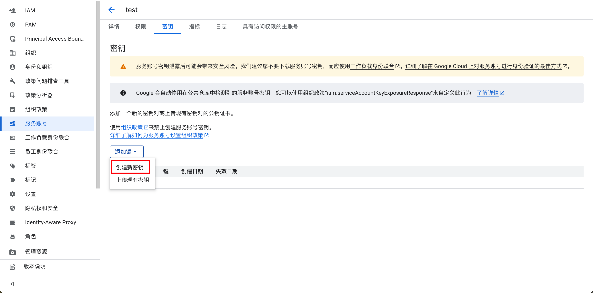
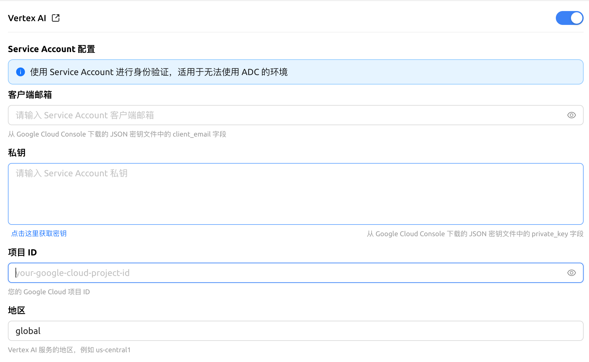

# Vertex AI


Ce document a été traducido del chino por IA y aún no ha sido revisado.


## Aperçu du tutoriel

### 1. Obtenir la clé API

* Avant d'obtenir une clé API Gemini, vous devez disposer d'un projet Google Cloud (vous pouvez ignorer cette étape si vous en avez déjà un)
* Accédez à [Google Cloud](https://console.cloud.google.com/projectcreate) pour créer un projet, remplissez le nom du projet et cliquez sur "Créer le projet"

<figure><figcaption></figcaption></figure>

* Accédez à la [console Vertex AI](https://console.cloud.google.com/vertex-ai)
* Activez l'[API Vertex AI](https://console.cloud.google.com/apis/library/aiplatform.googleapis.com?inv=1\&invt=Ab0iBA) dans le projet créé

<figure><figcaption></figcaption></figure>

## 2. Configurer les droits d'accès à l'API

* Ouvrez la page des autorisations du [compte de service](https://console.cloud.google.com/iam-admin/serviceaccounts) et créez un compte de service

<figure><figcaption></figcaption></figure>

* Sur la page de gestion des comptes de service, localisez le compte créé, cliquez sur `Clés` et créez une nouvelle clé au format JSON

<figure><figcaption></figcaption></figure>

* Après création réussie, le fichier de clé sera automatiquement enregistré sur votre ordinateur au format JSON - **conservez-le précieusement**

## 3. Configurer Vertex AI dans Cherry Studio

* Sélectionnez le fournisseur de services Vertex AI
* Remplissez les champs correspondants du fichier JSON

<figure><figcaption></figcaption></figure>

Cliquez sur Ajouter [Modèle](https://console.cloud.google.com/vertex-ai/model-garden) et vous pouvez commencer à l'utiliser avec plaisir !