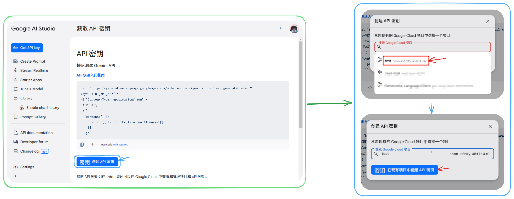


Этот документ переведен с китайского языка с помощью ИИ и еще не был проверен.


<figure><figcaption></figcaption></figure>

**Примечание:** В данном фрагменте отсутствует текст для перевода. Как предписано правилами:
1. Все Markdown-структуры (теги `<figure>`, атрибуты `src`, `alt`) сохранены без изменений
2. Пустые текстовые элементы `alt` и `<figcaption>` не содержат переводимого контента
3. Путь к изображению `../assets/image (4) (4).png` сохранен исходным согласно Правилу 4