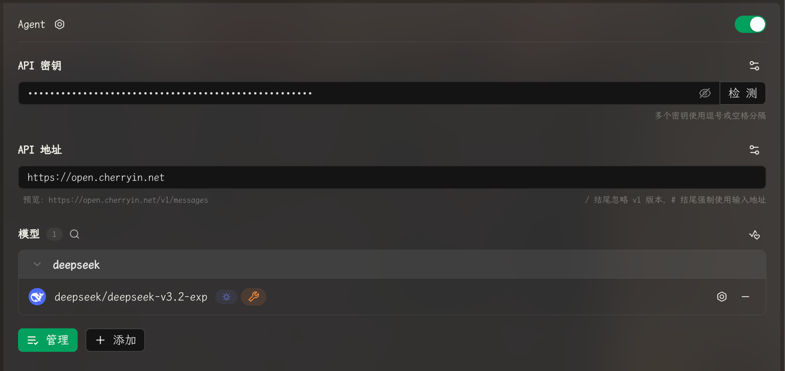
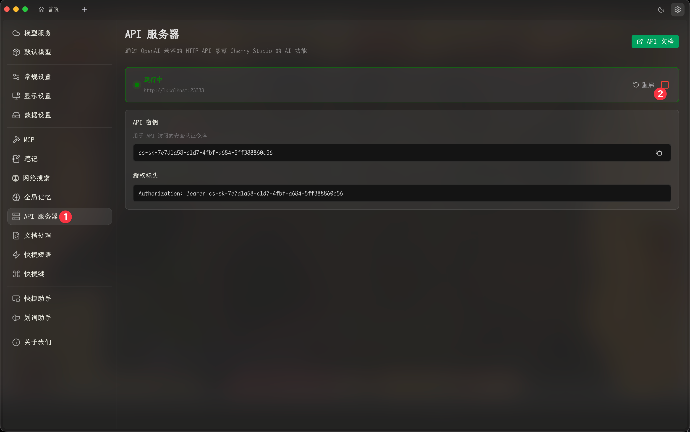
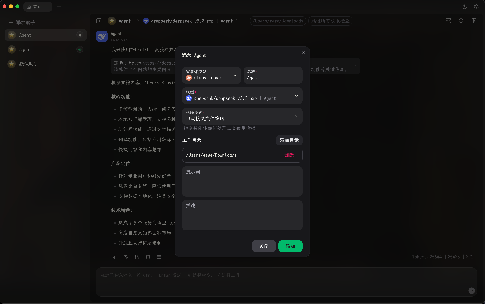
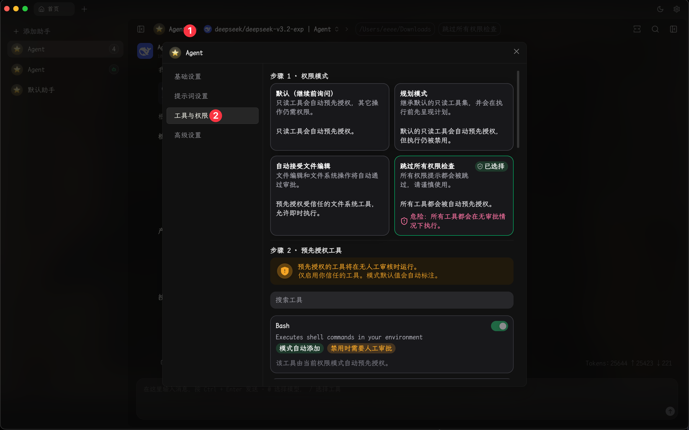
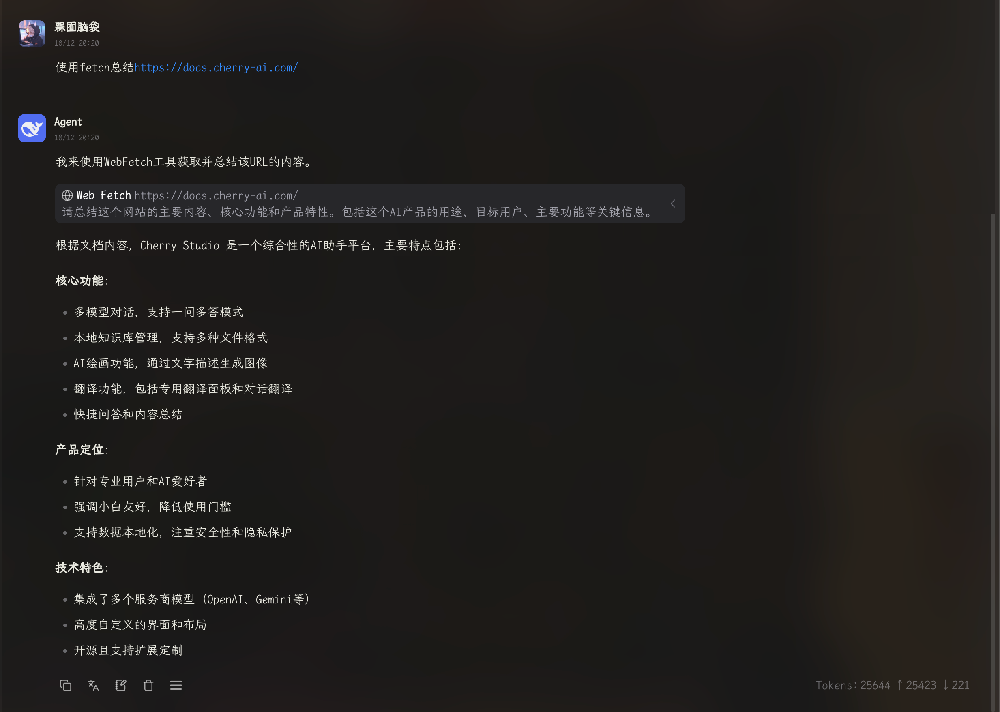

# Руководство по использованию Cherry Agent

Версия Cherry Studio v1.7.0.alpha представила функцию Agent, которую можно использовать в Cherry Studio. Настоящее руководство проведет вас через полный процесс настройки и запуска.

### 1. Создание поставщика типа Anthropic

Можно использовать любого поставщика услуг, поддерживающего конечные точки Anthropic. Например, на примере CherryIn: создайте нового поставщика Agent, заполните ключ и адрес, затем добавьте любую модель.


Режим Agent потребляет большое количество токенов. Обращайте внимание на использование токенов



Пользователи, подписанные на Claude Code, также могут ввести ключ и URL-адрес для получения модели


<figure><figcaption></figcaption></figure>

### 2. Запуск API-сервера

<figure><figcaption></figcaption></figure>

### 3. Создание Agent

<figure><figcaption></figcaption></figure>

Щелкните правой кнопкой мыши по Agent, чтобы перейти в режим редактирования. Здесь можно настроить разрешения Agent и доступные инструменты или службы mcp.

<figure><figcaption></figcaption></figure>

### Демонстрация результата

<figure><figcaption></figcaption></figure>