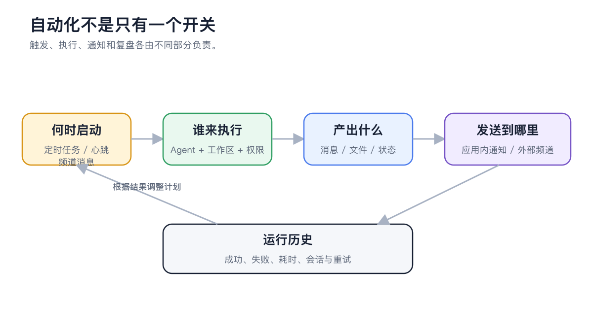
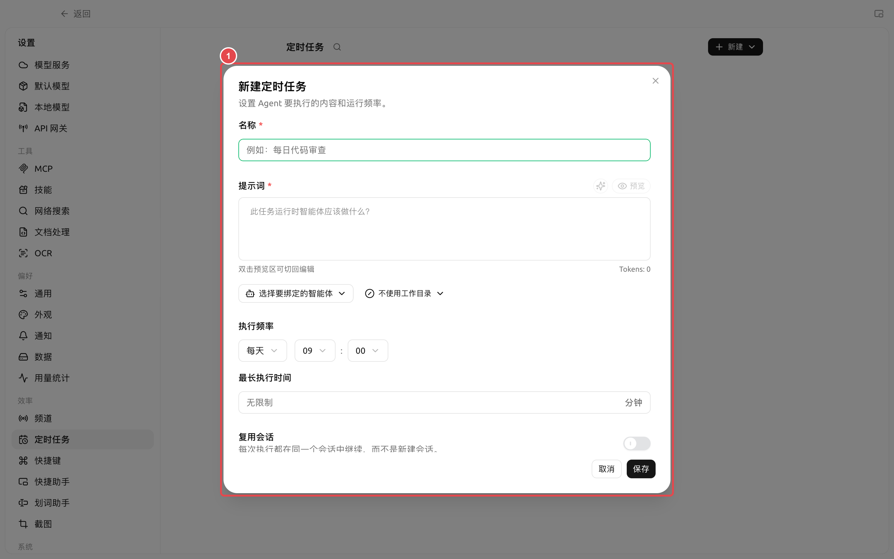

# Планируемые задачи, heartbeat и журнал выполнения

Что делать, если задача выполнена, но канал не получил сообщение?

Сначала проверьте [Историю выполнения], чтобы убедиться, что Agent успешно завершил работу. Если задача выполнена успешно, проверьте параметры получения в канале. Если задача завершилась с ошибкой, нажмите [Просмотр сессии] и проверьте ошибки модели, разрешений, рабочей области и инструментов.

<figure><figcaption></figcaption></figure>

<figure><figcaption></figcaption></figure>
