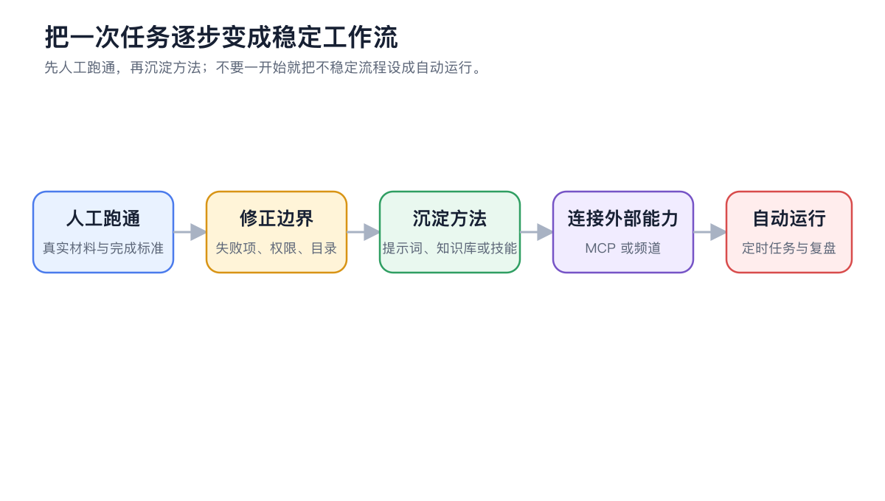
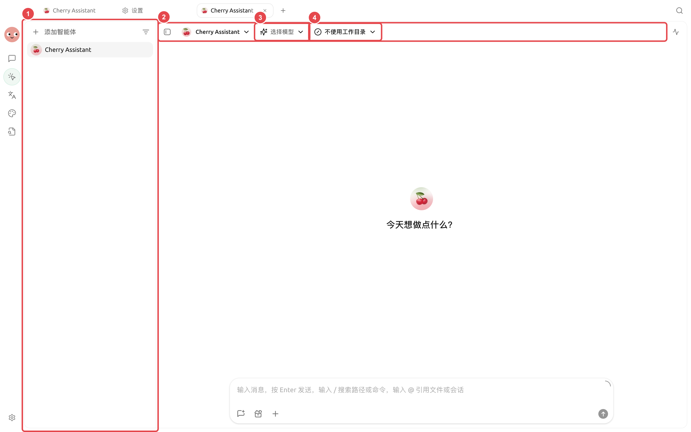

# Примеры применения

Эти примеры показывают, как объединить диалоги, Agent, базы знаний, заметки, рисование, перевод, каналы, запланированные задачи и многооконный режим в рабочие процессы, готовые к использованию. Настройки в примерах — это отправная точка; при реальном использовании их нужно адаптировать в зависимости от чувствительности данных, объёма нагрузки и правил команды.

<figure><figcaption>
Сначала прогоните процесс вручную с реальными материалами, затем постепенно добавляйте базы знаний, навыки, MCP, каналы и запланированные задачи. 
</figcaption></figure>

## Выбор примера

<table data-view="cards"><thead><tr><th></th><th></th><th data-hidden data-card-target data-type="content-ref"></th></tr></thead><tbody><tr><td><strong>Ретроспектива исследования с несколькими моделями </strong></td><td>Внутренние материалы, внешние источники и проверка противоречий </td><td><a href="research-review.md">research-review.md </a></td></tr><tr><td><strong>Рецензирование длинных документов </strong></td><td>Проверка по разделам и создание исправленной версии </td><td><a href="long-document-review.md">long-document-review.md </a></td></tr><tr><td><strong>Передача файлов проекта через Agent </strong></td><td>Контроль каталогов, прав и области результата </td><td><a href="project-delivery.md">project-delivery.md </a></td></tr><tr><td><strong>Набор изображений для бренда </strong></td><td>От визуального направления до изображений в разных размерах </td><td><a href="brand-image-kit.md">brand-image-kit.md </a></td></tr><tr><td><strong>Вопросы и ответы по частной базе знаний </strong></td><td>Ограничение области материалов и отказ от догадок </td><td><a href="private-knowledge-qa.md">private-knowledge-qa.md </a></td></tr><tr><td><strong>Еженедельный отчёт из заметок </strong></td><td>От ежедневных записей к проверяемому еженедельному отчёту </td><td><a href="notes-weekly-report.md">notes-weekly-report.md </a></td></tr><tr><td><strong>Обработка многоязычных материалов </strong></td><td>Терминология, OCR, документы и проверка согласованности </td><td><a href="multilingual-materials.md">multilingual-materials.md </a></td></tr><tr><td><strong>Каналы и автоматический ежедневный отчёт </strong></td><td>Agent, каналы, планирование и журнал выполнения </td><td><a href="automated-daily-report.md">automated-daily-report.md </a></td></tr><tr><td><strong>Многооконная исследовательская рабочая область </strong></td><td>Одновременное хранение материалов, сравнение и выполнение задач </td><td><a href="multi-window-research.md">multi-window-research.md </a></td></tr></tbody></table>

## Общий порядок настройки

<figure><figcaption>
Примеры — это не набор изолированных настроек, а полный рабочий процесс: от ввода и выполнения до проверки и передачи результата. 
</figcaption></figure>

## Выбор примера по задаче

| Ваша задача | Сначала посмотрите | Основные возможности |
| ----------- | -------------- | -------------- |
| Сравнение мнений и сохранение хода исследования | 【Ретроспектива исследования с несколькими моделями】 | Диалоги, ветвления, заметки |
| Рецензирование большого объёма материалов и выдача замечаний | 【Рецензирование длинных документов】 | Agent, рабочий каталог, файлы |
| Передача документации и результатов проекта | 【Передача файлов проекта через Agent】 | Agent, состояние, файлы |
| Генерация набора изображений в едином стиле | 【Набор изображений для бренда】 | Рисование через Agent, шаблоны рисования |
| Ответы только на основе внутренних материалов | 【Вопросы и ответы по частной базе знаний】 | База знаний, тесты извлечения, Agent |
| Составление еженедельного отчёта из разрозненных записей | 【Еженедельный отчёт из заметок】 | Заметки, Agent, файлы |
| Обработка многоязычных файлов | 【Обработка многоязычных материалов】 | Перевод, Agent, рабочий каталог |
| Отправка фиксированного отчёта по расписанию | 【Каналы и автоматический ежедневный отчёт】 | Agent, каналы, запланированные задачи |
| Одновременное наблюдение за материалами и длительными задачами | 【Многооконная исследовательская рабочая область】 | Вкладки, многооконный режим, глобальный поиск |



### 1. Сначала определите результат

Укажите, какой файл, таблица, изображение или сообщение должны быть получены в итоге, и что считается завершением задачи.



### 2. Прогоните процесс вручную в разделе 【Работа】

Проверьте, достаточно ли модели, промптов, рабочего каталога и материалов. Операции, требующие подтверждения, проверяйте по отдельности.



### 3. Фиксируйте только стабильные части

Повторяющиеся шаги оформите как навыки, долгосрочные материалы поместите в базу знаний, временные требования оставьте в промпте задачи.



### 4. В конце подключите внешние сервисы и автоматизацию

После однократной ручной приёмки подключайте MCP, каналы или запланированные задачи, сохраняя возможность ручного вмешательства при сбоях.


