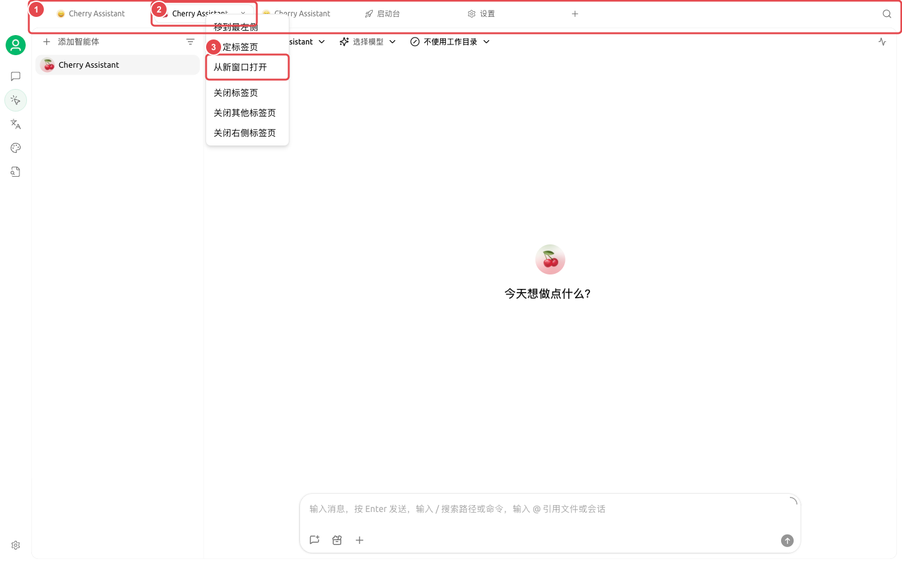
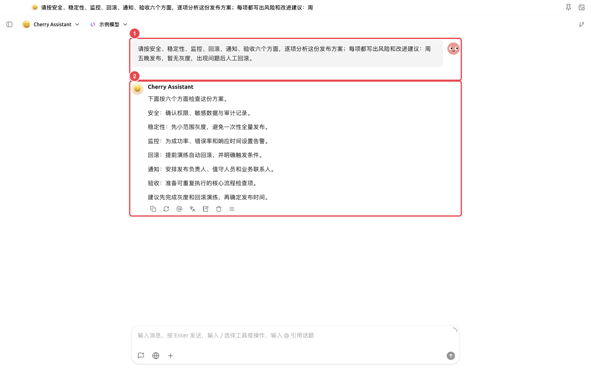

# Рабочее пространство для исследований в нескольких окнах

Исследователям необходимо одновременно сохранять материалы и сравнение моделей, а также позволять Agent организовывать файлы и генерировать отчеты. При распределении исследовательских задач по отдельным окнам основное окно продолжает использоваться для поиска материалов, не прерывая состояние Agent.

## Рекомендуемая компоновка

* Основное окно: диалог с материалами и глобальный поиск;
* Отдельное окно: запуск задачи исследовательского Agent с закреплением окна;
* Вторая вкладка: открытие базы знаний или заметок для сверки с первоисточниками.

<figure><figcaption>
В основном окне сохраняется сравнение нескольких моделей, в отдельном окне продолжает работать исследовательский Agent. 
</figcaption></figure>

## Порядок действий



### 1. Сравнение исследовательских вопросов в разделе «Диалог»

Используйте сравнение нескольких моделей для выявления консенсуса, противоречий и пунктов, требующих проверки, не спеша с генерацией итогового отчета.



### 2. Подготовка каталога для исследовательского Agent

Разделите исходные материалы и каталог вывода, привяжите соответствующую базу знаний и потребуйте сохранения ссылок на внешнюю информацию.



### 3. Перенос задачи в отдельное окно

Щелкните правой кнопкой мыши по вкладке Agent и выберите «Открыть в новом окне», при необходимости используйте функцию закрепления окна. Основное окно продолжает использоваться для поиска материалов, не прерывая состояние Agent.



### 4. Сводка и проверка

Проверьте отчет в разделе «Файлы» справа от Agent, откройте исходный диалог в основном окне для сверки противоречий. В итоге сохраняйте только те выводы, которые можно проследить до материалов или источников.



<figure><figcaption>
Перенос задачи Agent в отдельное окно через меню вкладки. 
</figcaption></figure>

<figure><figcaption>
① В отдельном окне сохраняется исходный вопрос; ② Результаты и последующие действия полностью сохраняются, в основном окне можно продолжать поиск материалов или вести заметки. 
</figcaption></figure>

## Рекомендуемые комбинации и критерии завершения

| Окно | Рекомендуемое содержимое |
| ----- | --------------------------------- |
| Основное окно | Диалог с материалами, глобальный поиск и заметки |
| Отдельное окно | Одна работающая задача Agent |
| Закрепленная вкладка | Наиболее часто используемая база знаний или задача проекта |
| Критерий завершения | Источники материалов, статус задачи и итоговые заметки соответствуют друг другу; после завершения задачи окно сворачивается или закрывается |

Подходит для исследований, требующих постоянного наблюдения за длительными задачами. Не рекомендуется открывать множество окон одновременно только ради «более профессионального» вида.


Несколько окон изменяют только расположение отображения, не создавая новых учетных записей или изолированных пространств. Данные и разрешения для одной и той же задачи остаются неизменными.

