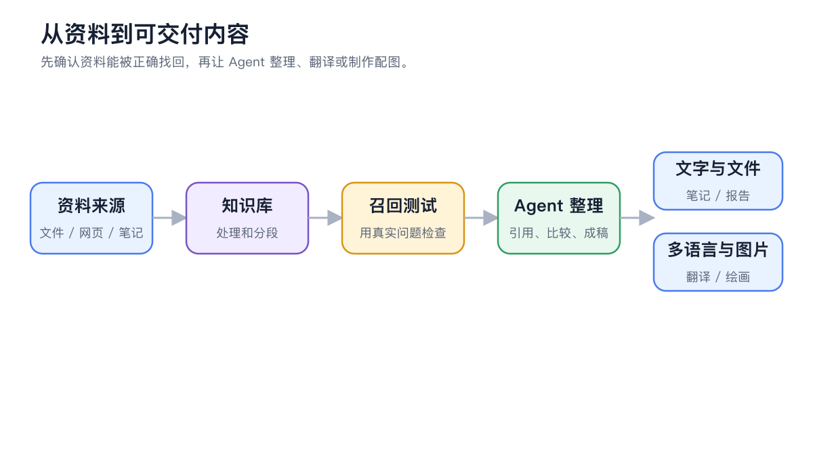
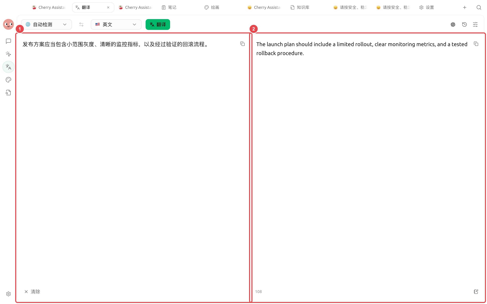

# Подготовка многоязычных материалов

Команда маркетинга получает набор материалов, включающий документы, скриншоты и терминологию продукта, которые необходимо перевести на другой язык, сохраняя единообразие названий, цифр и форматирования. Глоссарий и пробный перевод небольшого фрагмента помогают сократить количество доработок всего материала.

<figure><figcaption>
Сначала убедитесь в точности поиска материалов, затем Agent унифицирует терминологию и формат вывода, а в конце проводится ручная проверка ключевых разделов. 
</figcaption></figure>

<figure><figcaption>
Слева отображается исходный текст, справа — фактический перевод. Перед сдачей можно построчно проверить ключевые термины, такие как ступени, метрики мониторинга и процедуры отката. 
</figcaption></figure>

## Порядок действий



### 1. Сначала создайте глоссарий

Перечислите названия продуктов, функций, имена собственные, единицы измерения и юридические формулировки, которые нельзя изменять. Для каждого термина укажите его использование в целевом языке.



### 2. Откалибруйте стиль на небольшом фрагменте

В разделе 【Перевод】 сначала обработайте один репрезентативный раздел, чтобы определить уровень формальности, стиль заголовков и терминологию, а затем переведите весь документ.



### 3. Отдельно проверьте OCR изображений

После загрузки скриншотов сначала проверьте распознанный текст, особенно цифры, названия кнопок и таблицы. Ошибки распознавания необходимо исправить до перевода.



### 4. Попросите Agent проверить согласованность

Поместите исходный текст, перевод и глоссарий в рабочую директорию и попросите Agent перечислить несоответствия терминологии, пропущенные переводы, расхождения в цифрах и проблемы со ссылками, не заменяя юридические формулировки напрямую.



## Проверка перед сдачей

* Названия продуктов и пути в интерфейсе соответствуют фактическому интерфейсу;
* Цифры, даты, валюты и единицы измерения не изменены;
* Ссылки Markdown, блоки кода и подписи к изображениям сохранены;
* Юридические, медицинские или связанные с безопасностью материалы прошли профессиональную вычитку.

## Рекомендуемые комбинации и критерии готовности

| Элемент | Рекомендуемый подход |
| ---- | --------------------------------- |
| Точка входа для перевода | Для коротких текстов и скриншотов используйте 【Перевод】, для обработки нескольких файлов — Agent |
| Терминология | Сначала предоставьте список названий продуктов, собственных названий и слов, которые не переводятся |
| Файлы | Храните исходные и переведенные файлы в отдельных директориях, сохраняя соответствие исходных имен файлов |
| Критерии готовности | Цифры, ссылки и собственные названия согласованы; текст на изображениях проверен выборочно; изменения в макете отмечены в сопроводительных материалах |


История позволяет повторно использовать данные, но также сохраняет содержимое переводов. После обработки конфиденциальных материалов проверьте и очистите записи в соответствии с вашими требованиями к управлению данными.

