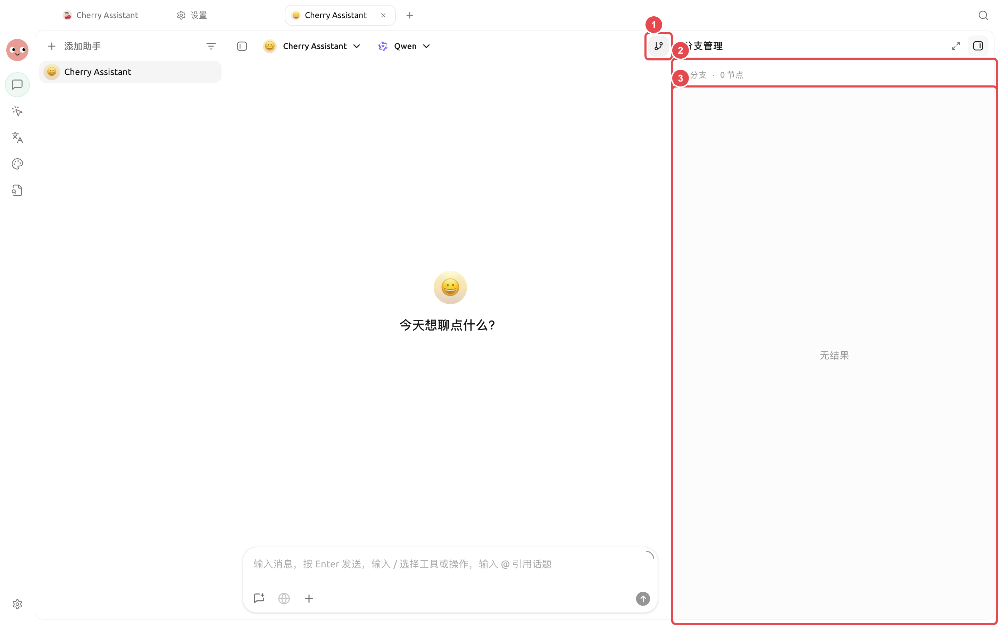
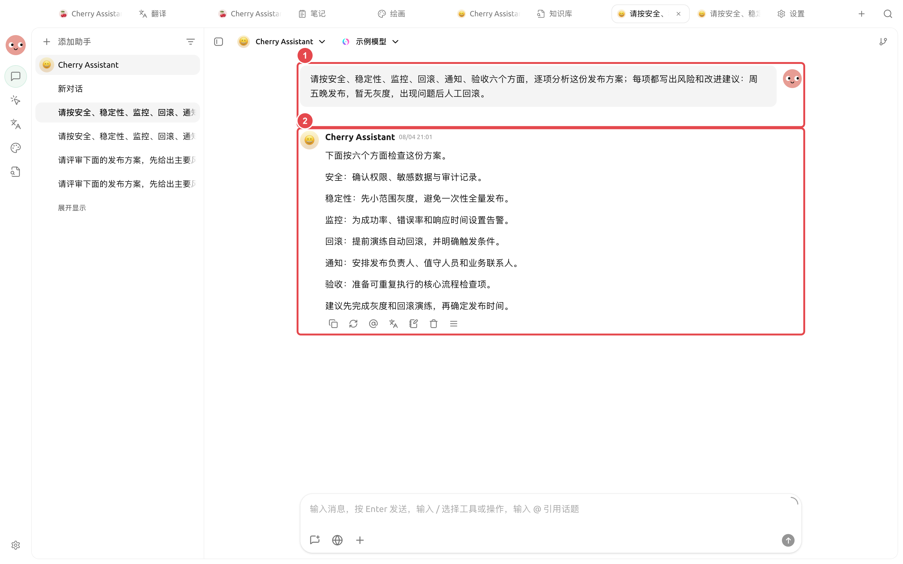

# Ретроспективный анализ с использованием нескольких моделей

Команда продукта готовит квартальный ретроспективный анализ: внутренние материалы уже собраны, но необходимо дополнить их публичной информацией и сравнить мнения, полученные от разных моделей. Итогом должна стать исследовательская отчётность, позволяющая вернуться к первоисточникам и чётко разделять факты и суждения.

<figure><figcaption><p>На этапе начала исследования фиксируются сравниваемые модели и рамки вопросов; критерии не меняются произвольно в процессе. </p></figcaption></figure>

<figure><figcaption><p>Различные гипотезы размещаются в отдельных ветках, после чего подтверждённые выводы сводятся в основную ветку. </p></figcaption></figure>

<figure><figcaption><p>① В запросе чётко указываются проверяемые аспекты и известные условия; ② Результаты структурируются единообразно, что упрощает дальнейшее сравнение, уточнение и ручную проверку. </p></figcaption></figure>

## Рекомендуемая комбинация

* 【Диалог】Несколько моделей: выявление консенсуса, расхождений и упущений;
* Исследовательский Agent: продвижение задач, разбивка на подзадачи и генерация отчёта;
* База знаний: поиск внутренних материалов;
* Веб-поиск или надёжный MCP: дополнение внешних источников;
* Рабочая директория: хранение исходных материалов и итоговых артефактов.

## Порядок действий



### 1. Сравнение мнений с помощью одного вопроса

В 【Диалоге】 выбирается несколько моделей, каждая из которых должна перечислить выводы, допущения, источники и элементы неопределённости. Реальные противоречия оформляются как вопросы для дальнейшего исследования.



### 2. Создание исследовательского Agent

Привязываются соответствующие базы знаний и исследовательские навыки; права доступа остаются на уровне 【Подтверждение при каждом действии】. В рабочей директории исходные материалы и каталог `report/` выделены отдельно.



### 3. Назначение подзадач

Agent последовательно проверяет хронологию фактов, изменения данных и внешние мнения, после чего основной Agent сравнивает противоречия. Неподтверждённая информация сохраняется как требующая проверки и не объединяется принудительно.



### 4. Генерация отчёта и ручная проверка

Отчёт включает выводы, источники, элементы неопределённости и дальнейшие действия. Перед публикацией в панели 【Файлы】 справа проверяются ссылки, даты и числовые значения.



## Пример задачи

```
Проведите обзор материалов проекта в текущем каталоге и дополните их открытой информацией. Разделяйте факты, оценки и рекомендации, сохраняя ссылки на внешние источники. Отдельно проверьте сроки, данные и риски, затем создайте отчёт в report/review.md. Не изменяйте файлы в raw/.
```

## Подготовка перед использованием и критерии завершения

| Элемент | Рекомендуемая подготовка |
| ---- | ------------------------------- |
| Исследовательский вопрос | В одном чётком предложении указать сравниваемые выводы |
| Требования к источникам | Указать временной диапазон, регион и допустимые источники |
| Рекомендуемая комбинация | Сравнение нескольких моделей для сбора различий, ветки для уточнения, заметки для сохранения подтверждённых выводов |
| Критерии завершения | Каждый ключевой вывод можно проследить до источника; расхождения выделены отдельно; неподтверждённый контент не оформляется как факт |

Данный сценарий подходит для исследований, требующих сравнения мнений и ретроспективного анализа процесса принятия решений, но не предназначен для прямого использования голосования нескольких моделей как фактического суждения.


Для высокорисковых тем, таких как финансы, медицина и право, нельзя полагаться исключительно на выводы моделей. В отчёте должны сохраняться источники, а проверка должна проводиться лицами, обладающими соответствующим опытом или квалификацией.

