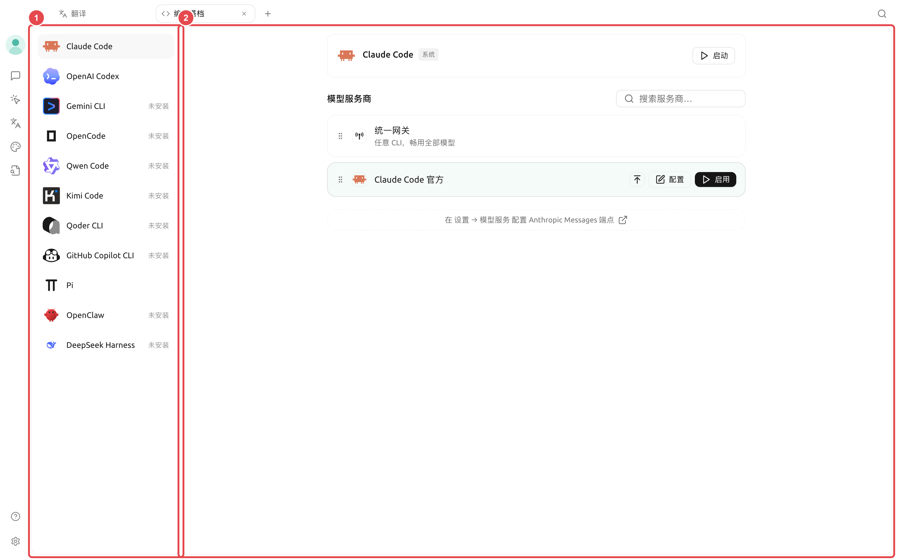
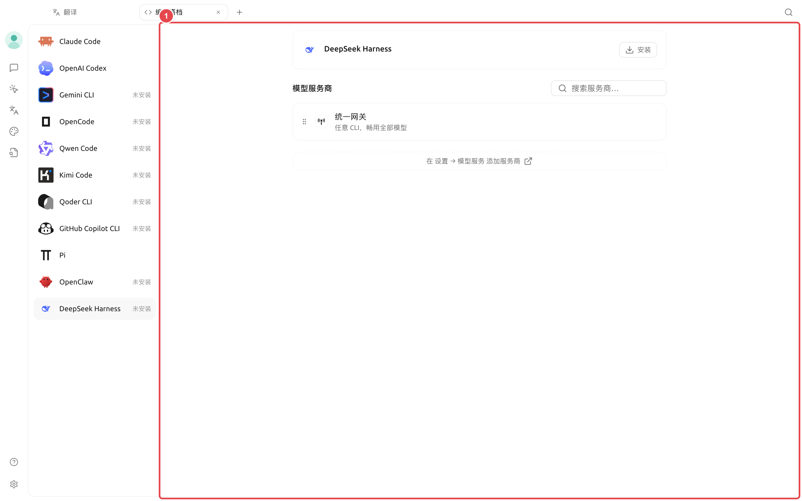

# Партнёр по кодированию (Code CLI)

【Партнёр по кодированию】 предназначен для установки, настройки и запуска популярных командных инструментов для программирования. Cherry Studio различает версии, управляемые приложением, версии, уже присутствующие в системном PATH, и собственную аутентификацию инструментов. Приложение не заменяет системные установки автоматически.

<figure><figcaption>
① Выберите инструмент слева и проверьте статус установки; ② справа выберите единый шлюз, официальный аккаунт инструмента или совместимый сервис моделей. 
</figcaption></figure>

### Возможности страницы

* Проверка наличия инструмента и доступных обновлений;
* Установка, обновление или удаление копий инструментов, управляемых Cherry Studio;
* Обнаружение инструментов, уже присутствующих в системном PATH;
* Выбор провайдера, модели и параметров для CLI, требующих сервиса моделей;
* Сохранение нативного способа входа для CLI, использующих собственные аккаунты;
* Выбор рабочей директории и обнаруженного системой терминала перед запуском.

Страница включает инструменты: Claude Code, OpenAI Codex, Gemini CLI, OpenCode, Qwen Code, Kimi Code, Qoder CLI, GitHub Copilot CLI, Pi и DeepSeek Harness. Фактический список может меняться с обновлениями продукта; ориентируйтесь на список на странице.

### Общий процесс запуска



#### 1. Откройте 【Партнёр по кодированию】 из 【Панели запуска】

Выберите нужный инструмент и сначала проверьте статус: не установлен, управляется Cherry Studio или получен из системы.



#### 2. Завершите установку или вход

Если инструмент не установлен, нажмите 【Установить】. Для CLI, предоставляющих собственный вход через аккаунт, выполните нативный вход согласно подсказкам на странице. Выбор провайдера через Cherry Studio не требуется.



#### 3. Настройте подключение к модели

Для инструментов, требующих сервиса моделей Cherry Studio, выберите 【Единый шлюз】 или совместимого провайдера и модель. Страница фильтрует варианты по типу интерфейса, необходимому CLI; несовместимые провайдеры не отображаются.



#### 4. Выберите директорию и терминал

Рабочая директория определяет место запуска CLI. Терминал можно выбрать только из списка, обнаруженного системой; после запуска сначала подтвердите текущий путь с помощью команды только для чтения.



#### 5. Запустите и проверьте

Нажмите 【Запустить】, убедитесь, что аккаунт или модель указаны верно, затем выполняйте изменения файлов или команды. Если нужно настроить интенсивность рассуждений, права доступа или специфические для инструмента опции, откройте 【Настройки】.



### DeepSeek Harness

<figure><figcaption>
① Если инструмент не установлен, сначала выполните управляемую установку; после установки настройте совместимого провайдера, права по умолчанию и режим Agent, затем запустите Web UI. 
</figcaption></figure>

Процесс для DeepSeek Harness отличается от обычного терминального CLI: после установки и выбора провайдера Cherry Studio управляет запуском, и можно открыть отдельный Web UI. В параметрах можно выбрать режим Agent по умолчанию и права по умолчанию:

| Настройка | Подходит для | Примечания |
| -------- | -------------------------- | ------------- |
| 【Стандарт】 | Возможное использование файлов, Shell, поиска, навыков, планирования и субагентов | Максимальный набор инструментов; сначала используйте контролируемые права |
| 【PTC Code】 | Необходимость комбинирования многошаговых операций инструментов через Code Mode | Лучше подходит для сложных задач кодирования |
| 【Минимальный】 | Только постоянный Shell и текстовый редактор | Меньше зависимостей, но и меньший функционал |
| 【Только чтение】 | Проверка проекта без записи файлов | Для рискованных операций всё равно запрашивается подтверждение |
| 【Запись в рабочую область】 | Разрешено изменение текущей рабочей области DSH | Не означает доступ к файлам вне рабочей области |
| 【Полный доступ】 | Изолированная, доверенная и восстанавливаемая среда | Подтверждение операций не запрашивается; максимальный риск |

### Различайте источники установки

| Источник | Действия Cherry Studio | Как вам поддерживать |
| ---------------- | ------------------ | ----------------- |
| Управляется Cherry Studio | Установка, обновление и удаление соответствующей управляемой копии | Управляйте через 【Партнёр по кодированию】 или 【Зависимости среды】 |
| Системный PATH | Обнаружение и прямое использование без замены | Обновляйте или удаляйте через исходный менеджер пакетов |
| Официальный аккаунт инструмента | Сохранение собственного процесса входа инструмента | Управляйте аккаунтом и авторизацией в интерфейсе инструмента |

<figure><figcaption></figcaption></figure>


После удаления управляемой копии Cherry Studio, если в системе всё ещё есть исполняемый файл с тем же именем, страница автоматически переключится на системную версию. При изменении поведения сначала проверьте, какой источник используется в данный момент.


### Пример пользователя: запуск инструмента кодирования в директории проекта

Разработчик сначала выбирает текущую директорию проекта, выбирает проверенное подключение к модели, затем запускает Pi или другой CLI. Первая команда только читает состояние репозитория; после подтверждения аккаунта, модели и директории разрешите инструменту изменять файлы и выполнять проверки.

Почему не находится установленный терминал или CLI? 

Cherry Studio обнаруживает инструменты из среды входа и стандартных местоположений. Убедитесь, что команда выполняется в терминале входа, затем перезапустите приложение для обновления среды. Для портативных или нестандартных путей пока требуется ручной запуск из этого терминала.

Почему не находится установленный терминал или CLI? 

Cherry Studio обнаруживает инструменты из среды входа и стандартных местоположений. Убедитесь, что команда выполняется в терминале входа, затем перезапустите приложение для обновления среды. Для портативных или нестандартных путей пока требуется ручной запуск из этого терминала.

