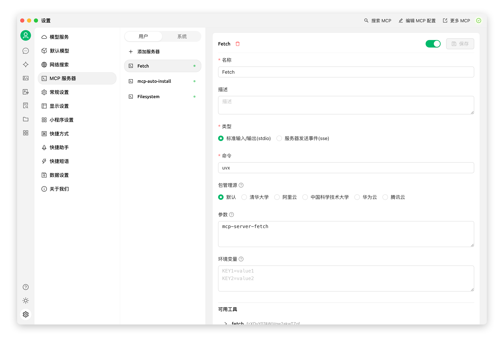
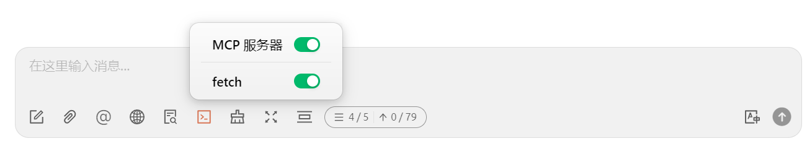
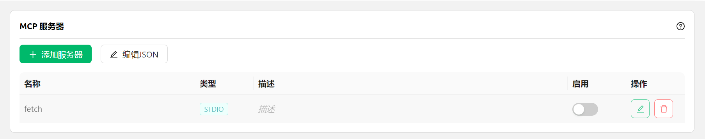
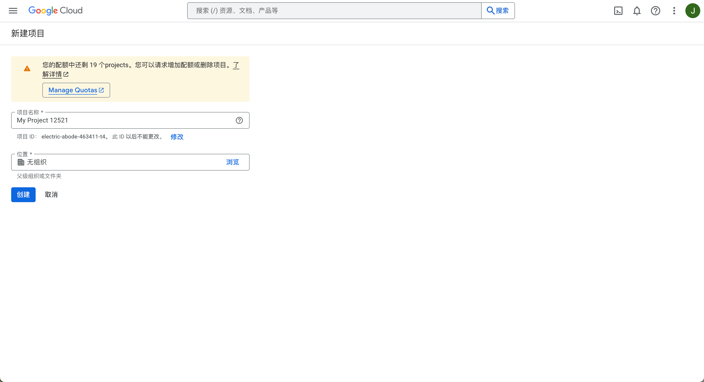

# Настройка и использование MCP

<figure><figcaption></figcaption></figure>

1. Откройте настройки Cherry Studio.
2. Найдите опцию `MCP сервер`.
3. Нажмите `Добавить сервер`.
4. Заполните параметры MCP-сервера ([ссылка для справки](https://github.com/modelcontextprotocol/servers/tree/main/src/fetch)). Возможные параметры:
   * Имя: произвольное название, например `fetch-server`
   * Тип: выберите `STDIO`
   * Команда: укажите `uvx`
   * Параметры: укажите `mcp-server-fetch`
   *(могут быть другие параметры в зависимости от сервера)*
5. Нажмите `Сохранить`.


После настройки Cherry Studio автоматически загрузит требуемый MCP-сервер - `fetch server`. После завершения загрузки можно начинать работу! Примечание: если mcp-server-fetch не конфигурируется, попробуйте перезагрузить компьютер.


### Активация MCP-сервиса в чате

<figure><figcaption></figcaption></figure>

* В настройках `MCP сервера` MCP-сервер успешно добавлен

<figure><figcaption></figcaption></figure>

### **Демонстрация работы**

<figure><figcaption></figcaption></figure>

Как видно из примера, функция `fetch` в составе MCP позволяет Cherry Studio точнее распознавать цели пользовательских запросов, получать релевантную информацию из интернета и давать более точные, комплексные ответы.