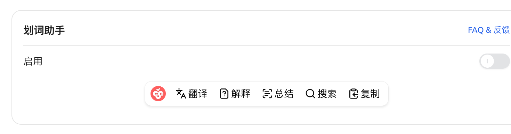
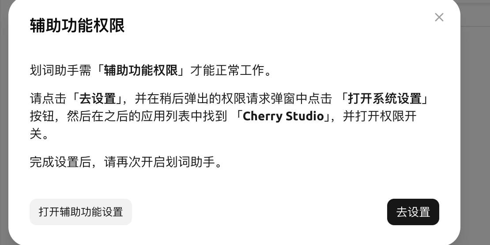
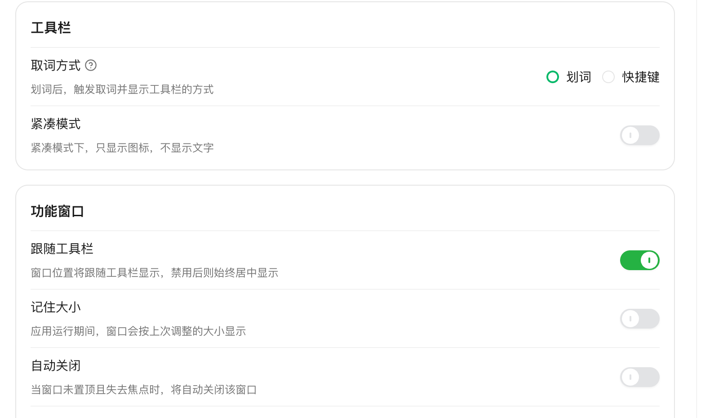
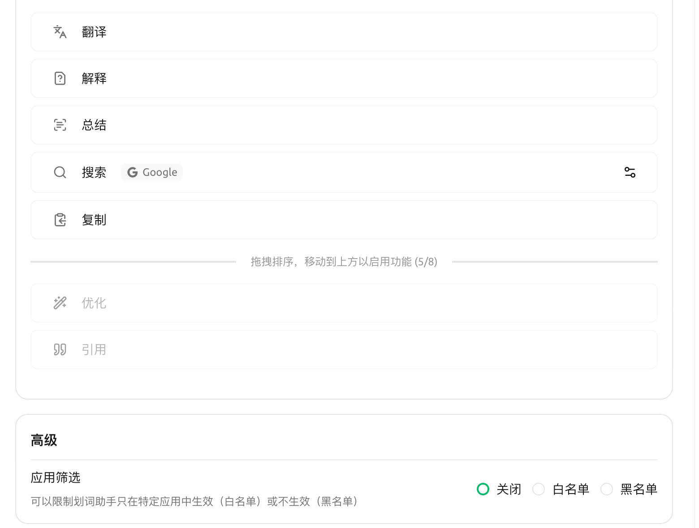

# Помощник выделения текста

Помощник выделения текста (Selection Assistant) позволяет **выделить текст в любом приложении** и выполнить действия с помощью ИИ — перевод, объяснение, оптимизация, резюме и другие — через всплывающую панель инструментов, без необходимости вставлять содержимое обратно в Cherry Studio.


**Отличие от [Быстрого помощника](quick-assistant.md)**:

* **Быстрый помощник**: вызывается глобальной горячей клавишей, открывает окно для **активного ввода**, где вы набираете вопрос
* **Помощник выделения текста**: после выделения текста появляется панель инструментов **для работы с выделенным содержимым**, позволяющая выполнять предустановленные действия в один клик


### Поддержка платформ

* ✅ **macOS**: полная поддержка, но при первом включении необходимо предоставить **разрешение на доступ к функциям вспомогательных технологий (Accessibility)**
* ✅ **Windows**: полная поддержка, специальные разрешения не требуются
* ⚠️ **Linux**: полная поддержка только в режиме **X11**; в режиме Wayland панель инструментов может не корректно позиционироваться относительно выделенного текста. Также необходимо добавить текущего пользователя в группу `input` (`sudo usermod -aG input $USER`) для получения прав на отслеживание нажатий клавиш

### Включение помощника выделения текста

Откройте [Настройки] → [Помощник выделения текста]:

<figure><figcaption>
Панель настроек помощника выделения текста
</figcaption></figure>

1. Включите переключатель **Включено**
2. Пользователи **macOS** при первом включении увидят запрос на **разрешение доступа к функциям вспомогательных технологий**:

   <figure><figcaption>
Запрос разрешения на доступ к функциям вспомогательных технологий при первом включении
</figcaption></figure>

   Нажмите **Перейти в настройки** → в открывшемся окне [Системные настройки] → [Конфиденциальность и безопасность] → [Вспомогательные технологии] найдите Cherry Studio и включите переключатель → вернитесь в Cherry Studio и снова включите функцию.
3. (Необязательно) В разделе [Панель инструментов] → [Способ выделения] выберите способ запуска (варианты зависят от платформы):
   * **Выделение**: панель инструментов появляется сразу после выделения текста (по умолчанию)
   * **Клавиша Ctrl** (только Windows): панель инструментов появляется только после выделения текста и **удержания клавиши Ctrl** (для предотвращения случайных срабатываний)
   * **Горячая клавиша**: панель инструментов появляется после выделения текста и нажатия горячей клавиши; клавишу можно изменить в [Настройки] → [Горячие клавиши]

<figure><figcaption>
Панель настроек после включения: способ выделения / компактный режим / следование панели инструментов…
</figcaption></figure>

### Встроенные действия

Помощник выделения текста предлагает 7 встроенных действий, **по умолчанию включено 5**: Перевод / Объяснение / Резюме / Поиск / Копирование. **Иконка Cherry слева на панели инструментов не является кнопкой действия** — это только ручка для перетаскивания, позволяющая перемещать всю панель инструментов.

| Действие | Включено по умолчанию | Назначение |
|---|---|---|
| **Перевод** | ✅ | Умный перевод: приоритетный перевод на целевой язык; если текст уже на целевом языке, перевод на резервный язык |
| **Объяснение** | ✅ | ИИ объясняет выделенное содержимое |
| **Резюме** | ✅ | ИИ кратко суммирует выделенное содержимое одним абзацем |
| **Поиск** | ✅ | Запрос в поисковой системе с использованием выделенного текста (по умолчанию Google, можно изменить через иконку ⋯ справа от каждого пункта) |
| **Копирование** | ✅ | Копирование выделенного текста |
| **Оптимизация** | Требует включения | ИИ переписывает текст более гладко / профессионально; необходимо перетащить в зону включения в настройках |
| **Цитирование** | Требует включения | Отправка выделенного текста в текущий диалог в формате цитаты; необходимо перетащить в зону включения в настройках |

<figure><figcaption>
Раздел [Функции] на панели настроек: сверху включенные, снизу зона ожидания — перетащите вверх для включения
</figcaption></figure>

### Пользовательские действия

В [Настройки] → [Помощник выделения текста] → [Функции] можно:

* **Редактировать** промпты встроенных действий
* **Добавлять** пользовательские действия (название + промпт + модель по умолчанию)
* **Перетаскивать** для изменения порядка действий на панели инструментов
* Перетащить редко используемые действия в нижнюю зону ожидания для «отключения»

### Внешний вид панели инструментов / окна результатов

Панель инструментов:
* **Компактный режим**: отображаются только иконки без текста, экономит место на экране

Окно результатов (раздел [Окно функций]):
* **Следовать панели инструментов**: окно появляется рядом с панелью инструментов (включено по умолчанию), при отключении всегда по центру
* **Запоминать размер**: размер окна, измененный вручную в этот раз, сохранится для следующего раза
* **Автозакрытие**: закрытие при клике вне окна
* **Автоверхний уровень**: всегда поверх других приложений
* **Прозрачность**: регулируется от 20% до 100%

### Поисковые системы

Встроенное действие [Поиск] в помощнике выделения текста позволяет выбрать предустановленные поисковые системы (Google, Bing, DuckDuckGo и др.). Настройка находится в [Настройки] → [Помощник выделения текста] → [Функции]: найдите пункт **Поиск**, нажмите иконку шестеренки в конце строки, чтобы открыть диалоговое окно [Настройка поисковой системы], где можно выбрать из предустановленных или добавить пользовательскую поисковую систему; в URL используйте `{{queryString}}` для обозначения позиции поискового запроса.

### Фильтрация приложений (расширенные)

В [Настройки] → [Помощник выделения текста] → [Расширенные] → [Фильтрация приложений] можно настроить **черный / белый список**, чтобы помощник выделения текста работал только в указанных приложениях (белый список) или не появлялся в указанных приложениях (черный список).

* **macOS**: укажите Bundle ID приложения (например, `com.google.Chrome`, `com.apple.mail`)
* **Windows**: укажите имя исполняемого файла приложения (например, `chrome.exe`, `Cherry Studio.exe`)

### Используемая модель

Помощник выделения текста по умолчанию использует [глобальную модель диалога по умолчанию](../../pre-basic/settings/default-models.md), также можно назначить отдельную модель для каждого действия.

### Советы и рекомендации

* Если на macOS панель инструментов не появляется, проверьте, отмечен ли Cherry Studio в [Системные настройки] → [Конфиденциальность и безопасность] → [Вспомогательные технологии]
* Часто случайно выделяете текст и вызываете панель инструментов? Переключитесь на режим запуска **клавишей Ctrl**
* Слишком много иконок на панели инструментов? Включите **компактный режим**
* Хотите выполнить цепочку действий, например «перевести и сразу озвучить»? Скопируйте результат «Перевод» и вызовите [Быстрый помощник](quick-assistant.md) для дальнейшей обработки

***

### Получение помощи и отправка отзывов

Если у вас возникли вопросы, обнаружены ошибки или есть предложения по улучшению функций в процессе настройки или использования, обратитесь к официальным каналам, указанным в разделе [Обратная связь и предложения](../../question-contact/suggestions.md).
