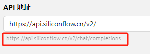
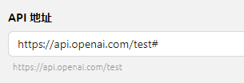

# Настройка сервиса моделей

На этой странице представлен обзор функций интерфейса. Инструкции по настройке можно найти в руководстве [Конфигурация поставщиков](../../../pre-basic/providers/) из базового курса.


* При использовании встроенных поставщиков достаточно указать соответствующий ключ.
* Разные поставщики могут использовать различные термины для ключей: ключ, Key, API Key, токен - все обозначают одно и то же.


### Ключ API

В Cherry Studio для одного поставщика поддерживается ротация нескольких ключей по принципу циклического перебора списка.

* Несколько ключей добавляются через запятую на английском языке. Например:

<pre><code><strong>sk-xxxx1,sk-xxxx2,sk-xxxx3,sk-xxxx4
</strong></code></pre>


Обязательно используйте запятую на **английском** языке.


### Адрес API

При использовании встроенных поставщиков обычно не требуется указывать адрес API. При необходимости изменения строго следуйте документации поставщика.

> Если поставщик указывает адрес в формате <mark style="background-color:red;">https://xxx.xxx.com</mark><mark style="background-color:green;">/v1/chat/completions</mark>, указывайте только корневую часть (<mark style="background-color:red;">https://xxx.xxx.com</mark>).
>
> Cherry Studio автоматически добавит оставшийся путь (<mark style="background-color:green;">/v1/chat/completions</mark>). Неправильное заполнение может привести к сбоям в работе.


Примечание: У большинства поставщиков маршруты LLM унифицированы. Если путь API отличается (v2, v3/chat/completions и т.д.), вручную укажите версию с завершающим "`/`". Для нестандартных путей (<mark style="background-color:green;">/v1/chat/completions</mark>) используйте полный адрес от поставщика, завершая его `#`.

То есть:
* Адрес с `/` в конце: добавляется только "<mark style="background-color:green;">chat/completions</mark>"
* Адрес с `#` в конце: используется без изменений



### Добавление моделей

Обычно при нажатии кнопки `Управление` в левом нижнем углу страницы конфигурации поставщика автоматически загружаются все доступные модели. Для добавления нажмите `+` в списке.


Не все модели из всплывающего списка добавляются автоматически. Нажмите `+` справа от модели, чтобы добавить её в список на странице конфигурации поставщика - только тогда она появится в выборе моделей.


### Проверка подключения

Нажмите кнопку проверки рядом с полем ввода ключа API для тестирования конфигурации.


Проверка использует последнюю добавленную диалоговую модель из списка. При ошибках проверьте список на наличие несовместимых моделей.



После успешной настройки обязательно включите переключатель в правом верхнем углу, иначе поставщик останется неактивным, а его модели недоступными.
