# Настройка Notion


Этот документ переведен с китайского языка с помощью ИИ и еще не был проверен.


## Руководство по настройке Notion

Cherry Studio поддерживает импорт тем в базу данных Notion.

### Шаг 1

Откройте сайт [Notion Integrations](https://www.notion.so/profile/integrations) для создания приложения

<figure>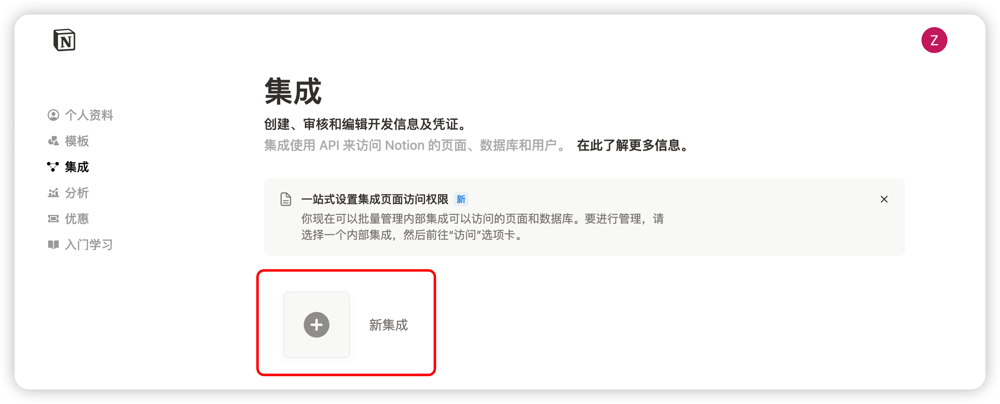<figcaption>
Нажмите значок "+" для создания приложения
</figcaption></figure>

### Шаг 2

Создайте приложение

<figure>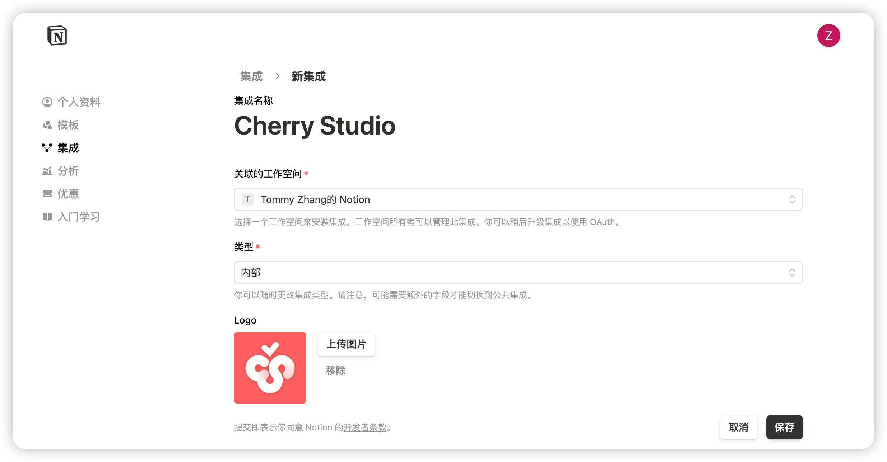<figcaption>
Заполните информацию о приложении
</figcaption></figure>

Имя: Cherry Studio

Тип: Выберите первый вариант

Иконка: Сохраните это изображение

<figure><figcaption></figcaption></figure>

### Шаг 3

Скопируйте секретный ключ и вставьте его в настройки Cherry Studio

<figure>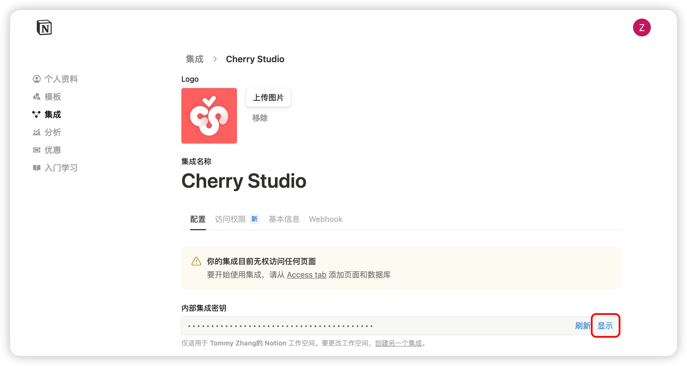<figcaption>
Нажмите "Скопировать ключ"
</figcaption></figure>

<figure>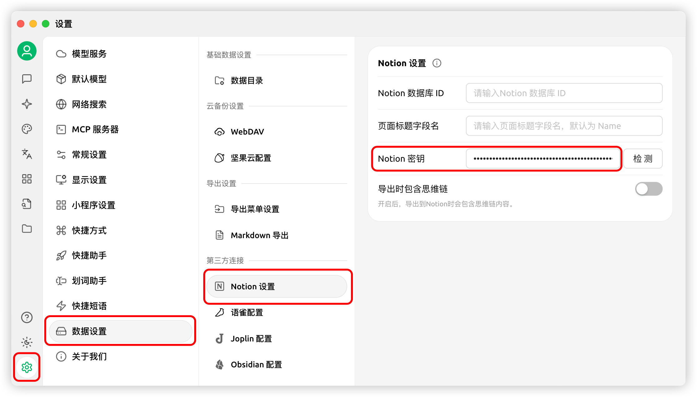<figcaption>
Вставьте ключ в раздел настроек данных
</figcaption></figure>

### Шаг 4

Откройте сайт [Notion](https://www.notion.so/), создайте новую страницу, выберите тип "База данных", укажите название "Cherry Studio" и подключите по инструкции

<figure>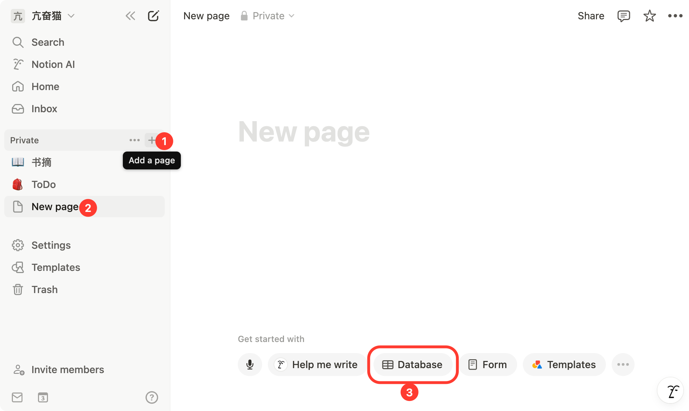<figcaption>
Создайте новую страницу и выберите тип "База данных"
</figcaption></figure>

<figure>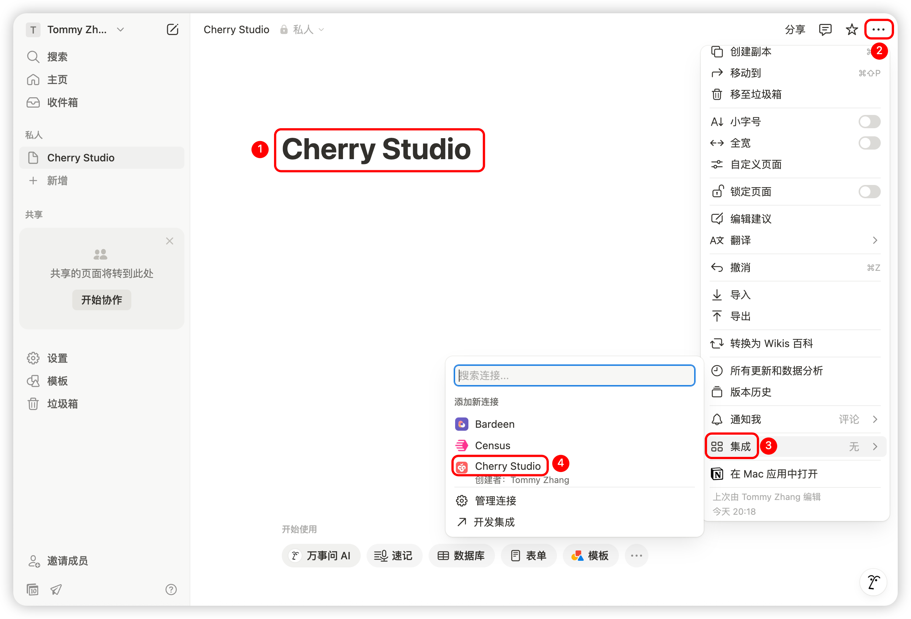<figcaption>
Введите название страницы и выберите "Подключить приложение"
</figcaption></figure>

### Шаг 5

<figure>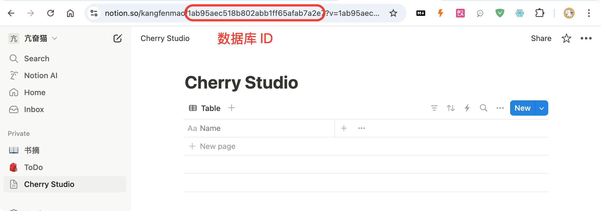<figcaption>
Скопируйте ID базы данных
</figcaption></figure>

Если URL вашей базы данных Notion выглядит так:

https://www.notion.so/\<long\_hash\_1>?v=\<long\_hash\_2>

то ID базы данных Notion - это часть `<long_hash_1>`

<figure>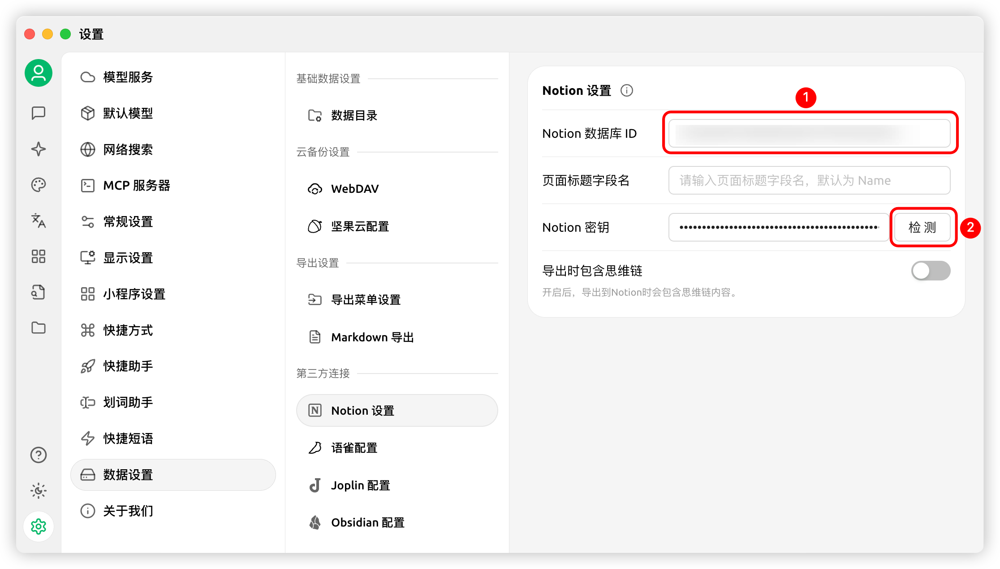<figcaption>
Введите ID базы данных и нажмите "Проверить"
</figcaption></figure>

### Шаг 6

Укажите `页面标题字段名` (название поля заголовка страницы):

Если интерфейс на английском - введите `Name`\
Если интерфейс на китайском - введите `名称`

<figure>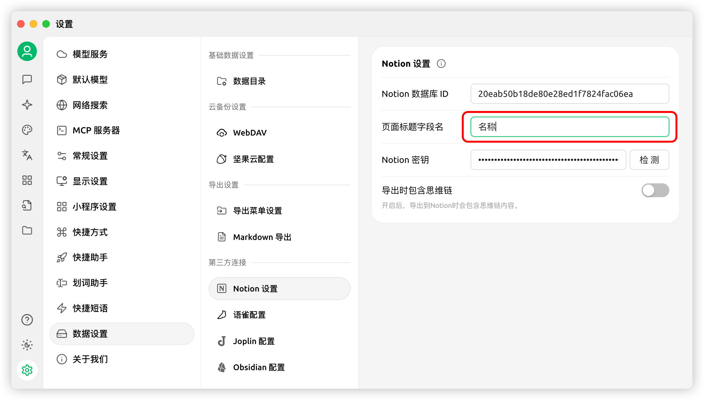<figcaption>
Заполните название поля заголовка страницы
</figcaption></figure>

### Шаг 7

Поздравляем! Настройка Notion завершена ✅ Теперь вы можете экспортировать контент Cherry Studio в базу данных Notion

<figure>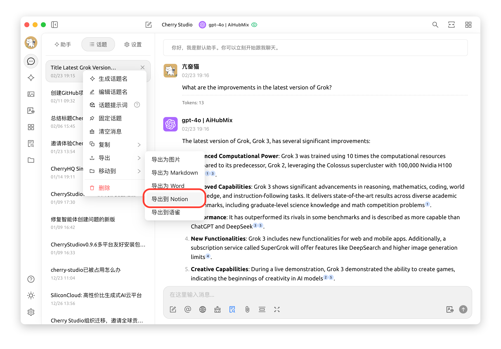<figcaption>
Экспорт в Notion
</figcaption></figure>

<figure>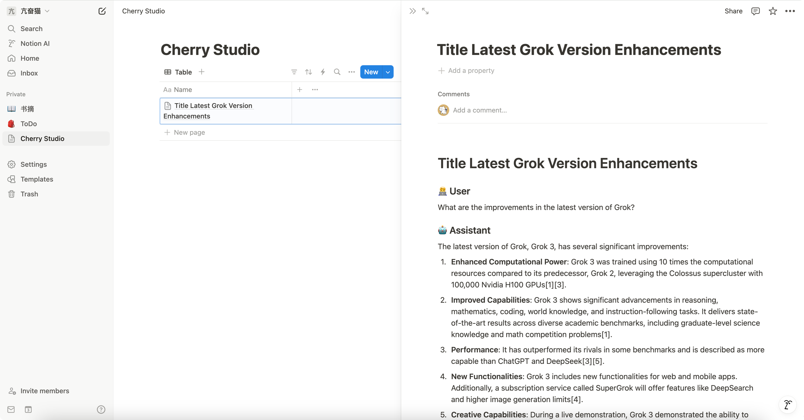<figcaption>
Просмотр результатов экспорта
</figcaption></figure>
