# Руководство по настройке Obsidian


Этот документ переведен с китайского языка с помощью ИИ и еще не был проверен.


Cherry Studio поддерживает интеграцию с Obsidian, позволяя экспортировать полные диалоги или отдельные сообщения в вашу библиотеку Obsidian.


Этот процесс не требует установки дополнительных плагинов Obsidian. Однако, поскольку принцип импорта Cherry Studio в Obsidian аналогичен Obsidian Web Clipper, рекомендуется обновить Obsidian до последней версии (текущая версия должна быть не ниже **1.7.2**), чтобы избежать [ошибок импорта при длинных диалогах](https://github.com/obsidianmd/obsidian-clipper/releases/tag/0.7.0).


## Актуальное руководство


В отличие от старой версии экспорта в Obsidian, новая функция автоматически определяет путь к библиотеке, избавляя от необходимости вручную вводить имя хранилища и папки.


### Шаг 1: Настройка Cherry Studio

Откройте в Cherry Studio: _Настройки_ → _Управление данными_ → _Конфигурация Obsidian_. В выпадающем списке автоматически появятся названия библиотек Obsidian, открывавшихся на этом устройстве. Выберите целевую библиотеку Obsidian:

<figure>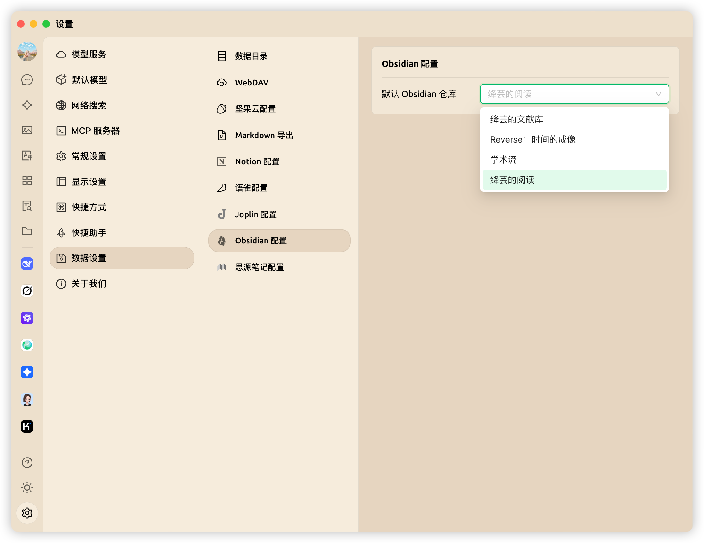<figcaption></figcaption></figure>

### Шаг 2: Экспорт диалогов

#### Экспорт полного диалога

В интерфейсе диалогов Cherry Studio щёлкните правой кнопкой мыши на диалоге, выберите _Экспорт_, затем нажмите _Экспортировать в Obsidian_:

<figure>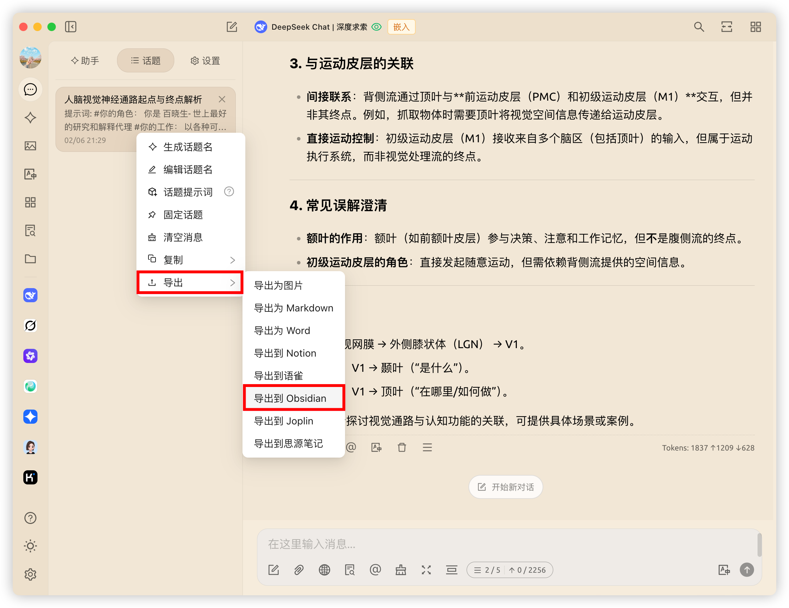<figcaption></figcaption></figure>

Откроется окно для настройки **свойств заметки**, **местоположения папки** в Obsidian и **метода обработки**:

* **Хранилище**: выберите другую библиотеку Obsidian через выпадающее меню
* **Путь**: выберите папку для экспортируемой заметки
* Свойства заметки Obsidian (Properties):
  * Теги (tags)
  * Дата создания (created)
  * Источник (source)
* Доступны три **метода обработки**:
  * **Новая заметка (перезаписать при наличии)**: создаст заметку в указанной папке, перезаписав существующую
  * **Дописать в начало**: добавит контент в начало существующей заметки
  * **Дописать в конец**: добавит контент в конец существующей заметки


Свойства (Properties) добавляются только при первом методе обработки.


<figure>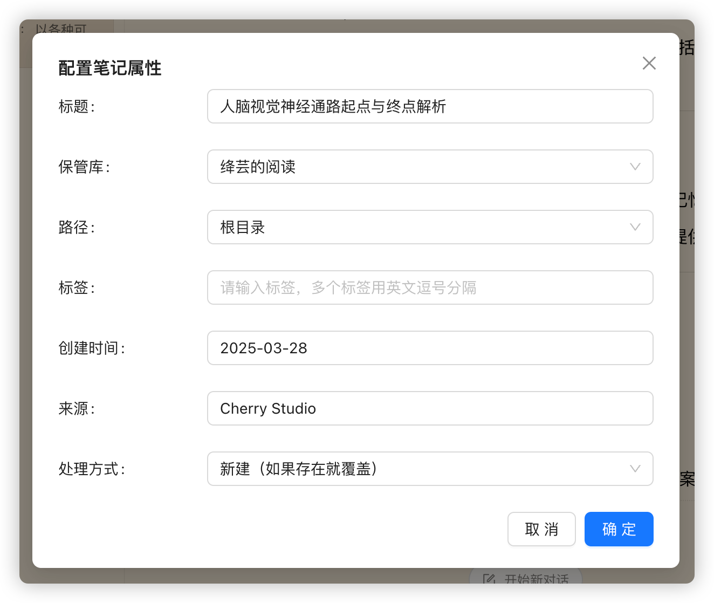<figcaption>
Настройка свойств заметки
</figcaption></figure>

<figure>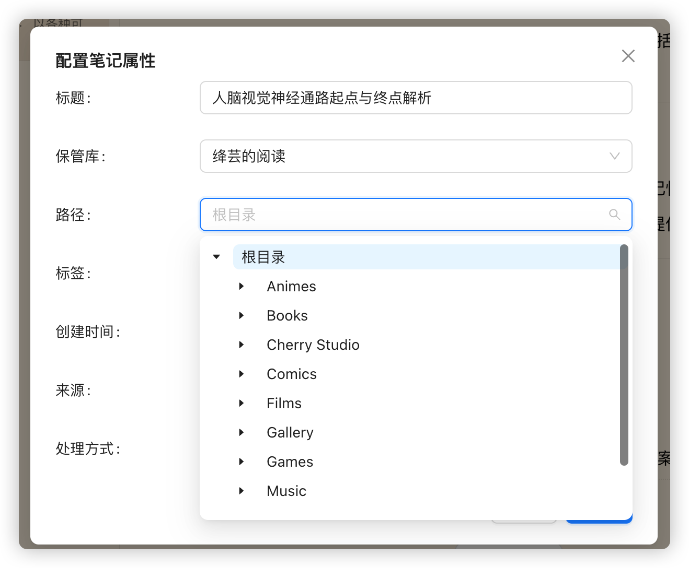<figcaption>
Выбор пути
</figcaption></figure>

<figure>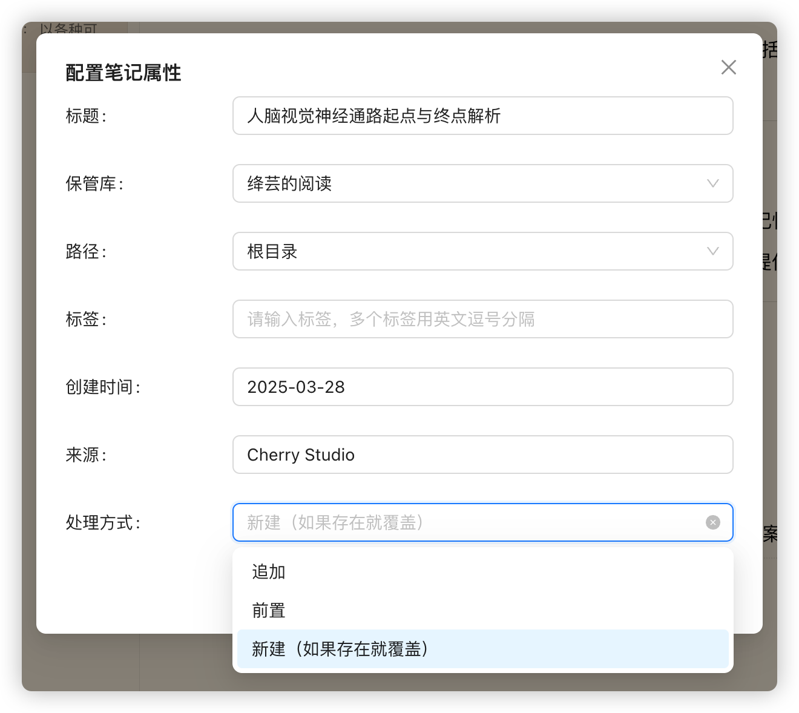<figcaption>
Выбор метода обработки
</figcaption></figure>

После настройки параметров нажмите "Подтвердить" для экспорта диалога в выбранную папку библиотеки Obsidian.

#### Экспорт отдельного сообщения

Для экспорта одного сообщения нажмите _меню с тремя полосками_ под сообщением, выберите _Экспорт_, затем _Экспортировать в Obsidian_:

<figure>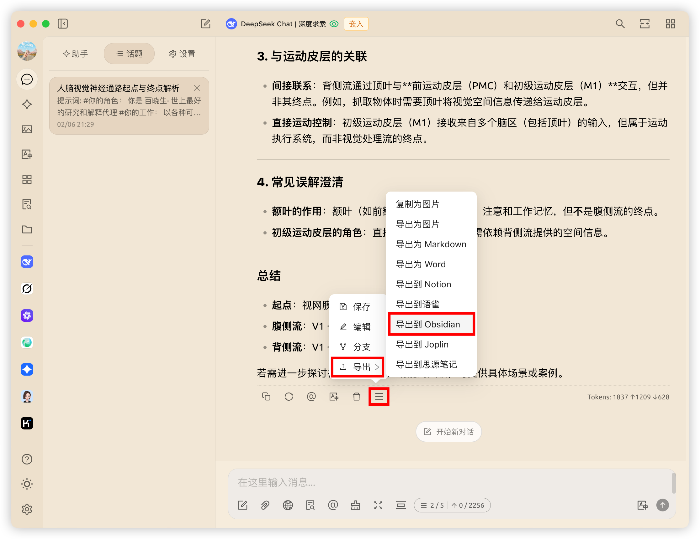<figcaption>
Экспорт отдельного сообщения
</figcaption></figure>

Появится идентичное окно для настройки **свойств заметки** и **метода обработки**, как описано в [разделе выше](obsidian.md#dao-chu-wan-zheng-dui-hua).

### Успешный экспорт

🎉 Поздравляем! Вы завершили настройку интеграции Cherry Studio с Obsidian и выполнили полный процесс экспорта. Приятного использования!

<figure>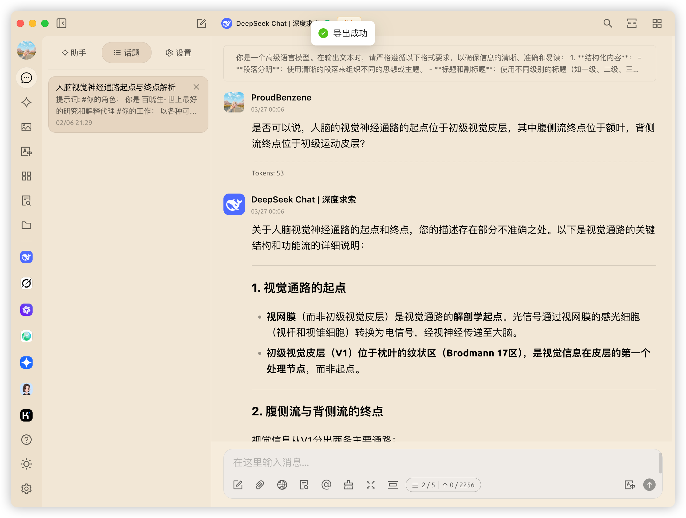<figcaption>
Экспорт в Obsidian
</figcaption></figure>

<figure>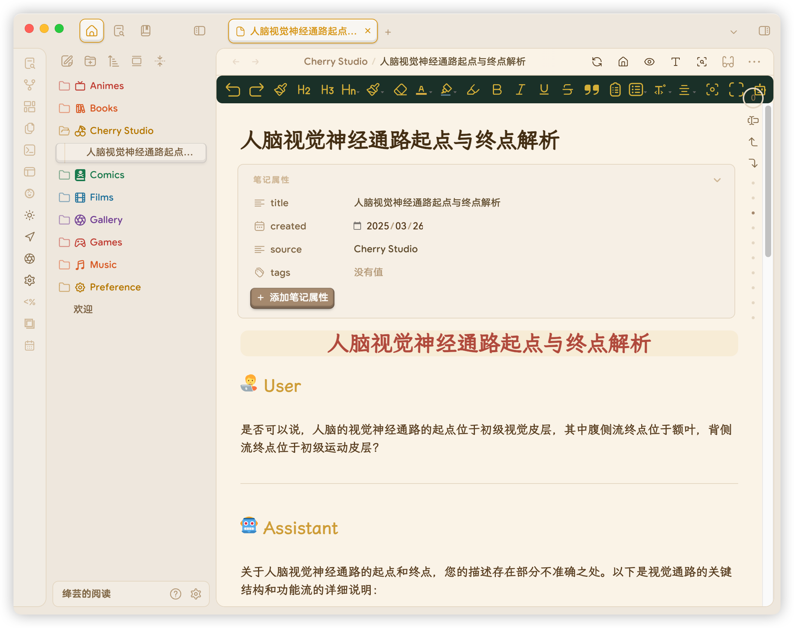<figcaption>
Просмотр результатов экспорта
</figcaption></figure>

***

## Устаревшее руководство (для Cherry Studio < v1.1.13)

### Шаг 1: Подготовка Obsidian

Откройте библиотеку Obsidian и создайте `папку` для экспорта диалогов (на примере папки Cherry Studio):

<figure>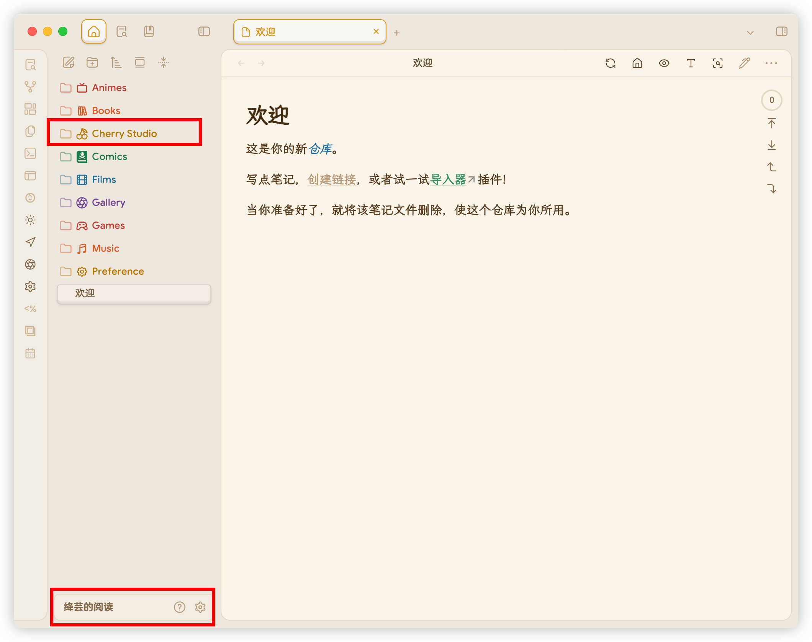<figcaption></figcaption></figure>

Запомните название `хранилища` (выделено в левом нижнем углу).

### Шаг 2: Настройка Cherry Studio

В Cherry Studio: _Настройки_ → _Управление данными_ → _Конфигурация Obsidian_ введите полученные на [Шаге 1](obsidian.md#di-yi-bu) название `хранилища` и `папки`:

<figure>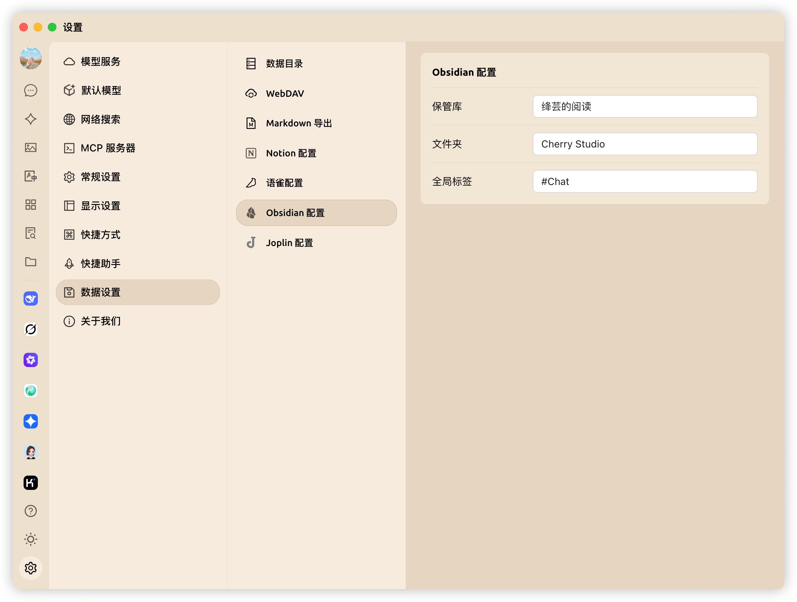<figcaption></figcaption></figure>

Поле `Глобальные теги` опционально – задаёт теги для всех экспортируемых заметок.

### Шаг 3: Экспорт диалогов

#### Экспорт полного диалога

В интерфейсе диалогов щёлкните правой кнопкой на диалоге → _Экспорт_ → _Экспортировать в Obsidian_:

<figure>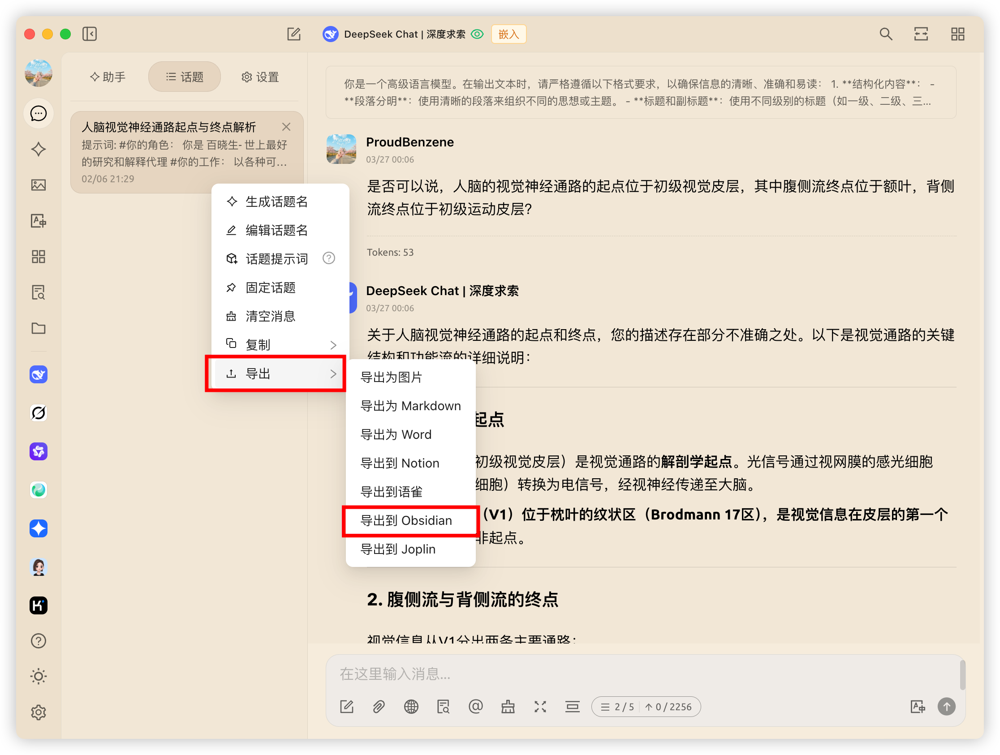<figcaption>
Экспорт полного диалога
</figcaption></figure>

В открывшемся окне настройте **свойства заметки** и выберите **метод обработки**:
* **Новая заметка (перезаписать при наличии)**
* **Дописать в начало**
* **Дописать в конец**

<figure>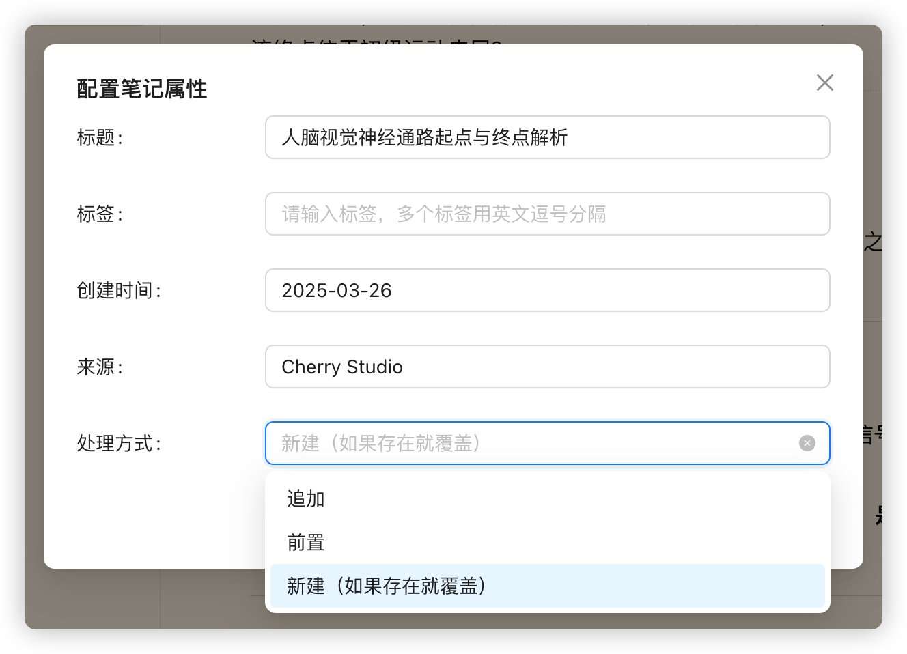<figcaption>
Настройка свойств заметки
</figcaption></figure>


Свойства (Properties) добавляются только при первом методе.


#### Экспорт отдельного сообщения

Нажмите _меню с тремя полосками_ под сообщением → _Экспорт_ → _Экспортировать в Obsidian_:

<figure>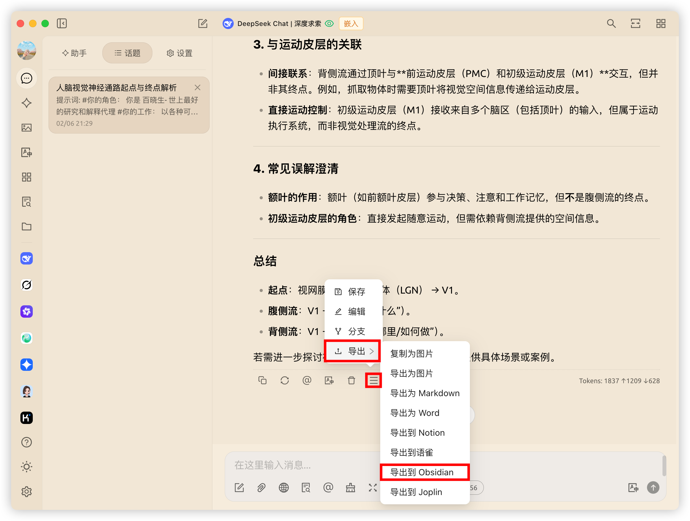<figcaption>
Экспорт отдельного сообщения
</figcaption></figure>

Настройте параметры в соответствии с [инструкцией выше](obsidian.md#dao-chu-wan-zheng-dui-hua).

### Успешный экспорт

🎉 Поздравляем! Вы завершили настройку интеграции и выполнили экспорт. Приятного использования!

<figure><figcaption>
Экспорт в Obsidian
</figcaption></figure>

<figure><figcaption>
Просмотр результатов экспорта
</figcaption></figure>