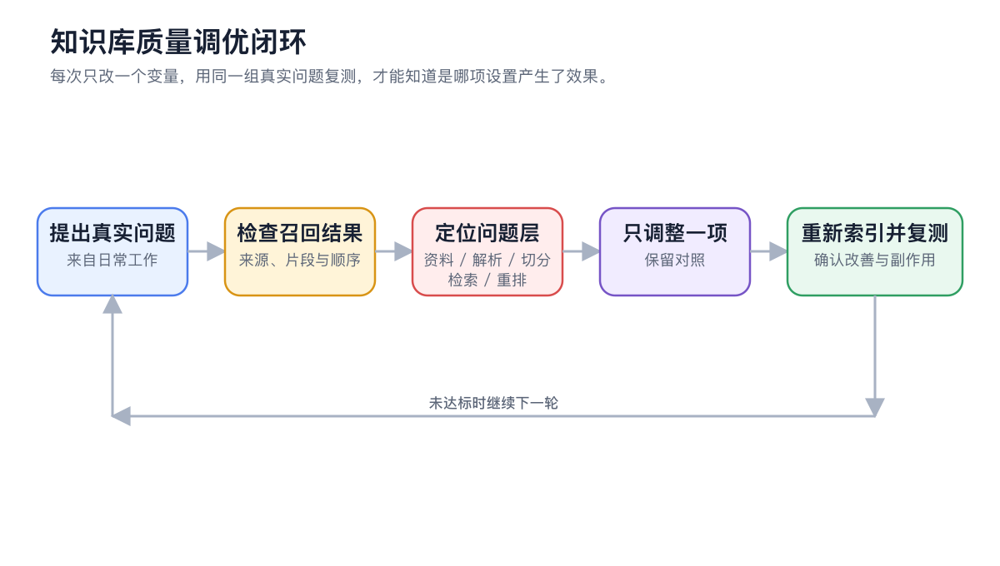

# Практические примеры использования базы знаний

Надёжность базы знаний определяется не объёмом данных, а чёткостью границ, возможностью поддержки источников и способностью стабильно извлекать корректные доказательства для реальных вопросов.


Ниже приведённые параметры служат лишь отправной точкой. Сначала протестируйте импорт, извлечение и использование на 3–10 репрезентативных документах, а затем расширяйте базу на основе фиксированного набора вопросов.


## Сначала спроектируйте с использованием единого подхода



### 1. Чётко определите конечную задачу

Уточните, какое решение или результат требуется пользователю, например, поиск регламентов, диагностика неисправностей или генерация исследовательского отчёта.



### 2. Определите границы данных

В одну базу знаний включайте только те материалы, которые должны извлекаться совместно при использовании. Содержимое с разными уровнями доступа, жизненным циклом, моделями продуктов или версиями лучше разделять.



### 3. Выберите источники и способ обновления

Определите, кто поддерживает документы, заметки, каталоги и веб-страницы, когда они заменяются и нужно ли сохранять исторические версии.



### 4. Подготовьте контрольные вопросы

Составьте 3–10 реальных вопросов, охватывающих точные факты, условные правила, разговорные формулировки и легко путающиеся версии.



### 5. Настройте стратегию поиска

Начните с простой конфигурации. Добавьте эмбеддинги, если BM25 не справляется с синонимами; включите переупорядочивание, если правильные кандидаты находятся, но их порядок нестабилен.



### 6. Интегрируйте с диалогом или Agent

Для одиночных вопросов используйте обычный диалог; для многошаговых исследований, сравнений и предоставления файлов привяжите Agent. Перед запуском проверьте источники по пунктам.



## Пример пользователя 1: Ответы на вопросы о корпоративных правилах

### Цель

Позволить сотрудникам запрашивать информацию об одобрении командировок, стандартах проживания и исключениях при возмещении расходов, а также открывать источники для проверки оригинального текста.

### Организация данных

* База знаний: 【Правила командировок сотрудников】
* Элемент: 【Процесс одобрения командировки】
* Элемент: 【Быстрая справка по стандартам проживания】
* Элемент: 【Частые вопросы о командировках】

<figure><figcaption>
Правила и FAQ поддерживаются отдельно, что позволяет обновлять один раздел без переработки всех данных.
</figcaption></figure>

### Рекомендуемая конфигурация

| Параметр | Стартовая точка | Когда настраивать |
| ---- | ---------- | ----------------- |
| Поиск | Сначала BM25 | Добавьте эмбеддинги, если формулировки сотрудников сильно отличаются от терминологии правил |
| Переупорядочивание | Сначала не использовать | Включите, если правильные кандидаты появляются, но их порядок нестабилен |
| Версия данных | Сохранять только текущую версию | Если требуется параллельное хранение для аудита, указывайте год в названии |
| Требования к ответу | Разделяйте вывод, условия и источник | Явно отмечайте, если данные не содержат информации |

### Контрольные вопросы

1. Какова максимальная сумма возмещения за проживание в командировке?
2. Можно ли возместить расходы на аренду автомобиля за рубежом?
3. Кто утверждает расходы, если общая сумма превышает 5000 юаней?
4. Что произойдёт, если забронировать отель без предварительного одобрения?

### Промпт для диалога

> Отвечайте только на основе «Правил командировок сотрудников». Сначала дайте вывод, затем перечислите применимые условия и источник; если в данных нет информации, укажите «В правилах не указано», не дополняйте ответ общими знаниями.


При успешном прохождении проверки одна и та же норма правил должна извлекаться как при формальных, так и при разговорных формулировках, а суммы, роли и условия в ответе должны напрямую подтверждаться цитатами.


## Пример пользователя 2: Помощник по послепродажному обслуживанию

### Цель

Систематизировать официальные руководства, коды неисправностей и проверенные кейсы, чтобы служба поддержки могла сначала давать безопасные и прослеживаемые рекомендации по диагностике.

### Границы данных

| База знаний или группа данных | Содержание | Принципы поддержки |
| ------- | ------------- | ------------- |
| Официальные руководства | Спецификации, границы гарантии, стандартные шаги | Сохраняйте модель и версию документа |
| Коды неисправностей | Один раздел на одну неисправность | Указывайте применимую прошивку и модель устройства |
| Проверенные кейсы | Кейсы с подтверждённой причиной и решением | Не импортируйте непроверенные чаты напрямую |

Если правила для разных моделей существенно различаются, разделяйте их по моделям в отдельные базы знаний, чтобы избежать конкуренции одинаковых кодов неисправностей.

### Конфигурация поиска и Agent

* Для PDF сначала проверьте оглавление, таблицы и двухколоночный текст.
* Коды неисправностей зависят от точной терминологии, сохраняйте BM25.
* Добавьте модель эмбеддингов, если описания клиентов более разговорные.
* Привяжите к Agent по обслуживанию официальные руководства и проверенные кейсы, включите только 【Поиск в базе знаний】.

> Проводите диагностику в три этапа на основе модели устройства, кода неисправности и симптомов. На каждом этапе указывайте, основан ли вывод на официальном руководстве или проверенном кейсе. При упоминании разборки, работы с электричеством или очистки данных сначала предупредите о рисках и дождитесь подтверждения.

### Критерии приёмки

* Не применяйте шаги для других моделей к текущей модели.
* Предупреждения о безопасности должны появляться до шагов по эксплуатации.
* Разделяйте официальные правила и рекомендации из кейсов.
* При отсутствии данных в базе передавайте запрос человеку, не догадывайтесь.

## Пример пользователя 3: Исследовательские данные и отчёты

### Цель

Извлекать проверяемые доказательства из статей, заметок интервью и снимков веб-страниц, после чего Agent генерирует сравнительный отчёт со ссылками на источники.

### Организация данных

* Создавайте базы знаний по исследовательским вопросам, не помещайте все статьи в одну большую базу.
* Включайте в имена файлов автора, год и краткий заголовок.
* В заметках интервью указывайте роль респондента, дату и возможность цитирования.
* Для веб-данных фиксируйте дату получения, так как база знаний хранит снимок на момент импорта.

<figure><figcaption>
Сначала проверьте покрытие источников с помощью фиксированных вопросов, затем передайте данные Agent для обобщения между документами.
</figcaption></figure>

### Промпт для Agent

> Найдите в привязанной исследовательской базе знаний доказательства того, «почему пользователи бросают начальную настройку». Сначала перечислите исходные мнения и ограничения по источникам, затем обобщите консенсус, разногласия и гипотезы, требующие проверки. В итоге сгенерируйте отчёт в формате Markdown; не записывайте выводы как прямые цитаты респондентов.

### От доказательств к результату

<figure><figcaption>
Сначала сохраняйте доказательства и ограничения, затем позволяйте Agent структурировать их в отчёт; не позволяйте готовому продукту затмевать исходные источники.
</figcaption></figure>

### Критерии приёмки

* Консенсус должен поддерживаться как минимум двумя независимыми источниками.
* Сохраняйте условия разногласий, не объединяйте их принудительно.
* Цитаты, выводы и рекомендации должны быть чётко обозначены.
* Снимки веб-страниц и версии статей должны быть прослеживаемы.

## Справка по конфигурации: Повторно используемая таблица проектирования

| Параметр | Вопрос, на который нужно ответить |
| ---- | ---------------------- |
| Цель | Какое решение должен принять пользователь или какой результат предоставить? |
| Границы | Какие данные должны извлекаться совместно, а какие необходимо разделять? |
| Источники | Как обновляются файлы, заметки, каталоги и веб-страницы? |
| Разбор | В каких документах чаще всего возникают проблемы с OCR, таблицами или порядком? |
| Поиск | Достаточно ли BM25? Когда нужны эмбеддинги и переупорядочивание? |
| Контрольные вопросы | Какие 3–10 вопросов представляют реальное использование? |
| Обработка ошибок | Что делать при отсутствии результатов, конфликте версий или отсутствии данных? |
| Поддержка | Кто отвечает за замену данных, повторный индекс и резервное копирование? |


Не считайте «импорт большого количества данных» критерием завершения. Чем больше данных, тем более явно необходимо управлять дубликатами, смешением прав доступа и шумом.


## Частые вопросы

Стоит ли хранить правила, руководства и кейсы в одной базе знаний?

Определите, должны ли они извлекаться совместно для одного вопроса, и совпадают ли права доступа и циклы обновления. При значительных различиях проще контролировать границы источников, разделяя базы.

Можно ли напрямую импортировать все чаты службы поддержки в базу кейсов?

Не рекомендуется. Сначала проверьте причины, решения и конфиденциальные данные, импортируйте только подтверждённые и повторно используемые кейсы.

Что нужно сделать перед расширением данных?

Сохраните набор фиксированных контрольных вопросов, импортируйте данные партиями и повторно тестируйте. Если новые данные ухудшают результаты, вы сможете быстро определить, какая партия вызвала проблему.

## Продолжить чтение

<table data-view="cards"><thead><tr><th></th><th></th><th data-hidden data-card-target data-type="content-ref"></th></tr></thead><tbody><tr><td><strong>Введение в базу знаний</strong></td><td>Сначала настройте создание, импорт, извлечение и использование.</td><td><a href="knowledge-base.md">knowledge-base.md</a></td></tr><tr><td><strong>Использование с Agent</strong></td><td>Настройте многошаговые исследования и права доступа к данным.</td><td><a href="agent.md">agent.md</a></td></tr><tr><td><strong>Частые вопросы</strong></td><td>Определите проблему по симптомам: данные, извлечение или ответы.</td><td><a href="troubleshooting.md">troubleshooting.md</a></td></tr></tbody></table>
