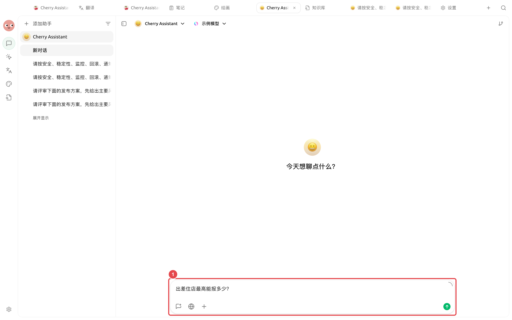

# Использование в диалоге

После успешного прохождения теста на извлечение (recall) в обычном диалоге можно выбрать одну или несколько баз знаний, чтобы модель отвечала на основе извлечённых фрагментов и указывала источники.


Диалог формирует ответ, а база знаний предоставляет доказательства. Сначала убедитесь в разделе 【Тест извлечения】, что найдены правильные фрагменты, и только затем решайте, нужно ли менять промпт или модель чата.


## Предварительные условия

| Пункт проверки | Статус готовности |
| ----- | ---------------- |
| Модель чата | Поддерживает вызов инструментов |
| Материалы базы знаний | Хотя бы один материал готов |
| Текущее сообщение | Не содержит вложений |
| Качество извлечения | Для ключевых вопросов находятся правильные источники и полные фрагменты |


Если текущее сообщение содержит вложения, выбор базы знаний будет заблокирован. Сначала удалите вложения, затем выберите базу знаний в области ввода.


## Выполнение запроса с указанием источников



### 1. Выберите модель с поддержкой вызова инструментов

Создайте или откройте обычный диалог и убедитесь, что текущая модель поддерживает вызов инструментов. Если при входе в базу знаний появляется сообщение о недостаточных возможностях, сначала смените модель.



### 2. Откройте выбор базы знаний

Нажмите кнопку добавления в левом нижнем углу области ввода, выберите пункт «База знаний» и отметьте одну или несколько целевых баз.



### 3. Проверьте состояние выбора

Название базы знаний должно отображаться в области ввода. Если вопрос касается только одной темы, лучше выбрать только одну базу, чтобы уменьшить конкуренцию со стороны нерелевантных фрагментов.

<figure><figcaption>
Перед отправкой убедитесь, что выбранная база знаний и текущий вопрос относятся к одному диапазону материалов. 
</figcaption></figure>



### 4. Чётко укажите задачу, диапазон и формат

Например: `Ответьте только на основании выбранной базы знаний о лимитах расходов на проживание в крупнейших городах Китая. Разбейте данные по уровням должностей и укажите источник для каждого пункта.`



### 5. Проверьте источники

Проверьте названия источников, содержание фрагментов и условия применимости. Информация, не указанная в материалах, не должна дополняться как факт.



### 6. При неудаче вернитесь к тесту на извлечение

Используйте тот же вопрос, чтобы проверить фрагменты, возвращаемые базой знаний. Если извлечение неверно, сначала исправьте материалы, парсинг или поиск; если извлечение верно, отрегулируйте промпт и модель чата.

<figure><figcaption>
Если ответ в диалоге неудовлетворителен, результаты извлечения помогут определить, на каком уровне возникла проблема: на уровне поиска или на уровне ответа. 
</figcaption></figure>



## Как формируется ответ

<figure><figcaption>
Модель чата видит только финальные извлечённые фрагменты, а не автоматически читает все материалы в базе знаний. 
</figcaption></figure>

## Рекомендуемые шаблоны вопросов

### Запрос конкретного правила

> Отвечайте только на основе выбранной базы знаний: каков лимит на проживание в городах первой линии Китая? Если стандарты различаются в зависимости от уровня должности, перечислите их по пунктам и укажите источник после каждого пункта.

### Сравнение нескольких материалов

> Сравните различия в одобрении командировок внутри страны и за рубежом. Составьте таблицу по столбцам «Условия запуска, Утверждающий, Документы перед отъездом»; места, не указанные в материалах, отметьте как «Не указано».

### Требование разграничения фактов и рекомендаций

> Сначала перечислите факты, подтверждённые текстом регламента, затем отдельно дайте операционные рекомендации. Рекомендации не должны формулироваться как требования регламента; для каждого факта сохраните название источника.


Хороший вопрос одновременно содержит четыре элемента: задачу, которую нужно выполнить, допустимый диапазон материалов, ожидаемый формат вывода и способ действий при отсутствии информации в материалах.


## Одна или несколько баз знаний

| Ситуация | Рекомендация | Причина |
| --------- | -------------- | --------------- |
| Вопрос по одному регламенту или продукту | Выберите только одну базу | Уменьшение конкуренции нерелевантных фрагментов |
| Сравнение между отделами или продуктами | Выберите несколько баз и укажите назначение каждой | Помогает модели сохранять границы источников |
| Смешанные результаты из нескольких баз | Разбейте на несколько вопросов и проверьте отдельно | Сначала убедитесь, что каждая база может независимо извлекать нужное |
| Необходимость долгосрочного многошагового исследования | Используйте Agent с привязанной базой знаний | Лучше подходит для непрерывного поиска, структурирования и передачи файлов |

## Настройки

| Параметр | Рекомендуемая начальная точка | Назначение | Примечания |
| ----- | ----------- | --------- | ------------ |
| Количество баз знаний | 1 | Контроль диапазона материалов | Увеличивайте только при реальной необходимости межбазового поиска |
| Диапазон вопроса | Явно укажите «только на основе базы знаний» | Уменьшение дополнения из общих знаний | Важные выводы всё равно нужно проверять по источникам |
| Формат вывода | Таблица или список по пунктам | Удобно для поэлементной проверки | Требуйте отметки «Не указано», а не догадок |
| Регрессионные вопросы | Используйте тот же вопрос, что и в тесте на извлечение | Разделение проблем поиска и ответа | Меняйте только одну переменную за итерацию |

## Сохранение контента диалога в базу знаний

Cherry Studio позволяет сохранять сообщения, темы или заметки в базу знаний. Перед сохранением удалите догадки модели, дублирующийся контент и временные обсуждения, а также используйте заголовки, отражающие тему и версию.

После сохранения формируется новый снимок материалов, который не синхронизируется в реальном времени с исходным диалогом или заметкой. При обновлении контента необходимо сохранить или заменить его заново.

## Примеры пользователей

Сяо Линь задал вопрос о лимите на проживание в базе знаний «Регламент командировок сотрудников». В первом ответе смешались факты из материалов и общие знания модели. Он изменил промпт на «Если в материалах не указано, напишите "Не указано"» и потребовал указывать источник для каждого пункта. Затем он последовательно открыл ссылки, чтобы проверить уровень города, должность и суммы.

Критерий готовности: каждая сумма должна быть напрямую подтверждена цитируемым фрагментом, а исключения, не указанные в регламенте, не должны дополняться моделью самостоятельно.

## Частые вопросы

Почему вход в базу знаний серый? 

Сначала выберите модель с поддержкой вызова инструментов и удалите вложения из текущего сообщения; затем убедитесь, что существует хотя бы одна база знаний с готовыми материалами.

Почему в ответе нет источников? 

Убедитесь, что в области ввода по-прежнему отображается выбранная база знаний, затем поместите тот же вопрос в тест на извлечение. Если правильное извлечение не происходит, сначала исправьте базу знаний.

Источники правильные, но выводы неточны. Что делать? 

Потребуйте от модели отвечать только на основе цитат, разбейте задачу на более мелкие фактические пункты и вручную проверьте важные выводы. Обычно это проблема промпта, возможностей модели или организации контекста.

## Продолжить чтение

<table data-view="cards"><thead><tr><th></th><th></th><th data-hidden data-card-target data-type="content-ref"></th></tr></thead><tbody><tr><td><strong>Проверка материалов и извлечения </strong></td><td>Сначала убедитесь, что правильные фрагменты стабильно находятся. </td><td><a href="recall-test.md">recall-test.md </a></td></tr><tr><td><strong>Использование с Agent </strong></td><td>Позвольте базе знаний участвовать в многошаговых задачах и передаче файлов. </td><td><a href="agent.md">agent.md </a></td></tr><tr><td><strong>Примеры применения баз знаний </strong></td><td>Переиспользование регламентов, примеров поддержки и исследований. </td><td><a href="cases.md">cases.md </a></td></tr></tbody></table>
