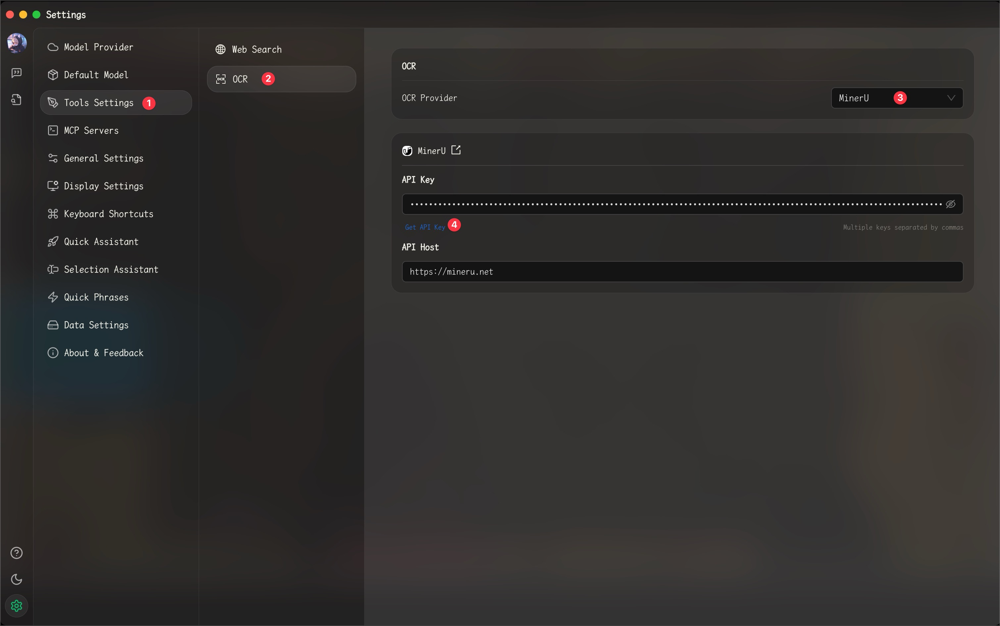
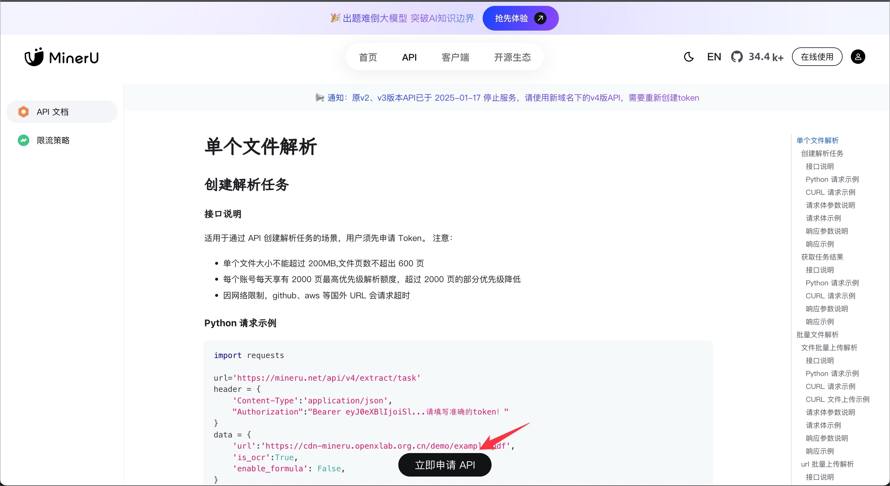
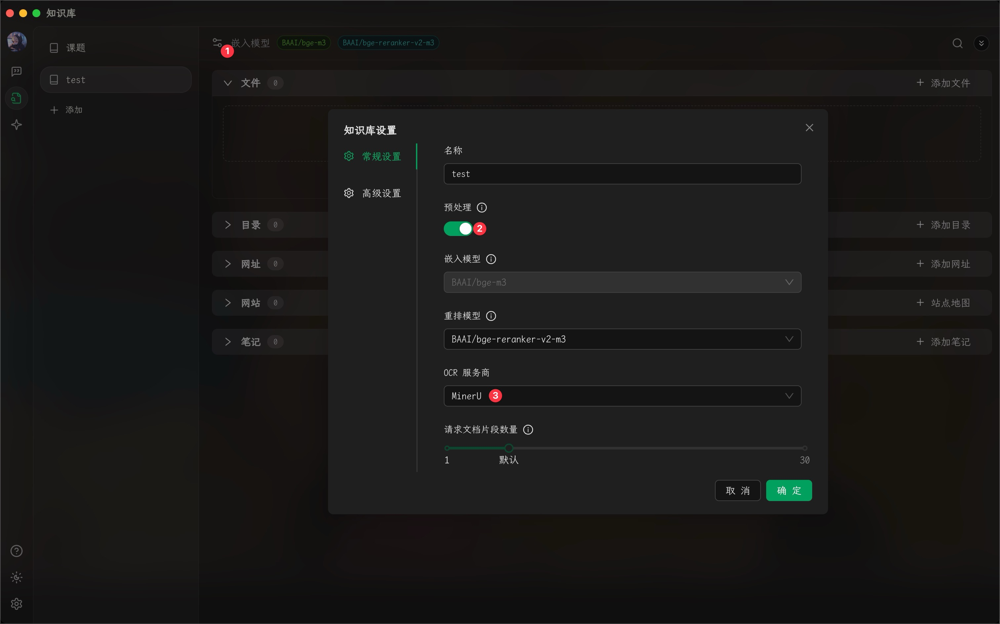
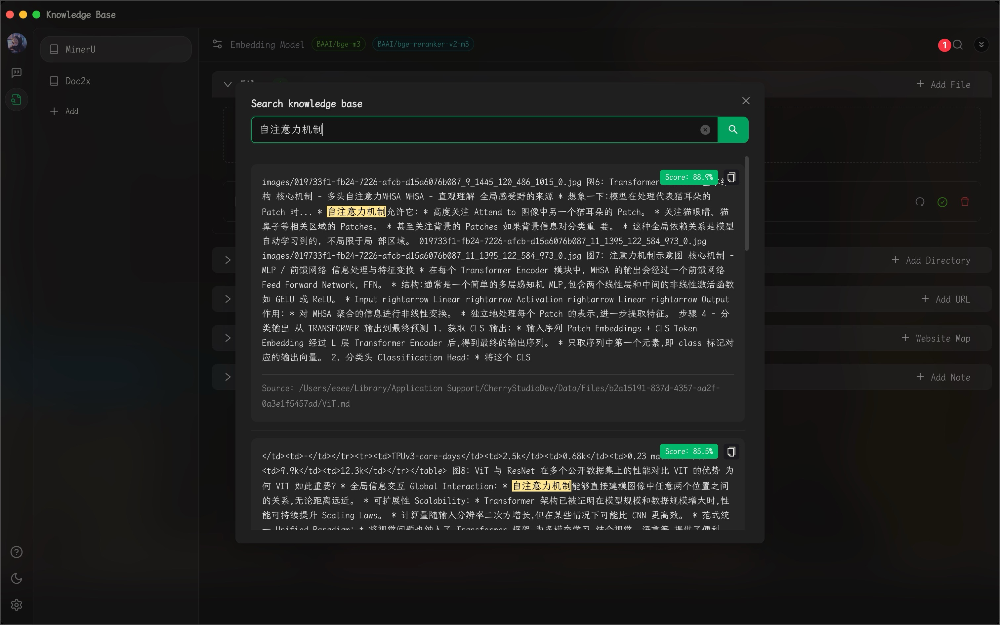
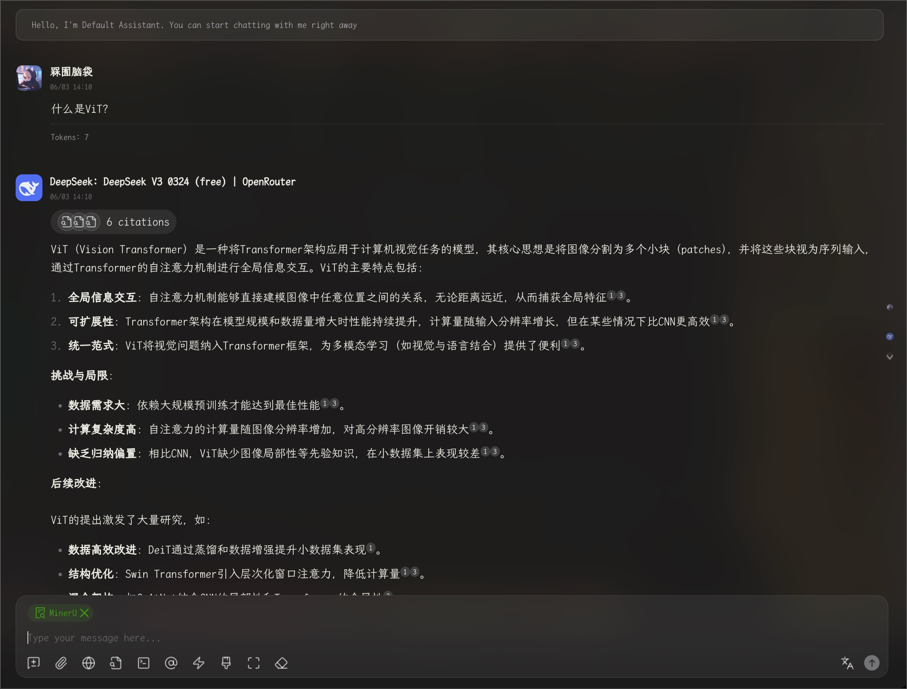
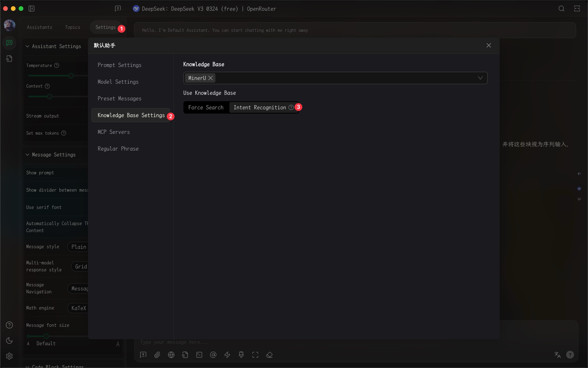

# Предварительная обработка документов базы знаний


Этот документ переведен с китайского языка с помощью ИИ и еще не был проверен.


Для предварительной обработки документов базы знаний необходимо обновить Cherry Studio до версии v1.4.8 или выше.

### Настройка провайдера OCR-услуг

<figure><figcaption></figcaption></figure>

После нажатия «Получить API KEY» в браузере откроется страница запроса. Нажмите «Немедленно подать заявку», заполните форму, получите API KEY и введите его в соответствующее поле.

<figure><figcaption></figcaption></figure>

### Настройка предварительной обработки документов базы знаний

<figure><figcaption></figcaption></figure>

Выполните указанные выше настройки в созданной базе знаний, чтобы завершить конфигурацию предварительной обработки документов.

### Загрузка документов

<figure><figcaption></figcaption></figure>

> Результаты работы базы знаний можно проверить через поиск в правом верхнем углу

### Использование в диалогах

<figure><figcaption></figcaption></figure>

> Советы по использованию базы знаний: При работе с **моделью с более высокой производительностью** измените режим поиска в базе знаний на распознавание намерений для более точных и широких формулировок запросов.

### Активация распознавания намерений в базе знаний

<figure><figcaption></figcaption></figure>