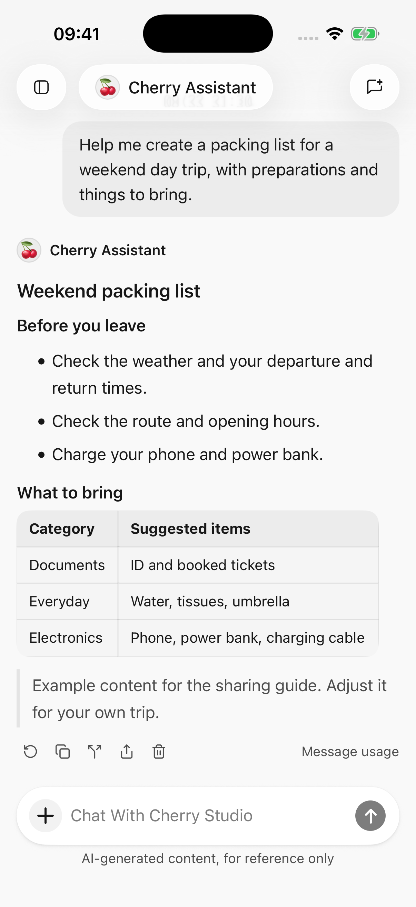
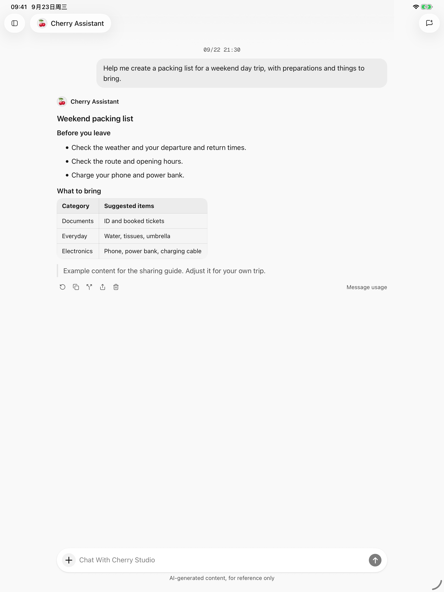

# Чаты и файлы

Используйте отдельный разговор для каждой темы, а агента — для выбора модели и сохранения инструкций, которые будут использоваться повторно. Один и тот же агент может вести отдельные разговоры на разные темы.

<figure data-mobile-shot="phone"><figcaption>
<strong>iPhone · Интерфейс на английском</strong> · Сообщения, сведения о модели и ответные действия в одном столбце.
</figcaption></figure>
<figure data-mobile-shot="tablet"><figcaption>
<strong>iPad · Интерфейс на английском</strong> · Более широкая область чтения для длинных ответов и содержимого файлов.
</figcaption></figure>

## Начни разговор или поменяй модель

Выберите **Новый чат** на боковой панели, выберите агента и модель, затем отправьте сообщение. Новый разговор начинается как черновик; отправка первого сообщения создает его историю.

Измените модели из средства выбора моделей в разговоре. При этом модель текущего агента обновляется для следующего запроса; существующие ответы не перезаписываются.

Поместите постоянные предпочтения, такие как «Дайте заключение перед действиями» в [инструкциях агента](agents-and-tools.md). Поместите требования к одному вопросу в самом сообщении.

## Найти предыдущие разговоры

* Просмотрите последние разговоры на боковой панели или воспользуйтесь меню списка последних, чтобы сгруппировать их по агентам. Коснитесь имени агента, чтобы развернуть/свернуть его разговоры. Выбранный режим просмотра сохраняется при запуске приложения.
* Кнопка поиска рядом с заголовком боковой панели позволяет выполнять поиск **заголовков разговоров и содержимого сообщений**. Прежде чем печатать, отображаются недавние разговоры.
* Результат сообщения открывает беседу в этом сообщении. Просмотрите историю поблизости или выберите **Вернуться к последним сообщениям**.
* Нажмите и удерживайте разговор на боковой панели, чтобы переименовать или удалить его. [Экспорт](sharing-and-export.md) все, что вы хотите сохранить в первую очередь.

Поиск находит все сообщение, не выделяя каждое ключевое слово внутри него. Он ищет разговоры, а не каждый файл на вашем телефоне.

## Добавить изображения

Коснитесь **＋** рядом с полем ввода, чтобы выбрать фотографии, сделать снимок или добавить изображение через «Файлы». Выберите модель, которая понимает изображения; фильтр Визуальные может помочь.

Например, прикрепите фотографию и попросите: «Превратите контрольный список на этой картинке в таблицу». Укажите, какая часть имеет значение.

Поддерживаемые форматы запросов: JPEG, PNG, GIF и WebP. Текущий лимит приложения составляет 9 изображений, 10 МБ на каждое изображение и 20 МБ вместе взятых; отдельные модели могут иметь более низкие пределы. Конвертируйте несовместимые форматы в JPEG или PNG.

Приложение может сжимать изображения и повторять запрос слишком большого размера, но сжатие не устраняет неподдерживаемые модели, слишком много изображений или все сетевые ошибки.

## Прикрепите документы или существующие файлы

1. Нажмите **＋ → Файлы**.
2. Выберите существующий файл или загрузите его с помощью средства выбора системы.
3. Дайте конкретное задание, например: «Подведите итоги второго раздела и перечислите его действия».

Обычные текстовые файлы имеют ограничение в 1 МБ на файл; документы имеют ограничение в 20 МБ. Длинный контент может быть сокращен в соответствии с ограничениями чтения или модели с уведомлением. Не думайте, что был включен весь файл. Извлечение текста PDF обрабатывает не более первых 100 страниц.

### Какой парсер документов выбрать?

Откройте **Настройки → Парсер документов**. Выбор немедленно сохраняется и применяется к последующей обработке документа; он не перезаписывает предыдущие ответы.

| Вариант | Лучшее для | Компромисс |
| --- | --- | --- |
| Встроенный | Резюме и вопросы о преимущественно текстовых документах | Извлекает текст из PDF, DOCX, XLSX и PPTX с меньшим использованием модели. |
| AnyDoc | Сложные документы, в которых важны заголовки и таблицы. | Сохраняет больше структуры для документов, отличных от PDF, обычно с использованием большего количества токенов. |

PDF-файлы по-прежнему используют системное извлечение текста. Переключение парсеров не превращает отсканированные страницы в выбираемый текст. Если текст не найден, предоставьте текстовую копию или отправьте соответствующие страницы в виде изображений в визуальную модель.

**Поддержка предварительного просмотра отличается от поддержки ввода модели.** Модели получают проанализированное содержимое документа. Аудио-, видео- или архивные файлы не становятся пригодными для использования вложениями просто при изменении флагов возможностей модели.

## Копировать, повторить, разветвить или удалить

| Действие | Когда его использовать | Результат |
| --- | --- | --- |
| Выбрать текст или скопировать | Сохранить часть или весь ответ | Используйте выделение текста или действие копирования ответа. |
| Ответь еще раз | Последний ответ не удался, был прерван или неудовлетворителен. | Снова обрабатывает исходный вопрос и заменяет последний ответ на место. |
| Перейти в новый чат | Исследуйте другое направление от более ранней точки | Продолжается в отдельном разговоре, сохраняя оригинал. |
| Удалить этот ход | Удалить обмен | Удаляет вопросы, ответы и промежуточные записи инструментов. |

Повторный ответ доступен только для последнего ответа после остановки генерации. Он не сохраняет несколько доступных для выбора версий ответа. Используйте ветку для более ранних пунктов.

Завершенные результаты инструмента могут быть сохранены при возобновлении прерванного ответа. Повторная попытка или удаление **не отменяет изменения календаря, отредактированные файлы или отправленное содержимое**. Повторная попытка может повлечь за собой дополнительную плату. Скопируйте, поделитесь или сначала разветвитесь, если вам нужен предыдущий ответ.

Удаление хода является постоянным и не возвращает средства за использование. Перед удалением дождитесь завершения генерации/операций или остановите их.

## Глубина мышления и долгие разговоры

Поддерживаемые модели предлагают настройку **Глубина мышления**. Доступные уровни зависят от модели; не все модели позволяют отключить рассуждения или предлагают одинаковое число уровней. Для простых вопросов используйте уровень по умолчанию или более быстрый режим, а для сложного анализа можно выбрать более глубокие рассуждения. Более высокие уровни могут требовать больше времени и токенов.

**Сжатие контекста/Сжатие контекста** означает, что предыдущая информация суммируется, чтобы освободить место для продолжения разговора или работы с инструментом. Видимая история остается, но в кратком изложении могут быть опущены детали. При необходимости повторите важные ограничения, цифры или точные цитаты в следующем сообщении.

Сжатие контекста не позволяет вместить вложение любого размера. Сократите материал или начните новый разговор, если запрос по-прежнему превышает лимиты.

См. [фоновые ответы и уведомления](settings-and-usage.md) для прерываний и [обмен и экспорт](sharing-and-export.md) для совместного использования нескольких сообщений вместе.

Информацию о сохраненных выходных данных и версиях см. в разделе [Создание и редактирование файлов](file-generation.md). Чтобы превратить сохраненный файл HTML в изображение или презентацию, см. [HTML в изображение и PPT](html-export.md).
