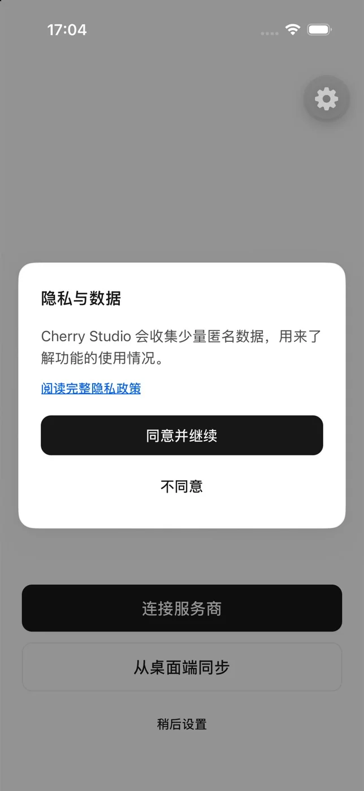

# Данные, конфиденциальность и разрешения

Понимать, куда уходят данные, полезнее, чем общее обещание «хранится локально».

<figure data-mobile-shot="phone"><figcaption>
<strong>Первый запуск</strong> · Текущая версия сначала объясняет, как используются анонимные данные, и только потом предлагает продолжить
</figcaption></figure>

## Данные на устройстве

Настройки приложения, конфигурация провайдеров и история диалогов хранятся преимущественно на текущем устройстве. Прежде чем удалять приложение, очищать системные данные или менять устройство, сохраните важное отдельно. Не рассчитывайте, что мобильное приложение автоматически синхронизируется с настольной версией.

## Данные, отправляемые провайдерам

Когда вы отправляете сообщение или файл либо генерируете изображение, запрос уходит к провайдеру моделей, выбранному в ваших настройках. Сроки хранения и способы обработки зависят от политики конфиденциальности этого провайдера, настроек вашей учётной записи и условий его API.

## API-ключи

* Вводите API-ключи только в официальном приложении.
* Никогда не показывайте ключ целиком на снимках экрана, в журналах, переписке и обращениях в поддержку.
* Если ключ мог быть скомпрометирован, отзовите его в панели управления провайдера и создайте новый.
* Для мобильного устройства стоит завести отдельный ключ с ограниченной квотой, который можно отозвать независимо.

## Системные разрешения

Для доступа к фотографиям, файлам, камере, календарю и напоминаниям могут потребоваться системные разрешения. Приложение запрашивает их в момент, когда соответствующая функция действительно используется. Изменить разрешения можно в любой момент в настройках Android или iOS.

Придерживайтесь принципа наименьших привилегий: не давайте доступ к неиспользуемым возможностям и оставляйте ручное подтверждение для инструментов, которые записывают данные или действуют за пределами приложения.
