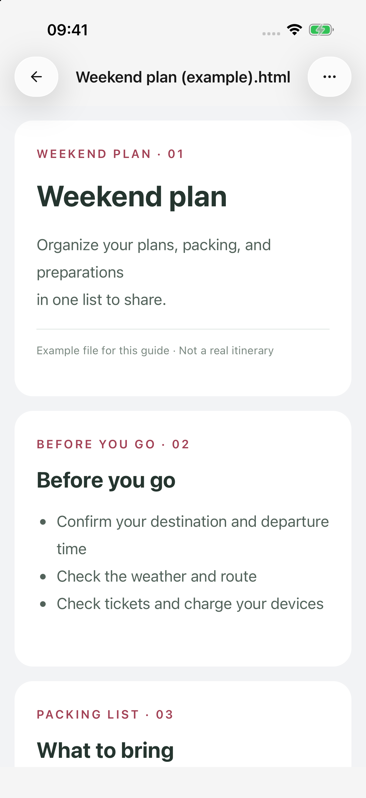
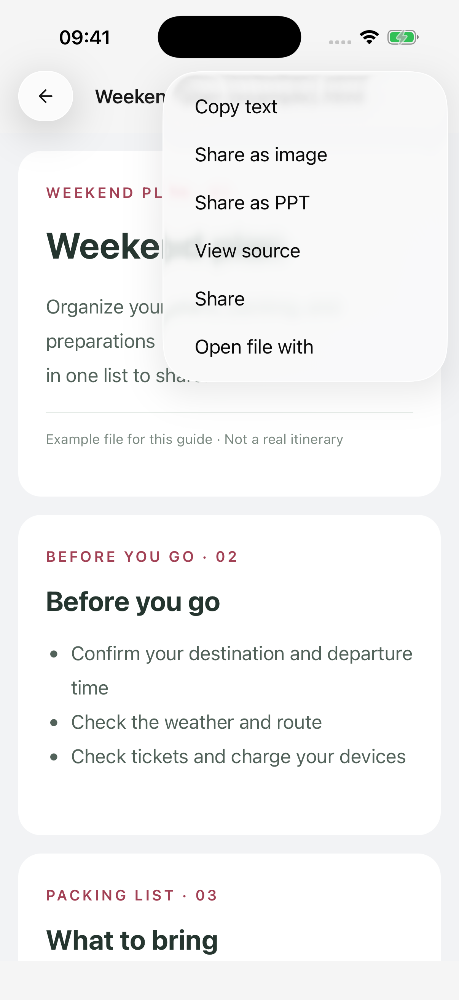

# Преобразование HTML в изображение или PPT

Файлы HTML могут содержать разработанные макеты, цвета и изображения. Откройте сохраненный файл HTML в Cherry Studio, чтобы поделиться им как изображение, или в PPT — это полезно для предложений, учебных карточек и коротких презентаций.

## Подготовьте файл HTML.

Загрузите существующий файл или попросите модель, поддерживающую вызовы инструментов, создать его:

> Превратите приведенный выше обзор проекта в отдельную презентацию HTML с тремя страницами: цели, план и следующие шаги. Используйте соотношение сторон 16:9, читаемый шрифт и никаких онлайн-изображений и шрифтов. Сохраните его как project-overview.html. Создайте для каждой страницы собственный контейнер с помощью class="slide".

Последнее предложение сообщает модели, как размечать страницы. Вы можете скопировать его, не написав код самостоятельно. Для одной информационной карты не нужны маркеры страниц.

Подождите, пока файл завершит сохранение, затем откройте его карточку или найдите его под **Файлы** на боковой панели. Если у вас в чате есть только блок кода HTML, сначала попросите модель [сохранить его как файл](file-generation.md).

## Поделиться как изображением или PPT

1. Откройте полный файл HTML и просмотрите его текст, изображения и макет.
2. Нажмите **Подробнее** в правом верхнем углу.
3. Выберите **Поделиться изображением** или **Поделиться в формате PPT**.
4. Дождитесь подготовки, захвата страницы и записи файла. Используйте **Отмена** в области прогресса, чтобы при необходимости остановиться.
5. Выберите место назначения в системном меню отправки.

Созданный файл PNG или PPTX также остается в разделе **Файлы**, откуда его можно открыть или отправить позже. Закрытие меню отправки не означает, что файл сохранен в другом месте.

<figure data-mobile-shot="phone"><figcaption>
<strong>iPhone · Интерфейс на английском</strong> · Откройте сохраненный файл HTML; это авторский демонстрационный файл
</figcaption></figure>
<figure data-mobile-shot="phone"><figcaption>
<strong>iPhone · Интерфейс на английском</strong> · Используйте меню «Файл», чтобы поделиться как изображением или PPT.
</figcaption></figure>

## Чем отличаются форматы?

| Формат | Лучшее для | Результат |
| --- | --- | --- |
| Изображение (PNG) | Быстрый просмотр и информационные карточки | Одно изображение всего документа; несколько страниц располагаются вертикально |
| PPT (PPTX) | Представление одной страницы за раз | Изображение каждой страницы, помещенное на слайд с соотношением сторон 16:9. |

**Текст и диаграммы в PPT являются частью изображений страниц, а не объектами, редактируемыми по отдельности.** Чтобы изменить содержимое, измените HTML и выполните преобразование еще раз. Поделитесь HTML, если получателю нужен исходный редактируемый источник.

HTML с явными маркерами страниц преобразуется постранично. Обычная длинная страница разбивается по вертикали на разделы формата 16:9, которые могут прорезать абзацы или таблицы; он не преобразуется автоматически в презентацию. Если это произойдет, попросите модель предоставить отдельные, менее перегруженные страницы.

Страницы с разными соотношениями сторон сохраняют свои пропорции и могут иметь белые поля. При преобразовании используется более широкий макет страницы, поэтому он может отличаться от узкого предварительного просмотра на телефоне.

## Что происходит с водяными знаками и интерактивным контентом?

Преобразование следует за **Настройки → Общие настройки → Водяной знак при отправке**. Если этот параметр включен, к изображению или последнему слайду PPT добавляется нижний колонтитул. Этот параметр влияет на вновь создаваемые файлы; его последующее изменение не приводит к восстановлению сохраненных результатов.

Конвертация открывает новую копию сохраненного HTML. Он не копирует нажатые вами кнопки, развернутые вами панели или формы, которые вы заполнили во время предварительного просмотра. Анимации и видео не становятся воспроизводимым содержимым PPT. Попросите модель сохранить желаемое состояние как статическое содержимое страницы.

## Почему преобразование недоступно или происходит сбой?

* **Файл не HTML:** Markdown, обычный текст и блоки кода чата не содержат этих действий преобразования.
* **Загружена только часть длинного файла:** неполный HTML преобразовать невозможно. Сократите или разделите его. Пустой контент также не может быть преобразован.
* **Не удалось загрузить изображения или шрифты.** Интернет-ресурсы должны быть доступны. Попросите версию без внешних зависимостей.
* **Документ слишком длинный:** PPT поддерживает не более 64 страниц, а изображения имеют ограничения по размеру. Уменьшите содержимое, разделите файлы или используйте отдельные страницы презентации вместо одного длинного изображения.
* **Макет постоянно меняется или приложение перешло в фоновый режим:** сложные динамические страницы могут не работать. Держите приложение на переднем плане и при необходимости используйте статические макеты.

Исходный HTML остается доступным после сбоя или отмены. Устраните указанную причину, прежде чем повторять попытку. После отправки важного файла подтвердите количество его страниц и содержимое в принимающем приложении.
