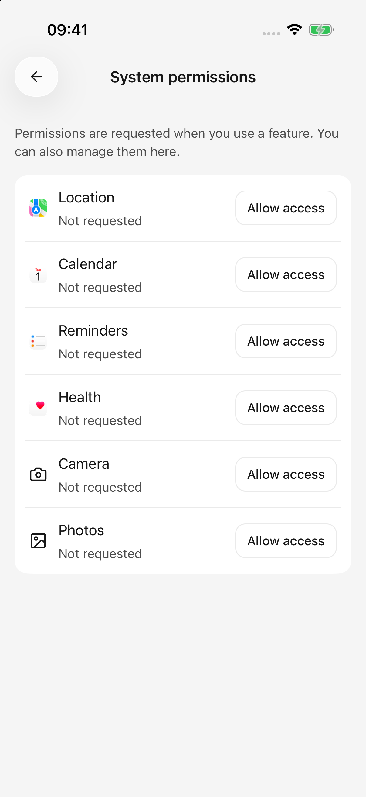

# Местоположение и данные о здоровье

Инструмент определения местоположения считывает текущее положение вашего телефона. Инструменты Health обобщают существующие записи Health iOS. Каждому требуется переключатель возможностей агента и системное разрешение; Автоматическое одобрение не предоставляет доступ.

## Управление разрешениями

Включите **Местоположение** или **Здоровье** в разделе **Система** текущего агента, а затем разрешите доступ при появлении соответствующего запроса. Вы также можете проверить поддерживаемые разрешения и их статус в **Настройки → Системные разрешения**.

<figure data-mobile-shot="phone"><figcaption>
<strong>iPhone · Интерфейс на английском</strong> · Системные разрешения отделены от переключателей возможностей агента.
</figcaption></figure>

Чтобы остановить использование возможности одним агентом, выключите его переключатель. Чтобы отозвать доступ приложения к системе, следуйте инструкциям на странице разрешений для соответствующих настроек системы.

## Узнайте свое местоположение, а затем выполните поиск поблизости

Начните с:

> Определите мое текущее местоположение. Примерно укажите район, в котором я нахожусь, и время получения этих координат.

Для близлежащих мест или маршрутов объедините его с подключенным плагином Amap:

> Узнайте мое текущее местоположение, а затем используйте Amap, чтобы найти ближайшие станции метро. Назовите их имена и адреса.

Эти шаги имеют отдельные требования: для определения местоположения телефона требуется разрешение системы, а для запросов к карте требуется соединение Amap. Подключение Amap само по себе не считывает местоположение вашего телефона.

### Могу ли я спланировать маршрут без предоставления доступа к местоположению?

Да. Укажите отправную точку и пункт назначения самостоятельно:

> Используйте Amap, чтобы найти маршруты общественного транспорта от Народной площади в Шанхае до железнодорожного вокзала Хунцяо. Сравните трансферы и предполагаемую продолжительность, не читая местоположение моего телефона.

Встроенный инструмент получает текущее местоположение, пока приложение открыто на переднем плане. Он не обеспечивает непрерывное отслеживание, фоновую геолокацию или пошаговую навигацию. Маршрут предоставляет картографический сервис; однократное определение местоположения не является навигацией в реальном времени.

### Не удалось определить местоположение, или в координатах нет адреса.

* Убедитесь, что службы определения местоположения системы и разрешение Cherry Studio включены, и оставьте приложение на переднем плане.
* Прием внутри помещения, точность устройства и системы влияют на результаты. Тайм-аут не обязательно означает, что в разрешении было отказано.
* Отдельно может произойти сбой преобразования координат в письменный адрес. Координаты без адреса не означают, что весь запрос местоположения не выполнен.
* Устраните указанную причину, прежде чем явно повторять попытку, или вместо этого укажите город, ориентир или начальный адрес.

## Обобщение медицинских записей на iOS

Современные инструменты могут читать следующие типы записанных данных:

| Категория | Доступная информация |
| --- | --- |
| Ежедневная активность | Шаги, активная энергия, дистанция ходьбы и бега |
| Измерения сердца | Частота сердечных сокращений, частота сердечных сокращений в состоянии покоя, вариабельность сердечного ритма. |
| Спать | Записанная продолжительность сна |
| Тренировки | Записанные тренировки в диапазоне дат |

Авторизуйте только те типы, которые вам нужны. Сводка шагов не требует предоставления данных о сердце или сне. Текущие инструменты читают записи; они не могут писать или удалять медицинские записи. На Android эти инструменты для работы с данными о здоровье пока недоступны.

Примеры запросов:

> Прочтите записанные шаги и расстояние ходьбы/бега за последние семь дней, сгруппированные по дням. Пометьте пропущенные дни «Нет доступных записей»; не заполняйте их нулями.

> Подведите итог записанной продолжительности сна за прошлую неделю и определите даты, в которых отсутствуют записи.

> Перечислите записанные тренировки в этом месяце, укажите, сколько из них было возвращено, и объясните, возможно, список неполный.

Запрос может охватывать не более 90 дней. Без дат инструменты по умолчанию отображают последние семь дней. Списки тренировок по умолчанию содержат 20 записей, но допускается не более 50 на вызов. Запрашивайте более короткие периоды, когда записей больше.

## Почему результаты пустые или частичные?

Возможно, в системе нет соответствующих записей, тип данных не авторизован, исторические записи могут быть недоступны или одна метрика может не загрузиться. **Пустой результат не означает отсутствие шагов или отсутствие упражнений.** iOS не полностью раскрывает отказы в чтении, поэтому приложение не может отличить эти случаи от пустого результата.

Проверьте даты и записи в системном приложении «Здоровье», а затем проверьте доступ для определенного типа. Попробуйте более короткий диапазон и одну метрику за раз. Попросите агента указать недостающие данные, а не рассматривать неполный результат как полную тенденцию.

Результаты о местоположении и состоянии здоровья могут быть отправлены в выбранную вами модельную службу в рамках разговора. См. раздел [Данные, конфиденциальность и разрешения](data-privacy.md).
